# 컴퓨터 사이언스 
# 목차 
* [컴퓨터 사이언스란?](#컴퓨터-사이언스란) 
* [컴퓨터는 무엇일까?](#컴퓨터는-무엇일까) 
* [컴퓨터의 역사](#컴퓨터의-역사) 
* [컴퓨터의 분류](#컴퓨터의-분류) 
* [데이터의 표현과 연산](#데이터의-표현과-연산) 
* [부울대수](#부울대수) 
* [컴퓨터 하드웨어 구성](#컴퓨터-하드웨어-구성) 
* [컴퓨터 하드웨어 기억장치](#컴퓨터-하드웨어-기억장치) 
* [컴퓨터 하드웨어 주기억 장치의 종류](#컴퓨터-하드웨어-주기억-장치의-종류) 
* [반도체 메모리](#반도체-메모리) 
* [보조 기억 장치](#보조-기억-장치) 
* [산술 논리 연산 장치](#산술-논리-연산-장치) 
* [적재와 프로그램과 프로세스](#적재와-프로그램과-프로세스) 
* [제어 장치](#제어-장치)
* [출처](#출처)

# 컴퓨터 사이언스란? 

## 컴퓨터 사이언스의 기원 
* 컴퓨터 사이언스는 컴퓨터라고 하는 기기에 대한 연구라고 할 수 있다. 
* 컴퓨터 사이언스의 현대적인 기원은 1940년대에 최초로 출현한 디지털 컴퓨터들의 등장과 1930년대에 이와는 별도로 형성된 계산기기들에 대한 적절한 수학적 모델에 있다고 할 수 있다. 컴퓨터는 그 전까지는 수작업으로 하던 덧셈과 뺄셈같은 계산들을 좀 더 빠르면서 정확하게 처리하고자 만든 장치에서 시작되었기 때문이다.   

## 컴퓨터 사이언스의 정의 
> 물리학은 에너지와 많은 관련성을 갖는 학문이다. 반면, 컴퓨터 사이언스는 정보의 표현, 저장, 조작 및 검색과 밀접한 관계를 갖는 학문이다.  
> 물리학이 에너지 변환장치를 이용하는 것처럼, 컴퓨터 사이언스는 정보변환장치를 이용한다.  

* 컴퓨터 사이언스에서는 정보가 중요하고 그것이 차지하는 비중이 크기 때문에 컴퓨터 사이언스를 정보과학(Information Science)이라고도 한다. 컴퓨터 사이언스는 여러 가지 서로 다른 측면에서 정의할 수 있다.   

### 1. 기기 중심 
* **문제를 해결**하기 위한 도구로서의 정의. 컴퓨터 기기와 이를 둘러싼 질문들, 즉 컴퓨터를 어떻게 설계하고 분석하고 구축하고 사용할 것인가 하는 것에 초점이 모아진다.  
 
### 2. 정보 중심 
* 컴퓨터에게 **정보(데이터)**의 개념과 처리는 중요하다. 정보 중심 관점에서는 데이터의 표현, 저장, 구성, 전송 및 처리에 관한 질문으로 귀결된다.  
  
### 3. 프로그램 중심 
* **프로그램**이란 어떤 문제를 풀기 위한 컴퓨터 명령어들의 집합이다. 프로그램 중심 관점에서 본다면 컴퓨터 사이언스는 프로그래밍에 관한 연구라고 할 수 있다. 그렇기 때문에 이 관점에서는 프로그램 표현을 위한 적절한 언어의 선택, 프로그램의 정확성과 효율성, 프로그램의 실행을 위한 기계, 그리고 프로그래밍 기술 등과 같은 프로그래밍에 관한 문제점들을 강조한다.  
 
### 4. 알고리즘 중심 
* **알고리즘**이란 문제 해결을 위한 작업이 어떻게 수행되는지를 정의하는 단계들의 집합니다. 컴퓨터는 알고리즘을 구현하는 기계이고, 정보는 알고리즘이 만들어내는 대상이며, 프로그래밍은 알고리즘을 기술하는 수단이다. 알고리즘 중심 관점에서 본다면 컴퓨터 사이언스는 알고리즘에 관한 연구라고 할 수 있다. 

> 👉 이와 같이 컴퓨터 사이언스는 컴퓨터의 설계, 컴퓨터 프로그래밍, 정보 처리, 알고리즘 문제 해결, 알고리즘 처리 자체 등과 같은 다양한 분야에 대한 과학적인 기초를 제공하는 학문이라 할 수 있다.   

## 컴퓨터 사이언스의 주요분야 
1. 컴퓨터 구조 
2. 시스템 소프트웨어 
3. 프로그래밍 언어 
4. 데이터베이스 
5. 데이터통신 
6. 컴퓨터 네트워크 
7. 인공지능 
8. 소프트웨어 공학   

## 컴퓨터 사이언스의 발전 
### 1. 컴퓨터의 멀티미디어화 
* 대용량의 사운드, 그래픽, 비디오 등을 지원하는 멀티미디어 PC가 보편화되면서 이에 따라 주변기기들의 성능도 멀티미디어를 잘 처리할 수 있는 수준으로 고성능화, 고용량화되고 있다.  
 
### 2. 컴퓨터의 네트워크화 
* 인터넷의 보급으로 클라이언트/서버 환경의 확대가 가속화되고 네트워크를 통한 정보의 교환이 급속히 늘어나면서 네트워크 환경에 알맞은 컴퓨터 기술과 더불어 더욱 고급화, 지능화되는 네트위크 기술의 개발과 연구가 가속화 되고 있다.  

### 3. 모바일 컴퓨팅의 확산 
* 노트북, PDA, 스마트폰 등 휴대할 수 있는 모바일 컴퓨터들이 확산되고 있는 것에 따라 무선 기술 및 관련 컴퓨팅 기술의 개발과 연구가 확대되고 있다.  

### 4. 컴퓨터의 임베드화 
* 컴퓨터 기술과 가전기기가 접합된 시스템을 임베디드(embedded) 시스템이라 한다. TV에 인터넷 접속 기능이 결합된 경우가 대표적이라 할 수 있다. 

### 5. PC의 고성능화 
* 클러스터링 기법을 활용한 병렬처리 컴퓨터 기술이 접합될 경우 지금의 서버 수준을 뛰어 넘는 고성능 PC가 개발될 것이다.  
***************

# 컴퓨터는 무엇일까? 

## 컴퓨터의 정의  
* 컴퓨터(Computer)란 지금까지 사람이 해 왔던 기억과 계산 등의 일을 빠르고 정확하게 처리해 주는 기계이며, 사람의 지시에 따라 여러 가지 일을 자동적으로 처리해주는 전자 장치이다. 컴퓨터라는 명칭 자체가 계산하다 라는 뜻인 compute에서 확장된, 계산해주는 사람(혹은 장치)이라는 뜻의 computer에서 유래되었다. 
* 초기의 컴퓨터는 단순 수치 계산을 목적으로 만들어졌지만 오늘날의 컴퓨터는 수치 계산 뿐만 아니라 기억, 분류, 비교하는 것과 같은 여러 가지 일들을 한꺼번에 처리할 수 있다. 외부로부터 입력된 자료를 정의된 방법에 따라 자료를 처리하여 정보를 생성하고, 사용자에게 생성된 정보를 출력해 주는 기능을 가지고 있다.  

## 컴퓨터의 기능  
### 1. 입력 기능 
* **처리할 데이터**와 **처리 방법** 그리고 **절차**를 지시하는 프로그램을 **외부로부터 읽어**들여 기억 장치로 전달해 주는 기능  

### 2. 기억 기능 
* **읽어 들인 데이터**와 **절차를 지시하는 프로그램**들과 **처리된 결과** 등을 기억 장치에 **기억**시키는 기능  

### 3. 연산 기능 
* 데이터를 기억 장치에 기억된 프로그램을 통해서 **산술 연산과 논리 연산을 하여 결과를 만들어 내는** 기능  

### 4. 제어 기능 
* 기억된 프로그램들의 명령을 하나씩 읽고 해석하여 컴퓨터 각각의 기능이 유기적으로 동작하도록 **장치들을 제어하고 지시**하는 기능  

### 5. 출력 기능 
* 컴퓨터 내에 기억된 내용과 처리된 결과를 문자, 도형, 음성 등의 형태로 외부에 보여주는 기능 
* 컴퓨터의 기능 중에서 **기억**과 **제어** 그리고 **연산** 기능은 가장 핵심적인 것으로서 **주기억장치(Main Memory)**와 **중앙처리 장치(Central Processing Unit : CPU)**에서 이루어진다.   

## 컴퓨터의 특징 

### 1. 신속성 
* 자료를 주어진 시간 내에 빠르고 신속하게 처리한다.  

### 2. 정확성 
* 계산 시에 에러나 오차를 최소화하고 정확하게 계산하고 판단한다.  

### 3. 자동성 
* 입출력을 비롯한 전체 처리 과정을 자동적으로(프로그램 된 대로) 처리한다.  

### 4. 대량성 
* 대량 데이터의 처리가 가능하고 대량 데이터의 저장이 가능하다.   

## 컴퓨터의 필요성 

1. 과학 기술의 발달과 산업 사회의 급격한 변화로 새로운 정보를 신속하게 수집, 분석, 활용할 필요성이 생겼다. 
2. 사회 현상이 복잡하고 다양해짐에 따라 처리할 데이터 양이 기하급수적으로 증가하였다. 
3. 가상 현실이나 모의 실험을 활용하여 위험 부담을 줄일 수 있기 때문이다. 
4. 편리한 생활을 위한 기계 및 전자 장치들을 제어하기 위해 컴퓨터가 필요하게 되었다.  
*****************

# 컴퓨터의 역사 

## 1. 초창기 계산기 
* 학교 다닐 때 배웠던 근대 문학에서 흔히 등장하는 주판이 있다. 주판은 지금 쓰는 전자식 계산기가 보급되기 전 계산을 할 때 쓰던 도구이다. 주판이 규칙에 따라 문제를 풀 수 있는 장치인 것을 알고 있는 중세와 근대의 유럽인들은 이러한 규칙을 기계 장치에 집어넣으면 계산을 자동화할 수 있지 않을까 하는 발상에서 톱니 계산기를 발명하게 된다. 
* 최초의 기계식 계산기는 1642년에 파스칼이 고안한 장치였다. 이 장치는 손잡이와 이에 딸린 톱니바퀴가 일정한 비율로 배열되어 손잡이를 좌우로 돌리는데에 따라 덧셈과 뺄셈이 자동으로 수행되는 장치였다.  
* 이후 라이프니츠가 만든 계산기는 덧셈과 뺄셈 이외에도 곱셈과 나눗셈, 간단한 제곱근까지도 계산이 가능했다고 한다.  

## 2. 근대 계산기 
* 초창기 계산기들은 손으로 수치를 일일이 입력해야 하는 것이 큰 단점이었다. 그래서 19세기 들어 입력 방식을 보완한 근대적 계산기가 탄생하게 된다. 구멍이 뚫려 있는 천공 카드(punched card)를 이용해서 카드에 뚫린 구멍의 순서에 따라 톱니가 물려 입력 순서를 정하게 되는 방식을 이용해 입력 방식을 보완한다.  
* 찰스 바베지는 증기 기관으로 작동되는 수식 계산 기계인 차분 엔진(difference engine)과 업그레이드 판인 해석 엔진(analytical engine)을 설계한다. 하지만 완성하지는 못했다. 찰스 바베지와 함께 프로젝트를 진행했었던 에이다는 세계 최초의 여성 컴퓨터 과학자로 기록되었으며, 병렬 처리 프로그래밍 언어로 유명한 Ada는 그녀의 이름을 딴 것이다.  

## 3. 현대식 컴퓨터 
* 현대식 전자 컴퓨터는 국방 분야에서 자동화를 위해 많은 인력과 자본을 투입해 개발한 것에서 시작되었다. 최초의 전자식 계산기의 토대는 2차 세계대전 기간에 만들어져, 2차 세계대전이 끝나고 1950년대 말부터 일반 사무용으로 보급된다.   

### 1) 0세대 
* 최초의 컴퓨터라 할 수 있는 ENIAC(Electronic Nemerical Integrator And Computer)이 개발되었다. 초당 5번의 곱셈이 가능했지만 지금의 컴퓨터와는 다르게 설계에 따라 한 문제만 풀 수 있었고 다른 문제를 풀게 하려면 진공관 회로의 배치를 바꿔줘야 했다. 당시 컴퓨터는 덩치가 아주 크고 진공관 수는 약 2만여개였기 때문에 배치를 바꾸는 데에 몇 주가 소요되었다. 그리고 전력도 많이 들고 진공관 고장도 잦고 효율적이지 않았기 때문에 현대 컴퓨터의 아버지라 불리는 존 폰 노이만이 새로운 방식을 고안해 낸다.  
* 이 방식이 지금 우리에게 익숙한 소프트웨어 방식이다. 저장 프로그램 개념으로 컴퓨터 프로그램을 처리해야 할 데이터의 일부로 규정하여 이를 기억 장치에 저장해 놓고 반복적으로 이용 가능하도록 한 방식이다. 
* 이 시기에는 0과 1로 이루어진 기계어가 프로그래밍 언어로 사용되었다.  

### 2) 1세대 컴퓨터(1950년대) 
* 0세대 컴퓨터는 연구와 국방 목적으로 이용되었지만 이것을 상업적으로 판매할 수 있을거라 생각한 사람들에게서 1세대 컴퓨터가 시작된다. 최초의 1세대 컴퓨터는 UNIVAC(Universal Automatic Computer)으로 입력 장치로 천공 카드를 이용하고 내부 계산 장치로 진공관을 이용하도록 설계되었다. 
* 하지만 진공관 컴퓨터는 전력을 많이 소모하면서 속도가 느리고 가격이 비쌌다. 그리고 작동시키려면 0과 1로 이루어진 이진법 기계어에 익숙한 전문가가 필요했기 때문에 여전히 대중화되지는 못했다. 
* 이 시기에 들어서면서 기계어를 인간이 인식할 수 있는 문자로 대치해서 쓰는 어셈블리어가 개발되었다.  

### 3) 2세대 컴퓨터(1959년대 말 ~ 1960년대 초) 
* 진공관의 단점인 크기, 전력 소모, 열 발생의 문제들이 해결된 트랜지스터가 개발된다. 트랜지스터를 이용해서 진공관 컴퓨터와 같은 원리로 동작하는 컴퓨터를 만드는 것이 가능했기 때문에 트랜지스터 컴퓨터가 개발되면서 컴퓨터의 처리 속도가 획기적으로 빨라지게 된다. 하지만 여전히 입력 수단으로는 천공 카드를 사용하고 있었는데 천공 카드의 입력 속도가 처리 속도에 비해 느려서 컴퓨터가 벌써 일을 다 끝내고 입력을 하염없이 기다리고 있게 된다. 
* 이를 해결하기 위해 
    * <U>**병렬 처리(parallel processing) 기법**</U> : 여러 개의 프로세서가 입력과 출력 및 연산을 독자적으로 수행하는 것 
    * <U>**멀티프로그래밍(multi-programming) 기법**</U> : 한 개의 프로세서가 서로 다른 여러 개의 프로그램을 번갈아 가면서 처리하는 것 
    들이 개발되었다. 
* 이 시기에 들어서서 인간이 인식하기 쉬운 언어로 작성한 프로그램을 기계어나 어셈블리어로 번역하는 컴파일러(compiler) 기술이 개발된다. 이에 따라 프로그램을 보다 체계적으로 구성할 필요가 생기면서 구조적 프로그래밍 언어 기법이 도입되었다. 이를 이용해서 우리가 코딩할 때 쓰는 라이브러리 개념이 생긴다.  

### 4) 3세대 컴퓨터(1960년대 중반 ~ 1960년대 말) 
* 3세대 컴퓨터 시기에 들어오면서 트랜지스터와 동일한 원리로 작동되지만 하나의 작은 실리콘 조각 위에 여러 개의 트랜지스터와 전자회로를 포함한 <U>**집적회로(IC : Integrated Circuit) **</U>가 개발된다. 집적회로는 비용을 크게 줄였기 때문에 보다 저렴하면서 강력한 성능을 가진 컴퓨터의 제작이 가능해졌다. 
* 다중 처리와 다중 프로그래밍이 중요해졌으며 시분할 처리 시스템(Time Sharing System)이 생겨난다.  

### 5) 4세대 컴퓨터(1970년대 초 ~ 1980년대 말) 
* 집적회로가 더욱 발전되어 하나의 집적회로에서 연산, 제어, 기억 등의 프로세서의 모든 기능을 단순하게나마 수행할 수 있는 <U>**마이크로프로세서**</U>가 개발된다. 마이크로프로세서를 이용해 만든 개인용 마이크로 컴퓨터가 폭발적인 인기를 끌면서 컴퓨터의 설계는 마이크로프로세서 중심으로 개편된다. 
* 이 시기부터 GUI(Graphical User Interface)가 개발되어 컴퓨터에 대한 지식이 없어도 쉽게 사용할 수 있게 된다.  

### 6) 5세대 컴퓨터(1990년 ~ 현재) 
* 데스크톱 말고도 랩탑과 팜탑 컴퓨터의 출현과 보조 기억 장치(CD-ROM, DVD 등)의 개선과 멀티미디어의 사용, 가상현실 등이 주요 특징이다. 
* 객체지향언어와 프로그래밍이 각광받기 시작했으며 인터넷이 등장했다.  

### 7) 미래의 컴퓨터 기술 
* 병렬 처리 기술이 더욱 두드러지고 대용량의 주변기기들과의 접목을 통해 컴퓨터의 멀티미디어화가 더욱 가속화 될 것이다. 
* 착용식 컴퓨터, 광 컴퓨터, 양자 컴퓨터, 바이오 컴퓨터 등과 같은 새로운 형태의 컴퓨터들이 출현할 것으로 기대된다. 
* 인공지능(AI)이 더욱 발전되어 사람처럼 생각하고 행동하는 소프트웨어가 개발될 것으로 예상된다. 
* 유비쿼터스 컴퓨팅이 보편화 되어 사용자가 네트워크나 컴퓨터를 의식하지 않고 장소에 상관없이 자유롭게 네트워크에 접속할 수 있는 정보통신 환경이 형성됨으로써 컴퓨팅의 사용성을 극대화한 사용자 중심의 중단없는 컴퓨팅 환경이 제공될 것으로 예상된다. 
*******************************

# 컴퓨터의 분류 

## 1. 사용 목적에 따른 분류 
### 1) 특수용 컴퓨터 
* 한 가지 작업만을 처리할 수 있도록 설계되고 만들어진 컴퓨터  

### 2) 범용 컴퓨터 
* 여러 분야에서 다양한 일을 할 수 있도록 설계된 컴퓨터 
* 일반적인 자료 처리는 물론이고 프로그램을 교체하여 다른 작업에 이용할 수 있다. 
* 연구, 기업업무용으로 주로 사용되어 우리가 흔히 아는 개인용 컴퓨터와는 약간 다르다.  

### 3) 개인용 컴퓨터 
* 개인의 업무를 처리하도록 설계된 컴퓨터 
* 우리가 흔히 볼 수 있는 컴퓨터로 교육용, 가정용, 기업용 등으로 널리 보급되어 있다.   

## 2. 데이터 표현 방식에 따른 분류 
### 1) 디지털 컴퓨터 
* 일반적으로 생각하는 컴퓨터 
* 이산적(discrete, 연속적이지 않다)인 형태로 이용한다. 
* 시간에 따른 연속적인 변화량을 정해진 시간에 측정된 수치로 기억한다. 연결된 것처럼 보일만큼 작은 단위로 쪼개서 기억한다고 볼 수 있다.  

### 2) 아날로그 컴퓨터 
* 연속적인 자료를 이용하여 물리적인 유사성으로 변수나 양을 표현하고 이를 수학적으로 분석한 물리적 상태를 흉내 내는 방식으로 작동한다. 
* 거리, 속도, 가속도, 온도, 압력 등의 물리량을 전압이나 전류의 양으로 대치하고 기계적 또는 전자적으로 동등한 회로에서 작동시킨 결과를 이용하는 방식이다.  

### 3) 하이브리드 컴퓨터 
* 변환기를 통해 아날로그 형태로 입력된 데이터를 디지털 형태로 변환하여 처리한 후 결과를 디지털 형태나 다시 아날로그 형태로 변환하여 출력할 수 있다.   

## 3. 처리 용량에 따른 분류 
* 현재는 크기와는 별도로 컴퓨터의 처리 속도에 따른 분류를 주로 사용한다.  

### 1) 슈퍼 컴퓨터 
* 가장 빠르고 가장 가격이 비싼 컴퓨터를 총칭하는 용어이다. 
* 항공 우주, 입자물리와 화학, 전자, 자동차 및 석유 탐사 분야와 기상 예측, 지진 분석, 유전자 분석 등 시간이 오래 걸리는 복잡한 수학 공식을 반복적으로 방대한 분량을 계산하는 과학 기술 분야에서 주로 사용된다. 
* 10기가 플롭스 이상의 속도를 가지고 있는 컴퓨터가 슈퍼 컴퓨터의 범주에 포함된다.  

### 2) 메인프레임 컴퓨터 
* 대규모 회사에서 주로 사용하는 컴퓨터 
* 계산의 양보다는 입력과 출력되는 데이터의 양이 많은 경우에서 주로 사용된다. 
* 다중 사용자(multi-user) 시스템  

### 3) 미니 컴퓨터 
* 메인프레임 컴퓨터보다 저렴하면서 메인프레임 컴퓨터와 유사한 기능을 이용할 수 있는 컴퓨터 
* 약 200명 정도의 동시 사용자를 지원해주는 시스템을 가지고 있다. 
* 메인프레임 컴퓨터의 하위 호완버전이라고 생각하면 된다. 
* 다중 사용자(multi-user) 시스템  

### 4) 워크스테이션과 마이크로 컴퓨터 
* 단일 사용자(single-user) 시스템  

* 4-1) 워크스테이션 
    * 강력한 계산, 고성능의 그래픽 디스플레이를 필요로 하는 공학자와 건축가, 그 외의 여러 분야의 전문가들의 작업에 적합하도록 설계된 데스크탑 컴퓨터  
    
* 4-2) 마이크로 컴퓨터 
    * 우리가 흔히 볼 수 있는 데스크탑 컴퓨터 
    * 현재 많은 사람들이 사용하는 개인용 컴퓨터(PC)는 마이크로프로세서를 이용한 마이크로 컴퓨터를 뜻한다.  
    
### 5) 휴대형 컴퓨터 
* 5-1) 랩탑 컴퓨터 
    * 3~4kg 정도의 무게에 무릎 위에 올려놓고 사용할 수 있는 컴퓨터  

* 5-2) 노트북 컴퓨터 
    * 우리가 흔히 사용하는 노트북  

* 5-3) 팜탑 컴퓨터 
    * 처리해야 할 작업의 종류가 다양하지 않고 노트북을 휴대하는 것조차 부담스러운 이용자들을 위해 개발된 컴퓨터 
    * 대표적인 것이 PDA로 약속 시간 관리 및 전화 번호부, 메모장 등의 용도로 한정되어 있다. 최근에는 무선 및 유선 통신 기능을 추가하여 근로용 단말기로도 이용되고 있다.  
    
* 5-4) 스마트폰 
    * 우리가 흔히 사용하는 스마트폰 
    * 다양한 기능 수용을 위해서 iOS, 안드로이드와 같은 표준화된 전용 운영체제를 갖추고 있다.  
    
* 5-5) 태플릿 PC 
    * 아이패드와 같은 태블릿 
    * 일반 업무용과 개인 멀티미디어 기기로 활용하며, 프레젠테이션, 교육, 모바일 네트워크 기기로 활용  

*************************************

# 데이터의 표현과 연산 

## 1. 컴퓨터의 수 체계 
* 우리는 10진수를 사용하지만 컴퓨터는 0과 1로 모든 것을 판단하기 때문에 2진수를 사용한다. 
* 컴퓨터의 연산과 제어의 기본은 부울대수이며, 컴퓨터가 다루는 데이터를 2진 숫자(Binary digIT)라고 하며 약자로 비트(BIT)라고 한다. 
* 8개의 비트를 한 단위로 하여 1바이트(byte)로 사용한다. 
* 2진수의 최상위 비트를 MSB(most significant bit)라 하고 최하위 비트를 LSB(least significant bit)라 한다.  

## 2. 데이터의 표현 
* 1) BCD 코드 
    * Binary Coded Decimal의 약자로 8421 코드라고도 한다. 
    * BCD 코드는 각 비트 자리가 자리값을 갖는데 1010이라는 4자리 비트가 있다고 했을 때 왼쪽(10진수로 생각할 때 1000의 자리)부터  
    * 2^3 = 8 
    * 2^2 = 4 
    * 2^1 = 2 
    * 2^0 = 1 
    * 의 값을 가지므로 8421코드라 부른다.  
    * 일반적으로 10진수를 2진수로 표현하는 것과 비슷하지만 10이 넘어가면 2진수는 1010이라고 표현하지만 BCD 코드는 0001 0000, 11은 0001 0001 ... 와 같은 방식으로 표현한다.  

* 2) 문자 데이터 
* 문자 데이터는 1바이트의 데이터이다. 아스키코드의 문자 ABC를 2진법과 16진법으로 나타낸다면 다음과 같이 된다. 

|문자|2진법|16진법|
|---|---|-----|
|A|0100 0001|41H|
|B|0100 0010|42H|
|C|0100 0011|43H|  
    
* 3) 존(Zone) 형식 
* 언팩(unpack) 형식이라고도 하며, 1바이트에 한 개의 10진수가 저장된다. 1바이트의 왼쪽 4비트를 존(zone) 비트라고 하며 항상 F(16진수)가 들어 있다. 
    
|2진수|1111|0111|1111|0001|1100|0010|
|----|----|----|----|----|----|----|
|16진수| F | 7  | F  | 1  |C(양수)|2 | 
    
* 10진수를 712로 표현한다면 위와 같이 표현되는데 마지막 바이트의 왼쪽 4비트를 이용해서 부호를 나타낸다. 위와 같은 경우처럼 마지막 바이트의 왼쪽 4비트가 C라면 양수고 

|2진수|1111|0111|1111|0001|1101|0010|
|----|----|----|----|----|----|----|
|16진수| F | 7  | F  | 1  |D(음수)| 2| 
    
* 위처럼 D라면 음수로 -712가 된다.  
    
* 4) 팩(Pack) 형식 
* 수치를 표현하는 4비트의 BCD를 1바이트에 2개를 나타내며 10진수 숫자 2개를 표시한다. 존 형식이 절반으로 줄어든 형태라고 보면 된다. 
    
|2진수|0111|0001|0010|1100|
|----|----|----|----|----|
|16진수| 7 | 1  | 2  |C(양수)| 
    
|2진수|0111|0001|0010|1101|
|----|----|----|----|----|
|16진수| 7 | 1  | 2  |D(음수)|  
    
* 5) 고정 소수점 형식 
* 고정 소수점 형식은 소수점 위치가 가장 오른쪽 끝에 고정되어 있다고 가정하는 것으로 전체의 수를 정수로 표현한다. 가장 왼쪽의 비트는 부호를 표시하며 0이면 +양수, 1이면 -음수를 나타낸다. 데이터 길이를 n이라고 했을 때 -(2^n-1 - 1) ~ (2^n-1 - 1)의 범위를 나타낼 수 있다. 
    * 고정 소수점은 BCD 코드에 비해서 명령 속도가 빠르다.  
    
* 6) 부동 소수점 표현 
* 아주 큰 수나 아주 작은 수를 표현한다든지 아니면 높은 정도(precision)로 취급할 때 많이 쓰인다. 유효숫자만을 나타내는 소수부(fraction part)와 소수점의 위치를 나타내는 지수부(exponent part)로 구분한다. 10^-78 ~ 10^74의 범위까지를 나타낼 수 있다.   
    

## 3. 보수 연산 
* 보수(complement)란 어떤 기준이 되는 수를 설정했을 때 그 수에 모자라는 수를 말한다. x에 대한 9의 보수는 9로부터 x를 뺀 것인데, 6에 대한 9의 보수는 3이고 2에 대한 10의 보수는 8이다. 
* 보수 연산은 뺄셈을 할 때 9의 보수를 사용하는 방법과 1의 보수와 2의 보수를 사용하는 방법 등이 있다.   

## 4. 정보 교환용 코드 
* 정보 교환용 코드는 국제표준화기구(ISO)에 의해 정해지고 이것에 준해서 각국에서 정하여 사용하고 있다. 컴퓨터 대 컴퓨터시스템간의 통신을 단순화하고 표준화하기 위해 만들어졌다.  
* 대표적인 것으로 프로그래밍을 할 때 자주 쓰는 아스키(ASCII)코드가 있다. 
* 산업 표준으로 전세계 모든 문자들을 컴퓨터에서 일관되게 표현하고 다룰 수 있도록 설계된 유니코드(Unicode)가 제정되어 사용되고 있다.   

***********************************

# 부울대수 

## 1. 부울대수의 개요 
* 부울대수(Boolean algebra)는 논리적 관계의 문제를 다룰 때 대수 형식으로 표시하며, 여러가지 논리회로를 설계하거나 같은 기능을 갖는 논리 회로를 간략화하는 데 사용된다. 인간의 지식이나 사고를 참, 거짓으로 공식화하고 이를 수학적으로 해석하기 위한 것으로 논리대수라고도 한다. 
* 주로 컴퓨터의 회로 설계 등에 이용되고 있으며 "0"과 "1"의 두 개의 수치만을 사용하여, 연산의 결과는 언제나 0 또는 1로 표한된다.   

## 2. 논리회로 
* 논리회로는 2가지 상태를 다루는 방법으로 컴퓨터에서 사용되는 방법이다. NOT, AND, OR 3가지의 기본논리회로의 조합으로 구성된다.   
* 1) NOT 회로 
    * 인버터(inverter)라고도 한다. 입력이 1개로 구성된 것으로 입력신호와 반대되는 출력을 내놓는다. 
    * 입력신호가 1이면 출력은 0, 입력신호가 0이면 출력은 1  
    
* 2) AND 게이트 
    * 두 입력이 모두 1일 때 출력이 1이 되고 그 외에는 모두 0이 출력된다.  
    
* 3) OR 게이트 
    * 입력신호 중 어느 하나 또는 두 개가 모두 1일 때 1이 출력된다.  
    
* 4) 부정논리곱 
    * AND와 NOT 회로를 결합한 것으로 AND의 결과를 반전한 결과를 얻는다. 
    * 두 입력이 모두 1일 때에만 0을 출력하고 나머지는 모두 1 출력  
    
* 5) 부정논리합 
    * OR와 NOT 회로를 결합한 것으로 OR의 출력이 반전된 결과를 얻는다.  
    * 두 입력이 모두 0이면 1을 출력하고 나머지는 모두 0 출력  
    
* 6) 베타논리합(XOR : exclusive-OR) 
    * 두 개의 입력조건이 서로 다르면 1이고, 조건이 같으면 0이 된다.  
    
## 3. 조합 논리 회로 
* 입력 논리치가 정해지면 출력 논리치가 결정되는 논리회로, AND, OR, XOR 등의 논리가 해당된다.  

* 1) 반 가산기(half adder) 
    * 1비트의 2진수 2개를 합하여 그 결과를 한 비트의 합과 한 비트의 올림수로 발생시키는 논리회로  
    
* 2) 전 가산기(full adder) 
    * 반 가산기는 자리 올림수를 더해줄 수 없기 때문에 이것을 보완하여 만든 회로 
    * 두 개의 입력과 전 단계에서 발생한 자리 올림수를 더할 수 있도록 구성된 회로 
    * 여러 자리의 2진수 덧셈을 위해서는 첫 자리의 덧셈은 반 가산기를 이용하고, 다음 단계부터는 자리 올림수를 더해줘야 하기 때문에 전 가산기를 사용한다.  
    
* 3) 인코더(encoder) 
    * 1게의 입력을 다수의 신호로 변환하여 출력을 얻는 회로로 부호기라고도 한다. 
    * 0, 1, 2, ... 와 같은 하나의 십진수를 4개의 비트를 이용한 2진수 코드로 변환할 때 사용할 수 있다.  
    
* 4) 디코더(decoder) 
    * 인코더와 반대로 다수의 입력신호로서 1개의 출력신호를 얻는 회로이다. 
    * 2진수 코드의 정보를 다른 부호로 바꾸어야 할 때 사용하는 회로로 해독기라고도 한다.  
    
* 5) 멀티플렉서(multiplexer) 
    * n개의 선택입력에 따라 2^n 개의 입력 중 하나를 선택하여 출력하는 회로로 다중기라고도 한다. 
    * 데이터통신 장치에 많이 사용된다.   
    
    
# 4. 순서 논리 회로 
* 조합 논리 회로가 입력신호의 조합에 따라 출력값이 결정되었다면 순서 논리 회로는 입력신호의 조합뿐만 아니라 논리회로의 내부 상태에 따라 다르게 출력이 나타난다.  
* 입력 신호에 의하여 상태를 바꾸도록 지시할 때까지 계속적으로 컴퓨터 내부에서 0, 1의 값을 가지는 bit을 기억하고 유지하기 위하여 사용된다. 
* 이런 소자를 플립플롭(Flip-Flop)이라 하며, 정보를 기억하는 레지스터 및 카운터 등의 구성소자에서 사용된다. 

## @레지스터(register) 
* CPU의 연산장치와 기억장치 중에서 기억장치에서 읽어내는 정보와 연산결과 등을 일시 기억하는 데 사용된다. 
* 1개의 플립플롭은 1비트의 정보가 기억되기 때문에 n개의 플립플롭을 사용하면 n비트의 정보를 기억하는 레지스터가 된다.  

********************************* 

# 컴퓨터 하드웨어 구성 
* 컴퓨터 시스템은 크게 하드웨어(hardware)와 소프트웨어(software)로 이루어져 있다. 
* 하드웨어는 눈으로 볼 수 있는 기계의 본체로 중앙처리장치(CPU), 보조기억장치, 입출력장치로 구성되어 있다. 
* 중앙처리장치는 주기억장치, 연산장치, 제어장치로 나눌 수 있다. 
* 소프트웨어는 컴퓨터를 이용하는 기술을 말하는 것으로 시스템 프로그램과 응용 프로그램으로 분류된다.  

## 컴퓨터 하드웨어의 구성 
### 1) 입력 장치 
* 자료를 컴퓨터에 읽어 들이는 기능을 가지고 있다. 
* 디스크 장치, 테이프 장치, 단말기, 카드 판독기 등이 있다.  

### 2) 기억 장치 
* 주기억 장치와 보조 기억 장치로 나누며, 입력된 자료가 처리될 때까지 일시적으로 기억하거나 연산 결과와 출력할 내용 등을 기억한다.  

### 3) 연산 장치 
* 산술 논리 연산 장치(ALU : Arithmetic and Logic Unit)라고도 한다. 
* 제어 장치의 지시에 따라 전송된 자료를 처리하기 위하여 사칙 연산, 논리 연산, 자리 이동 등의 연산을 수행하는 장치이다.  

### 4) 제어 장치 
* 자료를 처리하는 순서를 저장한 프로그램의 명령어를 해독하여 입력 장치, 기억 장치, 연산 장치, 출력 장치 등을 제어한다.  

### 5) 출력 장치 
* CPU로부터 출력 결과를 받아서 사람이 알 수 있는 형태로 변환하거나 다른 기억 장치(자기 테이프, 자기 디스크 장치 등)로 전송한다. 

|중앙 처리 장치(CPU)|주변 장치|
|-----|-----|
|제어 장치|보조 기억 장치|
|주기억 장치|입력 장치|
|연산 장치|출력 장치|

**********************************

# 컴퓨터 하드웨어 기억장치 

## 기억 장치 
* 입력 장치에서 읽어 들인 숫자, 문자, 각종 기호 등의 자료들을 저장하는 장치로 주기억 장치와 보조 기억 장치로 나누어진다.  

### 1) 주기억 장치(main memory unit) 
* 컴퓨터 중앙 처리 장치(CPU)에 위치하며 실행하고자 하는 프로그램이나 자료를 기억시키는 장치  

### 2) 보조 기억 장치(auxiliary storage unit) 
* 주변 장치로서(CPU에 속하지 않음!) 주기억 장치에 필요한 프로그램이나 자료를 보낼 수 있고, 처리된 자료 또는 개발된 프로그램 등을 저장할 수 있다.  

### 3) 기억 장치에서 사용되는 단위 
* 최소 단위는 비트(bit : binary digit)이다.  
* 8개의 비트가 모이면 1바이트가 된다. 
* 1바이트는 영문자 1개를 기억하며 한글 1문자를 저장하는 데엔 2바이트가 필요하다. 
* 1킬로 바이트(KB)는 1,024바이트로 구성되며, 1메가 바이트(MB)는 1,024킬로 바이트이고, 1기가 바이트(GB)는 1,024메가 바이트가 된다.  

- 메모리 셀(memory cell) 
    * <U>**한 소자나 전기회로가 하나의 비트를 저장**</U>하는 데 사용된다. 
    * (0 또는 1) 플립플롭, 충전된 커패시터, 자기테이프 또는 디스크 등을 예로 들 수 있다.  
    
- 메모리 워드(memory word) 
    * 메모리에 있는 비트는 몇 가지 형태의 명령이나 데이터로 표현된다. 
    * 예를 들면, 8개의 플립플롭으로 구성된 레지스터는 8비트 워드로 저장되는 메모리로 생각할 수 있다. 
    * 워드의 용량은 보통 4~8바이트 사이이다.  
    
- 바이트(byte) 
    * 8비트 워드에 대해 사용되는 용어이다. 
    * 항상 8비트로 구성된다. 
    * 마이크로컴퓨터에서 가장 일반적인 워드 크기이다.  
    
- 용량(capacity) 
    * 비트들을 저장할 수 있는 공간 
    * 메모리에 있어 워드수는 대개 1024의 곱이다. 
    * 우리가 흔히 보는 하드 용량 몇 GB는 2^10(1,024), 2^20(1,048), ... 와 같이 딱 나눠 떨어지는 10의 배수가 아닌 2의 거듭제곱들이다.  

## 주기억 장치 
### 1) 주기억 장치의 구성 
* 주기억 장치는 수많은 바이트로 구성된다.
* 입력 장치를 통하여 읽어 들은 자료는 1과 0의 상태가 모아져 바이트 단위로 구성되며 순서에 따라 특정한 장소에 저장된다. 
* 자료를 저장하거나 저장된 자료를 읽기 위하여 각 기억 장소는 고유한 주소를 갖는다. 
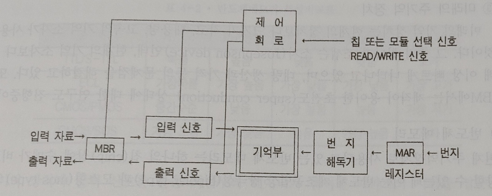 

- 기억부 
    * 주어진 프로그램이나 데이터를 기억해 두는 2진 기억 소자(memory cell)들이 2차원 행렬(matrix)로 구성되어 있다.  
    
- 메모리 주소 레지스터(MAR : Memory Address Register) 
    * 프로그램이나 데이터를 입출력하기 위한 번지를 가지고 있다.  
    
- 메모리 버퍼 레지스터(MBR : Memory Buffer Register) 
    * 입출력하고자 하는 프로그램이나 데이터를 임시 보관하는 레지스터  
    
- 번지 선택 회로 
    * MAR(메모리 주소 레지스터)에 의하여 기억 장소를 선택하는 회로  
    
- 제어 회로 
    * 기억 장치에 저장하라는 Write 신호와 기억 장치로부터 읽어내리는 Read 신호를 발생시키는 회로 
    * 칩이나 모듈 개념으로 여러개로 나누어 구성될 경우 칩 선택 신호나 메모리 모듈 선택 신호가 필요하다.  
    
### 2) 기억 장치에 저장하는 외부 동작의 순서 
1. 기억 장치의 위치(번지)를 MAR(메모리 주소 레지스터)에 넣는다. 
2. 프로그램이나 데이터의 비트를 MBR(메모리 버퍼 레지스터)에 넣는다. 
3. 입력 신호로 MBR(메모리 버퍼 레지스터)의 내용이 메모리에 저장된다.  

### 3) 기억 장치로부터 읽어낼 때 외부 동작 순서 
1. 읽어내려는 프로그램이나 데이터 번지를 MAR에 넣은 후 출력신호를 준다. 
2. 메모리의 해당 내용이 MBR로 옮겨져 외부로 출력하게 된다.  

### 4) 어드레스(Address) 
* 메모리에서 한 워드의 위치를 식별하는 주소(숫자) 
* 메모리소자 또는 시스템에 저장된 각 워드는 고유의 주소를 갖는다. 
* 주소는 보통 2진수, 8진수, 16진수로 표현되고, 편의를 위해 10진수로 표현되기도 한다. 
* 메모리에 있는 특정 워드의 위치를 언급할 때마다 그것을 식별하기 위해서 그 위치의 주소코드를 사용한다. 

# !모든 프로그램은 주기억 장치에서만 실행된다!
* 그래서 주기억 장치(RAM)의 용량이 클수록 더 많은 정보를 기억하고 실행할 수 있기 때문에 비싸다.   

***********************************

# 컴퓨터 하드웨어 주기억 장치의 종류
 
## 주기억 장치의 종류 
* 컴퓨터 하드웨어 기술의 발전은 기억 용량의 급속한 증가와 함께 기억 소자 크기의 감소, 그리고 가격면에서 급격한 하락을 가져왔다.  
 
### 1. 과거의 주기억 장치
- 초기
* 처음엔 진공관을 사용했다. 진공관 한 개는 1비트의 정보를 나타내는데, 그 크기와 전력 소모, 열 발생 등으로 문제점이 많았다. 이후 적은 전력 소모와 신뢰성을 가진 트랜지스터(transistor)가 사용된다.  
 
- 1960년대 초반 ~ 1970년대 중반
* 자기 코어(magnetic core)가 기억 소자로 사용되었다. 매우 작은 링(ring) 형태로 되어 있으며, 페라이트(ferrite)라는 자기 재료를 사용해서 페라이트 코어 메모리라고도 한다.  

* 기억 원리
    * 코어의 링을 통과하는 도선에 전류를 흘려 '플레밍의 오른손 법칙'에 따라 **자화**의 방향을 바꾸어 준다. 
    * 자기 코어는 한 번 1 또는 0의 상태가 되면 어떠한 변화를 주지 않는 한 계속 자화 상태를 유지하여 정보를 기억하게 되고, 여러 개의 코어를 코어판(core plane)의 형태로 묶어서 사용하게 된다.  
    
* 자화(magnetization)
    * 물질을 자기장 속에 놓았을 때 그 물질 전체가 갖는 거시적인 자기(磁氣)모멘트
    * 물질의 자기적 성질은 주로 전자의 자기모멘트에 연유하는데, 전자가 가진 극히 작은 미시적인 자기모멘트가 많이 모여, 그 총합으로 거시적으로 물질이 나타내는 자기모멘트를 **자화**라고 한다.  
    
* 플레밍의 오른손 법칙
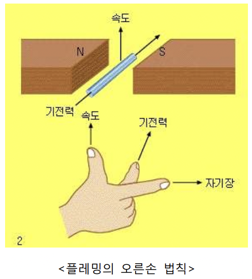 
    * N극에서 S극 방향으로 자기장이 형성되었을 때 그림처럼 자기장의 방향과 수직으로 도체(금속 막대 등)가 움직이고 있다면 전류는 가운데 손가락 방향으로 흐른다.
    * 엄지손가락 방향 : 도체를 움직이는 힘(속도)의 방향
    * 두번째 손가락 방향 : 자기장의 방향
    * 가운데 손가락 방향 : 전류가 흐르는 방향

### 2. 현재의 주기억 장치
* 1960년대 후반부터 반도체 집적 회로(IC : Integrated Circuit) 기술의 개발과 함께 기억 소자로의 적용이 추진된 후, 1968년에는 주기억 장치의 버퍼 메모리로 사용되기 시작했다. 
* 집적 회로는 집적도, 소비 전력, 소형성, 경제성 등으로 코어 메모리를 대체하여 널리 이용되고 있다.  

### 3. 미래의 주기억 장치
* 현재보다 크기가 작고, 대용량, 고속의 기억 소자가 사용될 것이라 예상된다.
* 그 중 하나가 조셉슨 소자(Josephson device)인데, 현재의 기억 소자보다 10배 이상 빠르게 나타나고 있으며 대량 생산과 가격 등의 문제점을 해결하고 있다. 
**********************************

# 반도체 메모리
* 현재 주기억 장치로 사용되고 있는 반도체 메모리는 하나의 칩(chip)상에 수메가 비트를 저장할 수 있다. 반도체 제조공법상 쌍극성(bipolar type)과 모스형(mos type)의 두 가지로 구분된다.  

## 메모리의 제조기술적인 분류에 따른 특성 
1) 밀도(chip당 bit 용량) 
2) 속도 
3) 소비전력(bit당 mW) 
4) bit당 cost(반도체 제조가격 측면) 
5) Noise 면역성  

## 읽기동작(read operation)과 쓰기동작
* 특별한 메모리위치(주소)에 저장되어 있는 2진 워드가 감지되어 다른 소자에 전달되는 동작
* 만약 100번 주소에 있는 메모리에서 워드 4를 사용하려 한다면 주소 100번에서 읽기동작을 실행해야 한다.
* 한 워드를 메모리부터 가져오기 때문에 패치(fetch)동작이라고도 한다.  

## 접근 시간(access time)
* 기억 장치가 출력 신호를 받은 시간부터 데이터가 출력된 때까지의 시간
* 자기 코어 기억 장치에서는 접근 시간과 복원 시간을 합해서 사이클(cycle) 시간이라 하며, IC 메모리에서는 사이클 시간이 접근 시간과 같다.
* 메모리소자 동작속도의 측정치로 읽기동작하는 데 필요한 시간이라고도 할 수 있으며, 이는 주소입력 순간으로부터 메모리 내용의 출력순간까지의 시간이다.  

## 랜덤 액세스메모리(RAM)
* 한 메모리 워드의 실제 물리적 위치가 그 위치로부터 읽거나 쓰는 데 걸리는 시간이 얼마나 걸리는가에는 영향을 받지 않는 메모리이다. 즉 액세스시간이 메모리의 모든 주소에 대해서 같은 메모리이다.
* 대부분의 반도체메모리와 코어메모리는 RAM이다.
    * 사용 예 : CDP(컴팩트 디스크 플레이어)는 적당한 코드를 입력함으로써 어떤 한 노래를 선택하든간에 같은 시간을 갖는다.   

# 순차 액세스 메모리(SAM)
* 액세스시간이 일정하지 않고 주소위치에 따라 변하는 메모리의 한 형태이다. 
* 원하는 주소에 도달할 때까지 모든 주소위치를 통하여 저장된 워드를 순차적으로 찾기 때문에 랜덤 액세스메모리보다 더 긴 액세스시간을 갖는다.
    * 사용 예 : 자기테이프, 디스크, 자기버블메모리  
    
## 읽기전용메모리(ROM)
* 읽기동작이 쓰기동작보다 매우 많은 응용분야를 위해 설계된 반도체메모리의 종류
* 기술적으로 (주로 제작자에 의해)단 한 번만 프로그래밍되어 쓸 수 있으며, 이후로는 내용을 수정할 수 없으며 읽기만 가능하다.
* 모든 ROM은 비휘발성이며 전원이 제거되어도 데이터는 그대로 저장된다.
* 한 번 이상 쓰기동작을 할 수 있는 메모리 RMM(Read Mostly Memory)도 있는데 읽기동작보다 쓰기동작이 훨씬 복잡하기 때문에 자주 사용되지는 않는다.  
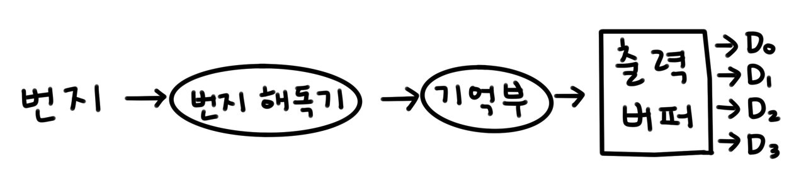 
> ROM의 구성도 
* ROM은 읽어내기만 하기 때문에 기억부와 번지 해독기, 출력 버퍼만으로 구성된다.  

### 프로그램이나 자료 저장 방법에 따른 ROM 분류
- 마스크(Mask) ROM : 사용자의 요구에 따라 제작사가 자료를 넣기 때문에 내용을 바꿀 수는 없지만 대량 생산에 적합
- PROM(Programmable ROM) : 제작시에 아무런 내용을 넣지 않은 상태로 만들어져서 사용자가 원하는 내용을 저장할 수 있다. 하지만 한 번 기억되면 그 내용을 변경할 수 없다.
- EPROM(Erasable ROM) : ROM의 내용을 자외선 삭제 장치로 지울 수 있다. 지운 후에 새로운 내용을 써 넣는 것도 가능
- EEPROM(Electrically Erasable PROM) : ROM의 내용을 전기신호로 지울 수 있다. 지운 후에 새로운 내용을 써 넣는 것도 가능  

## 정적 램(static RAM device, SRAM)
* 전원이 인가되는 동안은 저장된 데이터가 영원히 저장되고, 주기적으로 데이터를 다시 쓸 필요가 없는 반도체 메모리장치
* 플립플롭 조합으로 구성되어 있다.  

## 동적 램(dynamic RAM device, DRAM)
* 전원이 인가되어도 저장된 데이터가 영원히 유지되지 못하며, 데이터가 메모리에 주기적으로 다시 쓰여져야 저장된 데이터가 계속 저장되는 반도체메모리
* 이러한 주기적 동작을 리플레시(refresh)동작이라 한다.  

## 휘발성 메모리(volatile memory)
* 전원이 제거되면 메모리에 있는 모든 정보가 소실된다.
* 반도체메모리가 휘발성 메모리에 해당한다.  

## 캐시 메모리(cache memory)
* SRAM과 구성이 동일하다.
* 기억 용량은 작으나 속도가 매우 빠른 버퍼(buffer) 메모리로 주기억 장치와 CPU와의 속도 차이를 줄여서 처리의 효율을 높이기 위해서 사용된다.
* 캐시 기억 장치의 호출 시간은 주기억 장치의 호출 시간보다 5~10배 정도 빠르다.
* 전체 기억 장치 시스템의 총 소요 시간을 최소화하면서 가능한 하 높은 평균 액세스 속도를 얻기 위해서 사용한다.   

# 메모리의 연결
* 컴퓨터 내부메모리는 어드레스(Address) 버스, 데이터(Data) 버스, 제어(Control) 버스라는 세 종류의 버스로 CPU에 연결되는 신호선이 구성된다.  

## 버스 
1) 어드레스 버스 : CPU에서 메모리 IC까지 2진 어드레스 출력을 전달하는 단방향 버스 
2) 데이터 버스 : CPU와 메모리 IC 사이에 데이터를 옮기는 양방향 버스 
3) 제어 버스 : CPU에서 메모리 IC까지 제어신호들 전달  

## CPU의 쓰기동작 순서 
1) CPU가 데이터가 저장될 메모리 위치에 2진 어드레스 공급. 어드레스 버스선에서 이 어드레스를 인가한다. 
2) CPU가 데이터 버스선에 저장될 데이터 인가 
3) CPU가 메모리 쓰기 동작을 위해 제어신호선 동작시킴 
4) 메모리 IC들은 저장될 위치를 선택하기 위해 2진 어드레스 해독 
5) 데이터 버스에 있는 데이터가 선택된 메모리 위치로 전송됨  

## CPU의 읽기동작 순서 
1) 어드레스 버스선에 이 어드레스 인가. CPU가 데이터의 메모리 위치의 2진 어드레스 공급 
2) CPU가 메모리 읽기동작을 위해 제어신호선 활성화 시킴 
3) 메모리 IC중에서 읽기동작이 실행되는 위치를 선택하기 위해, 2진 어드레스를 해독한다. 
4) 메모리 IC들은 선택된 메모리 위치로부터 데이터 버스에 데이터 인가. 데이터가 전송되는 곳으로부터 CPU로 데이터 인가  

# 메모리 맵(Memory Map)
* 원하는 용량 및 워드사이즈에 알맞게 응용하기 위해 메모리칩을 조합하거나 큰 용량을 나누어 쓰는 것   
************************************

# 보조 기억 장치
* 주기억 장치는 적은 자료를 기억하여 고속으로 처리한다.
* <U>**그에 반해 많은 양의 자료를 기억시켜 관리하기 위한 장치**</U>를 보조 기억 장치 또는 2차 기억 장치(secondary memory)라 한다.
* 보조 기억 장치의 자료를 액세스하는 방법에 따라 <U>**순차 액세스**</U>와 <U>**임의 액세스**</U>로 분류할 수 있다.  

## 순차 액세스(sequential access)
* 물리적으로 저장된 순서에 따라 자료를 검색해 나가기 때문에 일괄 처리(batch processiong)에 적합하다.
* 그렇기 때문에 빠른 액세스가 요구되는 실시간 처리에는 잘 사용되지 않는다.
    * 사용 예 : 자기 테이프  
    
## 임의 액세스(random access)
* 원하는 레코드에 직접 액세스할 수 있는 방식
* 레코드를 순차적으로 읽지 않기 때문에 원하는 데이터를 빠르게 검색할 수 있다.
* 주로 실시간 처리 시스템에서 사용된다.
    * 사용 예 : 자기 디스크   
    

# 보조 기억 장치의 종류
## 자기 테이프(magnetic tape)
* 플라스틱 테이프의 표면에 자성 도료를 입혀 제작된 것  

1) 특성 
* 녹음 테이프와 비슷하게 생겼는데 폭이 1/2~3/4인지 정도로 넓고 기록 밀도가 높다. 
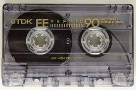  
* 대량의 자료를 반영구적으로 보관할 수 있고 가격이 저렴하다는 장점을 가지고 있다.
* 하지만 테이프가 릴에 순차적으로 감겨 있기 때문에 자료의 순차적 처리만 가능하다.  

2) 기록 밀도 
* 자기 테이프 1릴(reel)의 길이는 보통 800, 1,200, 1,600, 2,400 피트(feet) 등이며, 테이프의 기록 밀도는 테이프 1인치 당 저장될 수 있는 문자(character)의 수 혹은 바이트(byte)의 수로 계산 되고 있다.
* 이 기록 밀도의 단위를 BPI(Byte Per Inch)라고 하며 800, 1,600, 3,200, 6,250, 20,000BPI 등의 기록 밀도가 있다.
* 자기 테이프는 최초로부터 4~5m 지점에 BOT(Beginning of Tape) 마커가 있고 끝의 6~7m 앞지점에 EOT(End of Tape) 마커가 있는데, 이 부분에는 자료를 수록할 수 없다.
* 자기 테이프는 7개 또는 9개의 트랙(track)으로 구성되어 데이터를 표현한다.
* 자료의 저장은 ASCII 코드나 EBCDIC 코드로 표현된다.
* 파일의 갱신과 보수를 쉽게 하기 위하여 레이블을 사용하는데 레이블에는 표준 레이블, 비표준 레이블, 레이블이 없는 것 세 가지 종류가 있다.  

3) 저장 방법 
* 레코드는 자기 테이프에 순차적으로 기록되고 읽혀진다.
* 이 때 테이프가 레코드를 읽거나 기록하는 과정에서 테이프를 출발시키거나 멈추게 하는데는 물리적인 가속 및 감속 구간이 필요한데, 이를 IRG(Inter Record Gap)로 나타낸다.
* IRG의 길이는 약 0.3~0.75인치로 각 레코드마다 IRG를 두게 되면 그만큼 저장할 수 있는 공간이 줄어들기 때문에 비효율적이다.
* 따라서 효율성을 위해 몇 개의 레코드를 묶어서 한 개의 물리적 레코드로 만들어 준다.
* 이것을 블록화라고 하며 하나의 블록에 포함된 논리 레코드의 수를 블록화 인수, 각 블록 사이의 간격을 IBG(Inter Block Gap)라 한다.  

4) 자기 테이프의 레코드 형식 
* 고정 길이 비블록 레코드(fixed unblock record)
    * 블록화되지 않은 고정 길이 레코드
    * 물리 레코드와 논리 레코드의 길이가 같다.
* 고정 길이 블록 레코드(fixed block record)
    * 블록화된 고정 길이 레코드
    * 레코드의 길이가 일정하며 하나의 물리 레코드 내에 2개 이상의 논리 레코드가 존재한다.
* 가변 길이 비블록 레코드(variable unblock record)
    * 블록화되지 않은 가변 길이 레코드
    * 각 논리 레코드의 길이가 일정하지 않다.
* 가변 길이 블록 레코드(variable block record)
    * 블록화된 가변 길이 레코드
    * 길이가 일정하지 않은 논리 레코드가 블록화되어 있는 형식이다.
* 부정 형식 레코드(undefined record)
    * 길이를 나타내는 필드가 없는 가변 길이 레코드
    * 비블록 레코드이다.  
    
## 자기 디스크 장치 
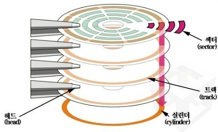 
* 대용량을 저장할 수 있고 임의로 호출이 가능하기 때문에 은행 업무, 좌석 예약 업무 등 실시간 처리가 요구되는 자료 처리에 효율적이다.
* 처리 속도는 1,200 ~ 3,600 회전/분이며, 기록 밀도는 한 트랙당 3,000 ~ 13,000바이트, 즉 60만 ~ 520만 바이트가 수록된다.
* 자기 디스크 장치는 여러 디스크가 하나의 축에 연결되어 있는데 이것을 디스크 팩(pack)이라 한다.
* 그리고 각 면의 트랙을 수직으로 연결한 트랙군을 실린더(cylinder)라 한다.
* 트랙과 실린더에는 고유 번호인 트랙 번호와 실린더 번호가 있어서 기억 매체상의 주소(address)가 할당되어 있기 때문에 데이터에 직접 액세스 하는 것이 가능하다.  

## 자기 드럼 장치(magnetic drum) 
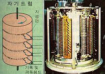 
* 초기에 사용되던 주기억 장치
* 새로운 기억 장치가 개발되면서 보조 기억 장치로 사용되기 시작했지만 현재는 그마저도 잘 안 쓴다.
* 직경 20~30cm인 금속 원통의 표면에 자성 물질을 입힌 드럼으로 드럼을 회전시킬 때 표면에 헤드를 접근시켜 기억된 내용을 읽거나 새로운 내용을 기억시킨다.  

## 플로피 디스크 장치(floppy disk) 
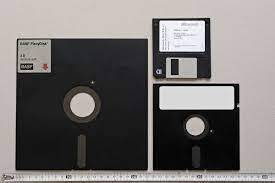 
* 자기 디스크와 같이 데이터를 직접 액세스하며 가볍고 취급이 간편한 반면, 먼지, 햇볕, 열 또는 자성 물질에 가까이 두지 않는 등 관리상 주의가 필요하다.
* 기록 방법에 따라 단밀도, 배밀도, 고밀도 등이 있으며, 2D는 양면 배밀도를 뜻하고 2HD는 양면 고밀도를 뜻한다.  

## 하드 디스크(hard disk) 
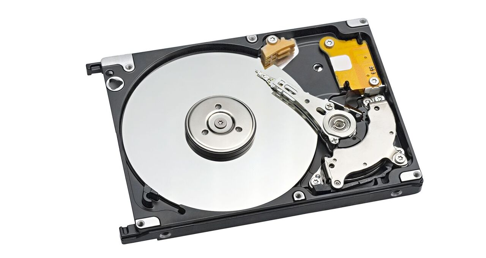 
* 개인용 컴퓨터의 보조 기억 장치로 널리 사용되고 있다.
* 동작 속도는 ms로 나타내며, 보통 평균 액세스 속도와 트랙간 이동 속도, 최대 이동 거리 속도 등을 표시한다.
* 평균 속도가 빠를수록 전체적으로 동작이 빠르며 가격도 높아진다.
* 하드 디스크는 본체에 내장되어 사용되는 것이 보통이나 기억 용량의 증가, 편의성 등으로 외장형 하드 디스크도 사용되고 있다.  

## 광학 디스크(optical disk) 
* 레이저를 이용해서 자료를 기록한다.
* 레이저가 필요한 표면에 도착하면 표면을 태워서 비트 형태의 데이터를 저장한다.
* 광학 디스크는 데이터가 잘 지워지지 않는 백업 파일, 역사적 기록 등의 분야에 이용된다.  

### 광 디스크의 종류 
#### 1) CD-ROM(Compact Disk-Read Only Memory) 
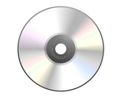 
* 지름이 12cm인 소형 디스크 위에 정보를 기록, 저장 및 검색할 수 있는 형식의 시스템으로 광학 드라이브를 이용해서 읽을 수 있다.
* 원본에 정보를 기록하기 위해서는 WORM 장치가 사용된다.
* 오디오 디스크, 비디오 디스크, 각종 상품화된 소프트웨어의 저장에 이용된다.  

#### 2) WORM(Write Once Read Memory) 
* 디스크에 단 한 번만 정보를 기록할 수 있고 기록한 후에 지울 수 없고 판독만 할 수 있는데, 그 후에는 드라이브에 있는 데이터가 삭제되지 않도록 보호하는 데이터 저장기술이다.
* 문서용 파일, 비디오용 파일 등에 이용된다.  

#### 3) MO DISK(Magneto Optical Disk) 
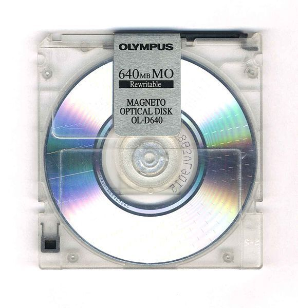 
* 자기광학 디스크라고도 하며 자기박막의 광자기 효과를 이용하여 자료를 기록하고 읽어낼 수 있는 CD-ROM 형태의 외부 기억 매체
* 자료를 기록할 때엔 레이저광을 사용하여 자화시키는데 이 자화가 유지되어 정보가 기록된다.
* 판독시엔 피트(pit : 광자기 디스크 표면의 미세한 홈)에 반사되는 빛의 유무로 데이터를 판독한다.
* 광자기 디스크는 3.5인치 디스켓보다는 빠르지만 하드 디스크보다는 느리다.
* 광자기 디스크는 자료 백업용 기억매체로 사용하기 좋으며 이동이 간편하고 신뢰성이 높은 것이 장점이다.
* 오디오용, 비디오용, 컴퓨터 데이터 파일 등에 이용된다.  

#### 4) DVD 
* CD에서 더 발전한 광학 디스크 기술을 이용하는 저장매체이다.
* 외형은 CD와 같지만 다른 포맷으로 저장되며 높은 용량을 가지고 있다.
* DVD는 MPEG-2 파일과 압축 표준을 사용한다.
* MPEG-2 이미지들은 MPEG-1 이미지의 4배 해상도를 가지며, 2개의 필드가 하나의 이미지 프레임을 구성하는 상황에서 초당 60개의 인터레이스드 필드(Interlaced Field)를 전송할 수 있다. (MPEG-1은 초당 30개의 인터레이스되지 않은 프레임을 전송한다)  

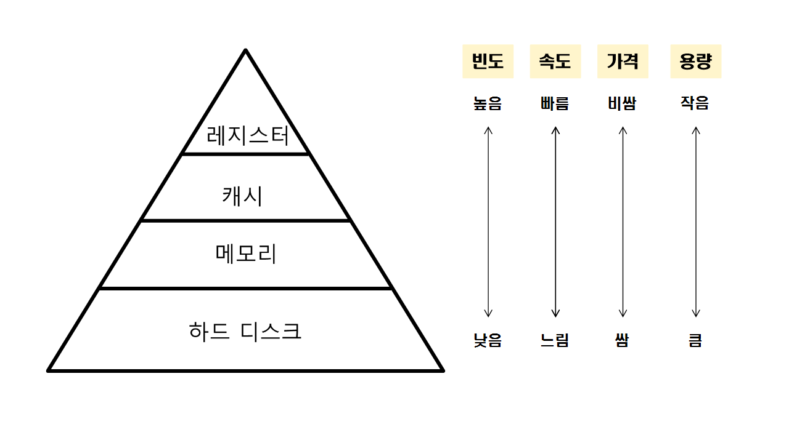 
> 메모리 계층 구조 
*********************************

# 산술 논리 연산 장치(ALU : Arithmetic and Logic Unit)
* 제어 장치의 지시에 따라 실제 자료 처리가 이루어지는 곳
* 사칙연산, 논리연산, 비교연산, 자리 이동(shift) 등을 수행한다.  

# 산술 논리 연산 장치의 구성
* 가산기(adder), 레지스터(register), 보수기(complementary) 등으로 구성된다.  
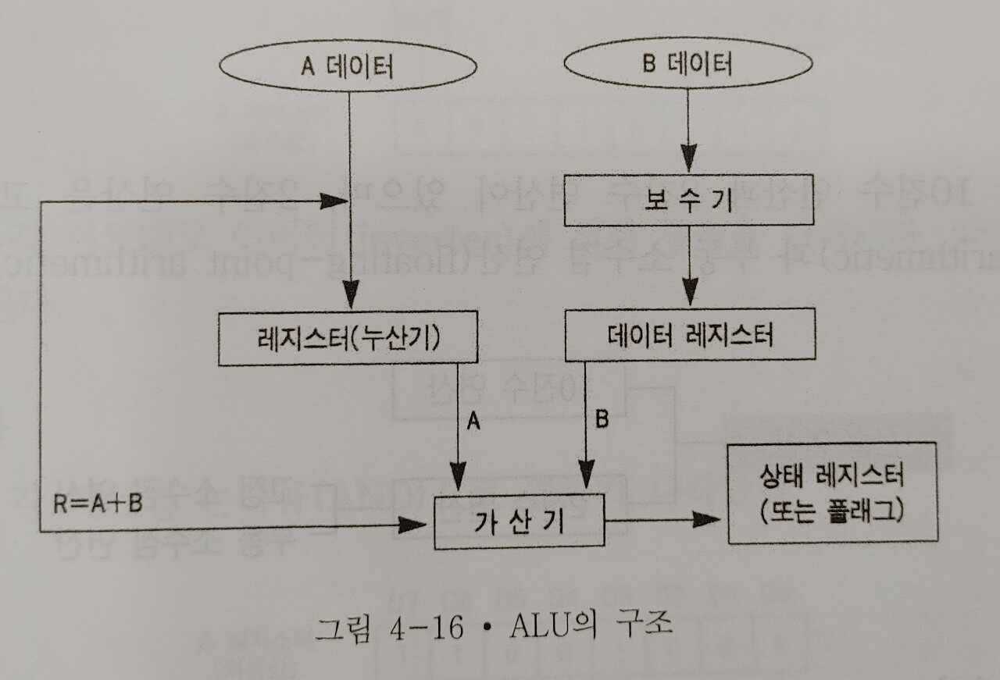  

## 1) 누산기(ACC : accumulator)
* 연산 장치의 중심이 되는 레지스터
* 초기에는 연산될 데이터의 보관 장소로 사용되며, 연산 후에는 산술 및 논리 연산 결과를 일시적으로 보관한다.
    * => **연산 결과값**을 일시적으로 기억  
    
## 2) 데이터 레지스터(data register)
* 연산에 필요한 데이터가 두 개인 경우, 하나의 데이터를 일시적으로 보관하고 있다가 필요할 때 제공하는 역할을 수행한다.
* 기억 레지스터(storage register)라고도 한다.
    * => **연산에 필요한 데이터**를 일시적으로 보관  
    
## 3) 가산기(adder)
* 누산기와 데이터 레지스터에 보관된 두 값을 더하여 그 계산 결과를 다시 누산기에 보관한다.  

## 4) 상태 레지스터(status register)
* 연산 결과가 양(0)인지 음(1)인지, 또는 자리 올림(carry)이나 오버플로우가 발생했는지 등의 연산에 관계되는 상태와 인터럽트(interrupt) 신호를 기억한다.  

## 5) 보수기(complementary)
* 어떤 수를 보수로 바꾸어 주는 회로로서 뺄셈을 수행할 때 빼는 수를 보수로 바꾸어 가산기에 입력함으로써 감산의 결과를 얻을 수 있다.
* 보수에는 1의 보수와 2의 보수가 있는데 주로 2의 보수를 많이 사용한다.   

# 산술 연산
## 1) 10진수 연산
* 부호가 있는 10진수 수치 자료의 연산을 수행하는 것
* 가감승제는 팩형 10진수(packed decimal) 형태의 데이터가 사용된다.  

## 2) 2진수 연산
* 고정 소수점 연산과 부동 소수점 연산으로 나누어진다.
* 고정 소수점 연산은 일정한 길이의 바이트에 표시된 고정 소수점 수를 연산하는 것으로 10진수 연산보다 처리 속도가 빠르다.
* 부동 소수점 연산은 부호 비트, 지수부, 소수부로 구성되어 있으며, 부동 소수점 연산을 위해서는 특수 목적을 가진 레지스터가 필요하다.
* 부동 소수점 연산은 매우 큰 수나 작은 수를 다룰 수 있으며 연산 처리 속도가 고속이다.   

# 논리 연산
* 사칙연산을 제외한 문자 처리
* 로드(load), 스토어(store), 분기(branch), NOT, AND, OR 등의 논리 연산과 자리이동(shift), 순환이동(rotate) 등이 있다.
* 이러한 데이터 처리는 비트나 바이트로 처리된다.
    * 로드 : 기억 장치에서 CPU의 레지스터로 이동하는 것
    * 스토어 : 레지스터에서 기억 장치로 이동하는 것
    * 분기 : 명령의 실행 순서를 변경하는 것. 무조건 분기와 조건 분기가 있다. 
********************************

# 적재와 프로그램과 프로세스
* 적재(로드 load) : 보조기억장치(HDD 등) -> 주기억장치(RAM)로 이동
* 프로그램(Program) : 하드디스크에 들어있는 상태 (아직 실행은 되지 않은 상태임)
* 프로세스(Process) : 주기억장치에 로드된 상태의 프로그램(실행되고 있는 프로그램)
    * 실행(load)되면 비로소 프로세스가 된다.
    * 그러므로 인터넷 브라우저를 켜서 쓰고 있다면 **인터넷 브라우저 프로세스를 사용**하고 있다고 할 수 있다.(인터넷 브라우저 프로그램 사용중이라고 하는거 **아님!!**) 
********************************

# 제어 장치
* 프로그램에 의해 주어진 연산의 순서를 실행해 나가기 위하여 기억 장치, 연산 장치, 입,출력 장치에 신호를 보내고, 또 이들 장치로부터 신호를 받아 다음에 수행해야 할 조작을 결정하는 부분
* 컴퓨터의 중추선이라 할 수 있다.
* 컴퓨터의 자료 처리 속도를 `MIPS(Million Instructions Per Second)`로 나타내는데 `1MIPS`는 1초에 백만 개의 명령어가 처리될 수 있다는 것을 의미한다.   

## 제어 장치의 구성
* 제어 장치(control unit)는 주기억 장치에 연결되어 있는 명령어를 순서대로 호출하고 해독하여 그 결과에 따라 연산 장치, 기억 장치, 입,출력 장치에 제어 신호를 보내 원하고자 하는 동작을 유도한다.  

### 1. 프로그램 계수기(PC : Program Counter)
* 명령의 실행 순서를 정하기 위하여 다음에 실행될 명령이 들어 있는 번지를 기억해 두는 레지스터
* 명령어 계수기(IC : Instruction Counter) 혹은 위치 계수기(LC : Location Counter)라고도 한다.  

### 2. 명령 레지스터(IR : Instruction Register)
* 프로그램 계수기(`PC`)가 지정한 번지에 기억되어 있는 명령을 꺼내어 이 명령을 해석하기 위하여 임시로 보관하여 두는 레지스터
* 명령부와 번지부로 구성되어 있다.
    * 명령부 : 실행 명령 코드(operation code)가 들어 있다.
    * 번지부 : 데이터가 기억되어 있는 번지(operand)가 들어 있다.
* 명령부의 명령 코드가 해독기에 옮겨져 해독되며 번지부의 번지가 번지 해독기에 이송되어 해독된다.  

### 3. 명령어 해독기(Instruction Decoder)와 기계 사이클 부호기
* 명령어 해독기 : 명령 레지스터의 명령부에 있는 명령 코드를 해독하여 기계 사이클 부호기에 그 신호를 보내는 장치
* 기계 사이클 부호기 : 명령어 해독기로부터 보내져 온 명령을 실행하는 데 필요한 신호를 만들어 시간 통제 및 제어 장치에 보낸다.  

### 4. 시간 통제 및 제어 장치(Timming and Control Unit)
* 기계 사이클 부호기에서 수신된 신호를 기계 사이클의 클럭에 따라 동기시켜 필요한 최종 신호를 만들어 순서대로 각 장치들로 송출  

### 5. 범용 레지스터(General Register)
* `CPU` 내에서 자료를 처리하는 과정에 자료를 일시적으로 보관하는 장치  

### 6. 작업 레지스터(Working Register)
* 산술 논리를 수행하는 레지스터로 처리 결과를 보관하는 장치  

### 7. 플래그 레지스터(Flag Register)
* 상태 레지스터(Status register)라고도 하며 `CPU`의 연산 결과 상태를 저장
* 처리 결과 0(zero), 부호(sign), 오버플로우(overflow), 자리올림(carry), 인터럽트(interrupt) 등의 발생 여부를 나타내는 특수 목적 레지스터   

## 제어 장치의 동작
1. `기억 장치`에 있는 명령을 꺼낸다(인출 사이클(fecth cycle))
2. `PC`(프로그램 계수기)에 초기 번지를 저장하면 주기억 장치의 명령이 그림의 `a`, `b`, `c` 순서로 명령 레지스터(`IR`)에 옮겨온다. 
3. 레지스터에는 1개의 명령 내용인 명령 코드와 번지부가 기억된다. 명령 해독기와 기계 사이클 부호기를 통해 해독된다.
4. 각 장치에 신호를 보내고, 시간 통제 및 제어 장치를 통해 외부 장치들에게 제어 신호를 송출한다.
5. 이 과정에서 `PC`의 주기억 장치의 번지는 자동으로 증가된다.  

### 1. 인출 사이클(Fetch cycle)
* `기억 장치`의 번지를 확인하여 명령을 읽어낼 때까지의 단계로 이 기간 동안에 명령이 `주기억 장치`에서 제어 장치 내의 `레지스터`로 옮겨진다.

#### 🔸 인출 사이클 진행 과정
1. 현 `PC`(프로그램 계수기)의 내용을 `CPU` 내부 버스를 통하여 `MAR`(메모리 주소 레지스터)로 전송한다.
2. `MAR`의 값에 의해 주어진 메모리 주소의 내용(명령어)을 데이터 버스를 통하여 `MBR`(메모리 버퍼 레지스터)에 저장한다.
3. `PC`의 값이 증가한다.
4. `MBR`의 내용(명령어 코드)을 `IR`(명령 레지스터)로 이동한다.  

### 2. 실행 사이클(Execution cycle)
* 읽어진 명령에 의해 필요한 신호를 만들어 결과를 얻을 때까지의 단계
* `명령 레지스터`의 `명령 코드` 내용이 명령 해독기에 의해 `해독`되고, 해독된 내용은 부호기에 의해 각 장치로 신호를 보내게 된다.
* 해독된 내용이 가산 명령이면 부호기의 신호에 의해 누산기(accumulator)의 내용이 소거되고, 명령 레지스터의 번지부가 주기억 장치의 번지 지정에서 산출되어 기억 레지스터로 옮긴 후 누산기와 가산기의 연산에 의해 계산된 결과는 누산기에 임시 저장된다.
* 여기까지 끝나면 실행 사이클이 끝나고 다시 인출 사이클이 시작된다. 이러한 과정을 기계 사이클(machine cycle)이라 한다.  

### 3. 인터럽트(Interrupt)
* `CPU`의 플래그 레지스터는 인터럽트에 관한 정보를 포함한다.
* 인터럽트가 `CPU`에 가해지면 현재 처리 프로그램을 일단 중지시키고, 인터럽트 프로그램을 수행시킨다.
* 인터럽트는 `CPU`의 제어 버스에 속하며, 인터럽트용 전기 신호 단자에 의해 `CPU`가 인지하게 된다.
* 어떤 처리 프로그램의 실행중에 제어 프로그램의 서비스를 요구하는 예기치 못한 일이 발생했을 때에 이걸 하드웨어로 포착해서 감시 프로그램(Supervisor)에게 제어권을 인도하기 위한 기능
* 인터럽트가 발생하여 제어권이 제어 프로그램(Control program)에 주어지면 제어 프로그램이 중에 준비된 인터럽트 처리 루틴(Interrupt handling routine)이 실행된다. 이 루틴의 처리가 끝나면 시스템은 인터럽트가 발생하기 전 상태로 되돌아가서 먼저 실행되던 프로그램의 실행을 다시 시작한다.  

#### 🔸 인터럽트 종류
##### 1. 기계 체크 인터럽트(Machine check interrupt)
* 어떤 프로그램 실행중에 장치 착오로 인하여 발생하는 인터럽트
* 기계에 착오가 발생했을 경우에 인터럽트가 일어나 제어 프로그램으로 제어권이 넘어간다.
* 제어 프로그램 내의 인터럽트 처리 루틴이 `CPU`의 제어권을 인도받아서 필요한 진단이나 착오 정정의 처리를 수행한 후 제어권을 다시 처리 프로그램에 되돌려 준다.  

##### 2. 외부 인터럽트(External interrupt)
* 오퍼레이터가 필요에 의해서 콘솔에 있는 인터럽트 키를 누를 때 발생하는 인터럽트
* 오퍼레이터가 시스템에 어떤 요구나 응답을 할 때 필요하다.
* 인터럽트 키를 누름으로써 인터럽트가 발생하여 오퍼레이터가 필요한 내용의 명령을 손으로 조작할 수 있다.  

##### 3. 프로그램 인터럽트(Program interrupt)
* 프로그램 실행중에 프로그램 상의 착오나 예외 상태가 발생했을 경우 일어나는 인터럽트  

##### 4. 입,출력 인터럽트(I/O interrupt)
* `CPU`는 입,출력 조작의 계시를 명령하는 것 뿐이지 실제로 입,출력 조작을 지시하는 것은 채널에서 이루어진다. 그래서 채널이 입,출력 조작을 함과 동시에 `CPU`는 다른 처리를 한다.
* 입,출력 조작이 끝나거나 입,출력 착오가 발생되면 `CPU`의 서비스가 필요해지므로 채널이 인터럽트 신호를 발생시킨다.
* 이 때 `CPU`는 제어 프로그램 중의 인터럽트 처리 루틴(I/O Interrupt handling routine)이 실행된다.  

##### 5. 제어(감시) 프로그램 호출 인터럽트(Supervisor call interrupt)
* 시스템에 의하여 자동적으로 발생하는 인터럽트가 아닌 프로그램 내에서 특정한 서비스를 요구하는 명령으로 인터럽트를 일으키는 경우
******************************************

# 출처
* 컴퓨터 사이언스(김철 저)

