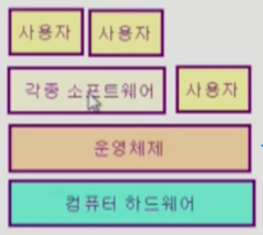
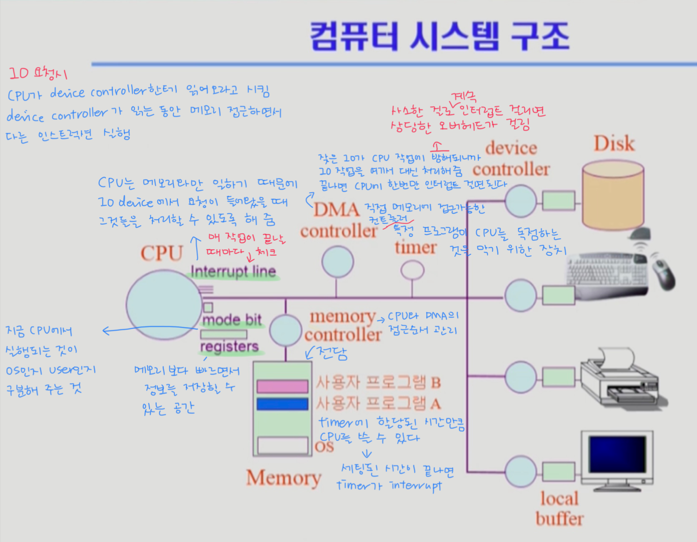
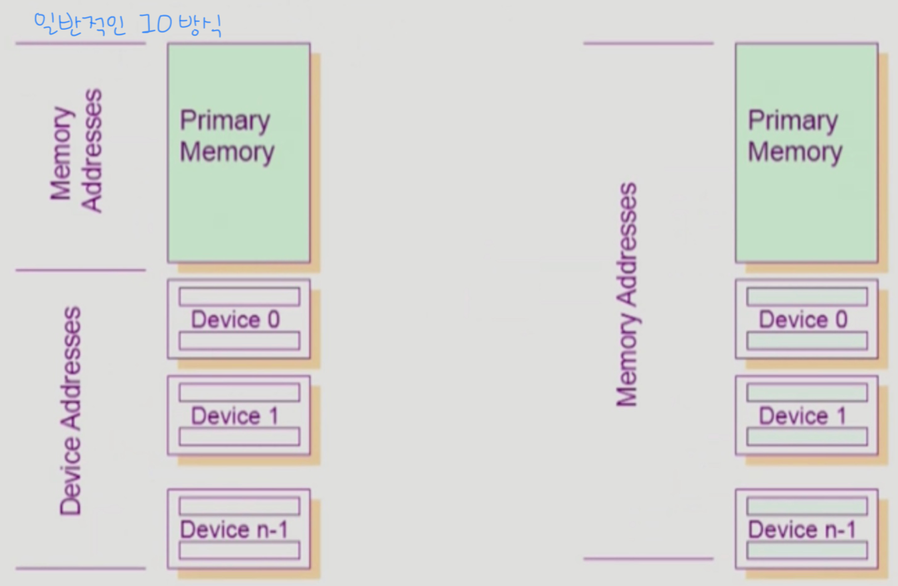
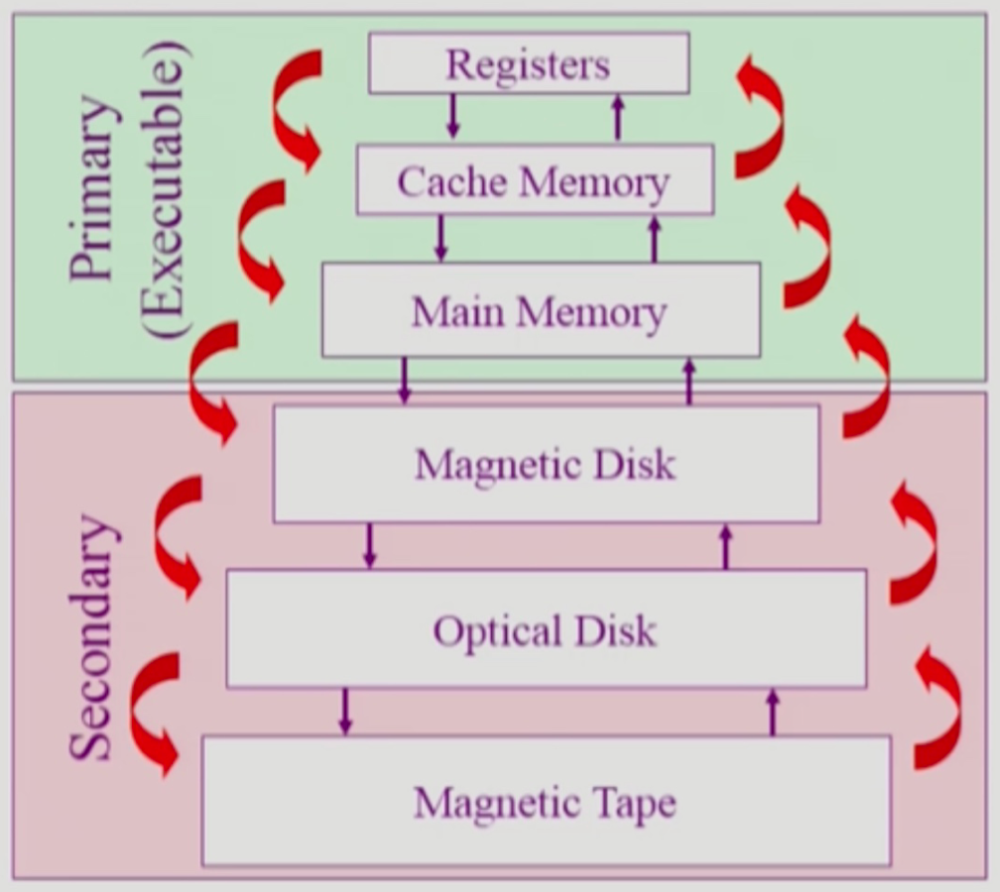
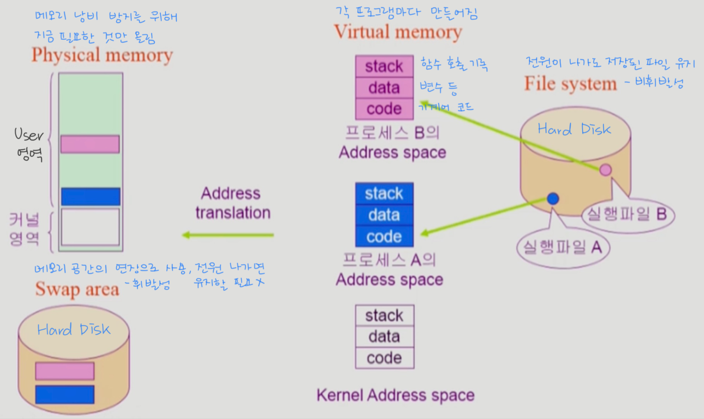
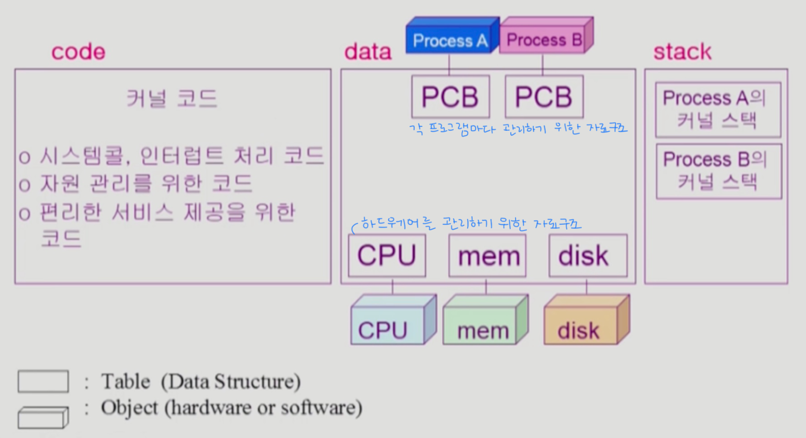
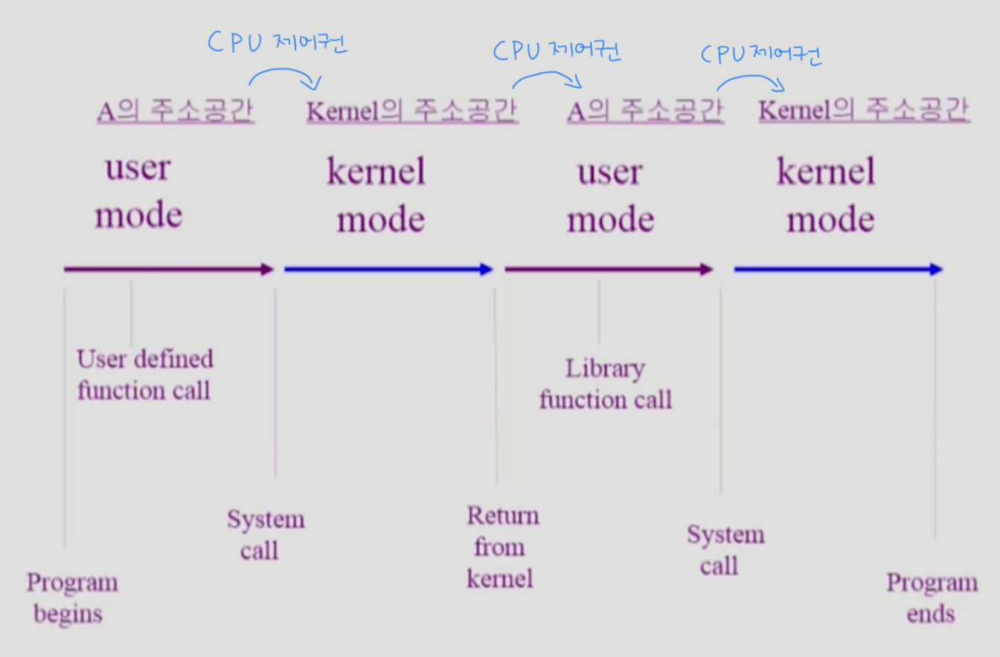

# 운영체제 
## 목차 
* [운영체제란?](#운영체제란)
* [컴퓨터 시스템 구조](#컴퓨터-시스템-구조)
* [프로세스](#프로세스)
* [스케줄러 (Scheduler)](#스케줄러-scheduler)
* [스레드 (Thread)](#스레드-thread)

# 운영체제란?
* Operating System, OS
* 컴퓨터 하드웨어 바로 위에 설치되어 사용자 및 다른 모든 소프트웨어와 하드웨어를 연결하는 소프트웨어 계층  
  

* 좁은 의미의 운영체제(커널)
    * 운영체제의 핵심 부분으로 메모리에 상주하는 부분
    * 전공자 입장에서는 운영체제 하면 커널만을 이야기한다.
    
* 넓은 의미의 운영체제
    * 커널 뿐 아니라 메모리에 상주하지 않는 각종 주변 시스템 유틸리티를 포함한 개념  
    
## 🔸 운영체제의 목적 
1. 컴퓨터 시스템을 편라하게 사용할 수 있는 환경 제공
2. 컴퓨터 시스템의 **자원을 효율적으로 관리**
    * 하드웨어 자원인 프로세서, 기억장치, 입출력 장치들의 관리와
    * 소프트웨어 자원인 프로세스, 파일, 메시지 등 모든 것을 관리한다.
    * 사용자간의 형평성 있는 자원 분배가 가능해야 하고 **주어진 자원으로 최대한의 성능**을 낼 수 있어야 한다.
    * 실행 중인 프로그램들은 CPU를 번갈아가며 차지하며 동작을 하게 되는데 이 때 운영체제는 한 프로그램이 CPU를 너무 오랫동안 쓰지 않고 짧은 시간동안 번갈아 쓰도록 할당해 주어야 한다.
    * 또한 실행 중인 프로그램들에게 메모리 공간을 적절히 분배해 주어야 한다.  
    
## 🔸 운영체제의 분류
* 동시 작업 가능 여부
* 사용자의 수
* 처리 방식  
* 위 세 가지에 따라 분류할 수 있는데 현대 운영체제는 동시 작업이 가능하고 다중 사용자를 지원하며 시분할이 가능하다고 정리할 수 있다.

### ☑️ 동시 작업 가능 여부
#### 단일 작업(single tasking)
* 한 번에 하나의 작업만을 처리한다.
* 예) MS-DOS 프롬프트 상에서는 한 명령의 수행을 끝내기 전에 다른 명령을 수행시킬 수 없음
* 과거에 MS-DOS에서 주로 사용되던 방식으로 현대 컴퓨터에선 쓰이지 않지만 엘리베이터처럼 기능이 단순하거나 특수 목적을 수행하는 기계에는 지금도 사용되고 있다.
    
#### 다중 작업(multi tasking)
* 동시에 두 개 이상의 작업 처리
* 예) UNIX, MS Windows 등에서는 한 명령의 수행이 끝나기 전에 다른 명령이나 프로그램을 수행할 수 있음
* 스마트폰을 포함한 현대의 대부분의 하드웨어에서 사용되는 운영체제이다.  
    
### ☑️ 사용자의 수
#### 단일 사용자(single user)
* 예) MS-DOS, MS Windows
    
#### 다중 사용자(multi user)
* 예) UNIX, NT server
* 사용자가 많아지면 파일에 대한 접근 권한이나 사용자간 자원 분배를 형평성 있게 해 줄 수 있어야 한다.  
    
### ☑️ 처리 방식
#### 일괄 처리(batch processing)
* Interactive 하지 않은 방식
* 작업 요청을 일정량 모아서 한꺼번에 처리
* 작업이 완전 종료될 때까지 기다려야 함(하루 이상 걸림)
* 에) 초기 Punch Card 처리 시스템
    
#### 시분할(time sharing)
* Interactive한 방식
* 현대에 주로 사용하는 운영체제로 일반적인 범용 컴퓨터에서 사용
* 여러 작업을 수행할 때 컴퓨터 처리 능력을 일정한 시간 단위로 분할해서 사용
* 일괄 처리 시스템에 비해 짧은 응답 시간을 가짐(UNIX)
* 하지만 응답 시간이 항상 고정된 것은 아니며 사용자가 많아지면 느려질 수 있다. 
* 사람이 빠르다고 느끼면서 주어진 자원과 시간을 최대한 활용하는 것이 목적이다.
    
#### 실시간(Realtime OS)
* 정해진 시간 안에 어떠한 일이 반드시 종료됨이 보장되어야 하는 실시간시스템을 위한 OS
* 원자로/공장 제어, 미사일 제어, 반도체 장비, 로보트 제어 등 특수 목적을 가진 시스템에서 사용된다.

##### ▪️ 실시간 시스템의 개념 확장
* Hard realtime system(경성 실시간 시스템)
    * 데드라인을 지키지 않으면 큰일나는 시스템
    * 예) 반도체, 미사일 등
    
* Soft realtime system(연성 실시간 시스템)
    * 데드라인을 좀 못 지켜도 괜찮은 시스템
    * 예) OTT  
    
## 🔸 비슷한 의미로 사용되지만 약간 다른 용어들
* `Multitasking` : 하나의 프로그램이 끝나기 전에 다른 프로그램 작업이 가능한 것
* `Multiprogramming` : 여러 프로그램이 메모리에 올라가 있는 것을 강조
* `Time sharing` : `CPU`의 시간을 분할하여 나누어 쓴다는 것을 강조
* `Multiprocess` : 여러 프로그램이 동시에 실행된다.
* => 모두 컴퓨터에서 여러 작업을 동시에 수행한다는 것을 뜻하지만 어디에 더 초점을 맞추느냐에 따라 다르게 사용된다.

### ☑️ Multiprocessor
* 하나의 컴퓨터에 `CPU(processor)`가 여러 개 붙어 있음을 의미
* `CPU`가 하나임을 전제로 하는 위의 네 가지 용어들과는 하드웨어적으로 다르다.  

## 🔸 운영체제의 예
### ☑️ 유닉스(UNIX)
* 멀티태스킹 가능
* 다중 사용자용
* 대형 서버용
* 코드의 대부분을 C언어로 작성 - 기계어 사용에 어려움이 많아서 유닉스 개발용으로 C언어를 만들었다.
* 높은 이식성 - 다른 기계어 집합을 사용하는 컴퓨터에 이식이 쉽다.
* 최소한의 커널 구조
* 복잡한 시스템에 맞게 확장 용이
* 소스 코드 공개 - 학술적으로 사용하기 좋다.
* 프로그램 개발에 용이
* 다양한 버전
    * System V, FeeBSD, SunOS, Solaris - 유로. 소스 코드 비공개
    * Linux - 무료. 소스 코드 공개. 유닉스보다는 규모가 작은 환경이나 개인용 컴퓨터에 사용된다.
    
### ☑️ DOS(Disk Operating System)
* MS사에서 1981년 IBM-PC를 위해 개발
* 단일 사용자용 운영체제
* 싱글태스크
* 메모리 관리 능력의 한계(주 기억 장치 최대 용량 : 640KB)

### ☑️ MS Windows
* MS사의 다중 작업용 GUI 기반 운영체제
* Plug and Play, 네트워크 환경 강화
* DOS용 응용 프로그램과 호환성 제공
* 불안정성(초창기 윈도우즈)
* 풍부한 지원 소프트웨어

### ☑️ Handheld device를 위한 OS
* PalmOS, Pocket PC(WinCE), Tiny OS  

## 🔸 운영체제의 구조
* 크게 `CPU` - `memory` - `Disk` - `I/O device` 구조

### ☑️ CPU
* `CPU 스케줄링`을 통해 실행중인 프로그램들에게 `CPU`를 효율적으로 할당해야 함
* `CPU`에게는 선착순 처리가 효율적이지 않기 때문에 프로그램마다 걸리는 작업 시간에 따라 처리하도록 스케줄링한다.

### ☑️ memory
* 프로그램을 실행하려면 `memory`에 올려야 하는데 `memory`는 한정되어 있기 때문에 적당히 잘 쪼개어 써야 한다.
* 최근에 많이 사용된 데이터는 오래 보관하고 그렇지 않으면 쫓아내는 방식으로 관리

### ☑️ Disk
* `Disk`에는 헤드가 있고 그 헤드를 움직이면서 일정 위치에 파일을 기록하기 때문에 I/O 요청이 들어왔을 때 헤드를 최대한 적게 움직이면서 최대한 빠르게 많이 처리할 수 있도록 처리 순서를 스케줄링 해야 한다.

### ☑️ I/O device
* 지금까지 나온 장치들 중에선 가장 느리다.
* 때문에 `인터럽트` 기반으로 관리되며 `CPU`는 평소에는 자기 할 일을 하고 있다가 `I/O` 장치에서 `인터럽트` 요청이 들어오면 입출력을 수행하는 방식으로 진행된다.

### ☑️ 프로세스 관리
* 프로세스의 생성과 삭제
* 자원 할당 및 반환
* 프로세스 간 협력

### ☑️ 그 외
* 보호 시스템
* 네트워킹
* 명령어 해석기(command line interpreter)
*******************************

# 컴퓨터 시스템 구조 

  

* `CPU`는 매 시간마다 `Memory`에서 기계어 `Instruction`을 읽어서 실행하게 된다.
* 따라서 `Memory`는 `CPU`의 작업공간이라 할 수 있다.
* `Disk`가 `I/O` 장치인 이유는 데이터를 `Memory`에서 읽어들이기도 하고 처리된 데이터를 가져와서 저장하기도 하기 때문이다.  

* `device controller`는 각 `I/O device`를 전담하는 작은 `CPU` 역할을 한다.
* `I/O device`가 `CPU`에 비해 많이 느려서 `CPU`가 `I/O` 작업 처리가 끝나는 것을 마냥 기다릴 수는 없기 때문에 중간에 `controller`를 둬서 `I/O` 작업이 끝나면 `CPU`에게 알려준다.
* `local buffer`는 각 `I/O device controller`의 작업공간이다. 
* 입력받은 내용이나 출력할 내용을 여기에 저장해뒀다가 `device controller`가 사용자 프로그램으로 전달하거나 화면에 출력하는 등의 작업을 한다.  

## Mode bit
* 사용자 프로그램의 잘못된 수행으로 다른 프로그램 및 운영체제에 피해가 가지 않도록 하기 위한 보호 장치가 필요해서 사용한다.
* 현재 수행중인 `Instruction`이 운영체제인지 사용자 프로그램인지 구분하기 위한 것
* `0`과 `1`이라는 두 가지 `operation`을 사용해 `모니터 모드`와 `사용자 모드`를 구분한다.
    * `1` 사용자 모드 : 사용자 프로그램 수행
    * `0` 모니터 모드(= 커널 모드, 시스템 모드) : `OS` 코드 수행
    
* 보안을 해칠 수 있는 중요한 명령어는 모니터 모드에서만 수행 가능한 `특권명령`으로 규정한다.
* `Interrupt`나 `Exception` 발생시 `하드웨어`가 `mode bit`을 0으로 바꾼다.
* 사용자 프로그램에게 `CPU`를 넘기기 전에 `mode bit`을 1로 세팅  

## Timer
* `CPU`를 특정 프로그램이 독점하는 것으로부터 보호하기 위해서 사용한다.
    * 정해진 시간이 흐른 뒤 운영체제에게 제어권이 넘어가도록 `Interrupt`를 발생시킨다.
    * `Timer`는 매 클럭 틱 때마다 1씩 감소한다.
    * `Timer` 값이 0이 되면 `Timer Interrupt` 발생  
    
* `time sharing`을 구현하기 위해 널리 이용된다.
* 현재 시간을 계산하기 위해서도 사용된다.  

## Device Controller
* 해당 `I/O` 장치유형을 관리하는 일종의 작은 `CPU`
* 제어 정보를 위해 `control register`, `status register`를 가진다.
    * `CPU`는 `device controller`를 통해 일을 시키는데 이 때 `control register`와 `status register`를 사용한다.
* `local buffer`를 가진다.(일종의 `data register`)  

* `I/O`는 실제 `device`와 `local buffer` 사이에서 일어난다.
* `device controller`는 `I/O`가 끝났을 경우 `Interrupt`로 `CPU`에 그 사실을 알린다.  

### ☑️ device driver(장치구동기)
* `OS` 코드 중 각 장치별 처리루틴 ➡️ `software`
    * ex) 새 프린터를 사면 설치하는 프린터용 드라이버
    
### ☑️ device controller(장치제어기)
* 각 장치를 통제하는 일종의 작은 `CPU` ➡️ `hardware`  

## 입출력(I/O)의 수행
* 모든 입출력 명령은 `특권명령`이다.

### ☑️ 사용자 프로그램의 `I/O` 방법
* 시스템콜(`system call`)
    * 사용자 프로그램은 운영체제에게 `I/O` 요청
* `trap`을 사용하여 인터럽트 벡터의 특정 위치로 이동
* 제어권이 인터럽트 벡터가 가리키는 인터럽트 서비스 루틴으로 이동
* 올바른 `I/O` 요청인지 확인 후 `I/O` 수행
* `I/O` 완료 시 제어권을 `system call` 다음 명령으로 옮김  

## 인터럽트(Interrupt)
* 인터럽트 당한 시점의 레지스터와 `program counter`를 저장한 후 `CPU`의 제어를 인터럽트 처리 루틴에 넘긴다.

### ☑️ 넓은 의미의 인터럽트
* `Interrupt` (하드웨어 인터럽트) : 하드웨어가 발생시킨 인터럽트로 일반적인 의미의 인터럽트
* `Trap` (소프트웨어 인터럽트)
    * `Exception` : 프로그램이 오류를 범한 경우(프로그램 강제종료 등으로 대응)
    * `System call` : 프로그램이 커널 함수를 호출하는 경우
* 일반적으로 인터럽트 하면 하드웨어적인 인터럽트를 의미하고 소프트웨어적인 인터럽트는 `Trap`이라고 따로 지칭한다.

### ☑️ 인터럽트 관련 용어
* 인터럽트 벡터 
    * 해당 인터럽트의 처리 루틴 주소(처리 위치)를 가지고 있다.
* 인터럽트 처리 루틴(= `Interrupt Service Routine`, 인터럽트 핸들러)
    * 해당 인터럽트를 처리하는 커널 함수
    
### 🔸 현대의 운영체제는 인터럽트에 의해 구동된다.
* 만약 인터럽트가 없으면 `CPU`는 항상 사용자 프로그램이 쓰고 있게 될 것이다.  

## 시스템콜(System Call)
* 사용자 프로그램이 운영체제의 서비스를 받기 위해 `커널 함수`를 호출하는 것
* 사용자 프로그램이 `I/O` 등의 작업을 수행해야 할 때 `시스템콜`을 통해 운영체제에게 `CPU`를 넘겨줌으로서 필요한 서비스를 받을 수 있게 된다.  

## 동기식 입출력과 비동기식 입출력
### ☑️ 동기식 입출력 (Synchronous I/O)
* `I/O` 요청 후 입출력 작업이 완료된 후에야 제어가 사용자 프로그램에게 넘어간다.  

* 구현 방법 1 (잘 안 씀)
    * 하나의 `I/O`가 끝날 때까지 그거 하나만 한다.
    * `I/O`가 끝날 때까지 `CPU`를 낭비시킴
    * 매시점 하나의 `I/O`만 일어날 수 있음  
    
* 구현 방법 2 (보통 이렇게 구현함)
    * `I/O`가 완료될 때까지 해당 프로그램에게서 `CPU`를 빼앗음
    * `I/O` 처리를 기다리는 줄에 그 프로그램을 줄 세움
    * 다른 프로그램에게 `CPU`를 줌
    * 이 프로그램의 `I/O` 작업이 끝나면 다시 `CPU`를 준다.
    
### ☑️ 비동기식 입출력 (Asynchronous I/O)
* `I/O`가 시작된 후 입출력 작업이 끝나기를 기다리지 않고 제어가 사용자 프로그램에게 즉시 넘어간다.

### 🔸 두 경우 모두 `I/O`의 완료는 인터럽트로 알려준다.

## DMA(Direct Memory Access)
* 입출력 장치를 메모리에 가까운 속도로 처리하기 위해 사용한다.
* `CPU`의 중재 없이 `device controller`가 `device`의 `buffer storage`의 내용을 메모리에 `block` 단위로 직접 전송
* `byte` 단위가 아니라 `block` 단위로 인터럽트를 발생시킴  

## 서로 다른 입출력 명령어 

  

* 일반적인 `I/O` 방식은 메모리를 관리하는 주소와 디바이스를 관리하는 주소를 따로 관리한다.
* `Memory Mapped` 방식은 디바이스를 관리하는 주소도 메모리 영역에서 함께 관리한다.  

## 저장장치 계층 구조 

  

* 위로 갈수록 `Speed` ⬆️  `Cost` ⬆️(단위공간당 용량이 적어진다)  `Volatility` ⭕️ (`휘발성` - 전원을 끄면 데이터가 사라진다)
    * `CPU`에서 직접 접근 가능(`byte` 단위 접근 가능)
* 아래로 갈수록 `Speed` ⬇️  `Cost` ⬇️(단위공간당 용량이 커진다)  `Volatility` ❌ (`비휘발성` - 전원을 꺼도 데이터가 사라지지 않는다)
    * `CPU` 직접 접근 불가(`byte` 단위 접근이 불가능하며 `섹터` 단위 접근 가능)
    
### ☑️ Caching
* 메인 메모리에 있는 내용 중 당장 필요한 것만 캐시 메모리에 올려 쓰는 것으로 재사용을 빠르게 하기 위한 목적  

## 프로그램의 실행(메모리 load) 

  

## 커널 주소 공간의 내용 

  

## 사용자 프로그램이 사용하는 함수
* 모든 프로그램은 함수 구조로 짜여 있다. (기계어 레벨에서도 함수의 시작과 끝이 표시됨)  

* 사용자 정의 함수
    * 자신의 프로그램에서 정의한 함수  
    
* 라이브러리 함수
    * 자신의 프로그램에서 정의하지 않고 만들어져 있는 것을 가져다 쓴 함수
    * 자신의 프로그램의 실행 파일에 포함되어 있다.

### ☑️ 이 두 가지는 자신의 프로그램의 코드 영역에 포함되어 있어서 가상 메모리 안에서 자유롭게 점프가 가능하다.  

* 커널 함수
    * 운영체제 프로그램의 함수
    * 커널 함수의 호출 = 시스템 콜

### ☑️ 커널 함수는 커널의 코드 영역에 포함되어 있기 때문에 사용자 프로그램에서 자유로운 점프를 할 수 없다. ➡️ `System call`을 통해 운영체제에게 `CPU` 제어권을 넘기게 된다.  

## 프로그램의 실행 

*************************************

# 프로세스
* 프로세스란 실행 중인 프로그램을 말한다.

## 프로세스의 문맥(context)
* 현대 프로세스는 멀티태스킹 환경이기 때문에 이 작업 저 작업 왔다갔다 하면서 실행하려면 프로세스가 어디까지 실행했었는지를 알 수 있는 문맥 정보가 필요하다.  

* `CPU` 수행 상태를 나타내는 하드웨어 문맥
    * Program Counter
    * 각종 register  
    
* 프로세스의 주소 공간
    * code, data, stack  
    
* 프로세스 관련 커널 자료 구조
    * PCB (Process Control Block) : 프로세스가 실행될 때마다 하나씩 만들어서 프로세스에 `CPU`, `메모리`를 얼마나 줘야 할 지, 어디까지 실행했는지 이상 행동을 하지는 않는지 관리하기 위한 자료구조
    * Kernal stack : 프로세스마다 별도로 둔다.

## 프로세스의 상태 (Process State)
* `CPU`가 하나라고 가정했을 때 프로세스는 상태가 변경되며 수행된다.

### Running
* `CPU`를 잡고 `instruction`을 수행중인 상태
* `Time interrupt`, `System call`이 생기게 되면 `CPU`를 다시 내어주게 된다.

### Ready
* `CPU`를 기다리는 상태(메모리 등 `CPU`를 얻기 위한 다른 조건을 모두 만족하고)
* `CPU`를 얻기 위한 `Ready queue`에서 기다리고 있다.

### Blocked (wait, sleep)
* `CPU`를 주어도 당장 `instruction`을 수행할 수 없는 상태
* `Process` 자신이 요청한 event(ex. I/O)가 즉시 만족되지 않아 이를 기다리는 상태
    * 예) 디스크에서 파일을 읽어와야 하는 경우
    
### New
* 프로세스가 생성중인 상태

### Terminated
* 수행(execution)이 끝난 상태인데 작업이 완전히 끝난 것은 아니고 정리할 것이 남아있는 상태이다.  

## PCB (Process Control Block)
* 운영체제가 각 프로세스를 관리하기 위해 프로세스당 유지하는 정보
* 다음의 구성 요소를 가진다(구조체로 유지).
1) `OS`가 관리상 사용하는 정보
- Process state, Process ID
- scheduling information, priority  

2) `CPU` 수행 관련 하드웨어 값
- Program counter, registers  

3) 메모리 관련
- Code, data, stack의 위치 정보  

4) 파일 관련
- Open file descriptors...  

## 문맥 교환 (Context Switch)
* `CPU`를 한 프로세스에서 다른 프로세스로 넘겨주는 과정
* `CPU`가 다른 프로세스에게 넘어갈 때 운영체제는 다음을 수행한다.
    * `CPU`를 내어주는 프로세스의 상태를 그 프로세스의 `PCB`에 저장
    * `CPU`를 새롭게 얻는 프로세스의 상태를 `PCB`에서 읽어옴  
    
❗️ `System call`이나 `Interrupt` 발생시 반드시 `Context switch`가 일어나는 것은 아니다. 
`System call`이나 `Interrupt` 발생 후 다른 프로세스에게 `CPU`를 넘겨줬을 때 `Context switch`가 일어나는 것이지 같은 프로세스에게 다시 `CPU`를 줬을 때엔 `Context switch`가 일어난 것이 아니다.  

* `Context switch`가 일어나면 `cache memory`를 비워야 하는데 이거 자체가 상당한 오버헤드를 일으킨다.  

## 프로세스를 스케줄링하기 위한 큐
### Job queue
* 현재 시스템 내에 있는 모든 프로세스의 집합

### Ready queue
* 현재 메모리 내에 있으면서 `CPU`를 잡아서 실행되기를 기다리는 프로세스의 집합

### Device queues
* `I/O device`의 처리를 기다리는 프로세스의 집합  

🔸 프로세스들은 각 큐들을 오가며 수행된다.  

# 스케줄러 (Scheduler)
## Long-term scheduler (장기 스케줄러 or job scheduler)
* 시작 프로세스 중 어떤 것들을 `ready queue`로 보낼지 결정
* 프로세스에 `memory(및 각종 자원)`을 주는 문제 결정
* `degree of Multiprogramming`(메모리에 올라가 있는 프로세스의 수) 제어
* 하지만 `time sharing system`에는 보통 장기 스케줄러가 없다(무조건 `ready`)

## Short-term scheduler (단기 스케줄러 or CPU scheduler)
* 어떤 프로세스를 다음번에 `running` 시킬지 결정
* 프로세스에 `CPU`를 주는 문제 결정
* 충분히 빨라야 함 (millisecond 단위)

## Medium-term scheduler (중기 스케줄러 or Swapper)
* `time sharing system`에서는 중기 스케줄러를 사용한다.
* 여유 공간 마련을 위해 일부 프로세스를 통째로 메모리에서 디스크로 쫓아낸다.
* 프로세스에게서 `memory`를 뺏는 문제 결정
* `degree of Multiprogramming` 제어

## 중기 스케줄러를 사용하면서 바뀌는 프로세스의 상태
### Running
* `CPU`를 잡고 `instruction`을 수행중인 상태
* `Time interrupt`, `System call`이 생기게 되면 `CPU`를 다시 내어주게 된다.

### Ready
* `CPU`를 기다리는 상태(메모리 등 `CPU`를 얻기 위한 다른 조건을 모두 만족하고)
* `CPU`를 얻기 위한 `Ready queue`에서 기다리고 있다.

### Blocked (wait, sleep)
* `I/O`등의 `event`를 (스스로) 기다리는 상태
    * 예) 디스크에서 파일을 읽어와야 하는 경우
* 자신이 요청한 `event`가 만족되면 `Ready` 상태가 된다.

### Suspended (stopped)
* 외부적인 이유로 프로세스의 수행이 정지된 상태
* 프로세스는 통째로 디스크에 `swap out` 된다.
    * 예) 사용자가 프로그램을 일시 정지시킨 경우 (break key)
    * 시스템이 여러 이유로 프로그램을 잠시 중단시킴(메모리에 너무 많은 프로세스가 올라와 있을 때)
* 외부에서 `resume` 해 주어야 `Active` 상태가 된다.
**************************************************

# 스레드 (Thread)
* 프로세스 하나에 `CPU` 수행단위(`Program Counter`)만 여러개 두고 있는 것
* 스레드를 사용하는 이유는 메모리 절약과 수행속도를 높이기 위해서라고 볼 수 있다. 
* 만약 같은 프로세스를 여러개 실행시키고 싶을 때 프로세스를 여러개 만들면 그만큼 메모리 공간을 할당해야 하니까 메모리 낭비가 커진다. 그리고 그 프로세스들 간에 문맥 교환이 일어난다면 오버헤드도 클 것이다. 
* 하지만 프로세스의 주소공간(메모리)은 함께 쓰면서 각 프로그램마다 `PCB`에 코드를 어디까지 실행했는지만 저장해 놓고 코드 영역에서 각자 다른 부분의 코드만 실행하면 메모리를 아낄 수 있다(그 프로그램에 저장된 데이터와 코드가 바뀌는 것이 아니니까). 즉, 프로세스의 `Code`와 `Data` 영역만 함께 쓰는 것이다. 
* 하지만 각 스레드별로 함수를 어디까지 실행했는지 등의 정보는 각자 알고 있어야 하기 때문에 함수 실행과 관련된 정보를 저장하는 `Stack`영역은 따로 사용해야 한다. 
* 그래서 하나의 프로세스를 만들고 스레드를 생성하면 `code`와 `data` 영역은 공유하고 각 스레드의 `stack` 영역이 여러개 만들어진다.   

## 스레드 사용의 장점
### 응답성 - 사용자 입장에서 빠르게 느껴진다
* 만약 웹페이지를 로드한다고 했을 때 이미지와 텍스트를 불러오는 작업은 상당히 시간이 걸리는 작업인데 스레드를 하나만 써서 웹페이지가 완전히 완성될 때까지 기다렸다가 사용자에게 보여주면 웹페이지를 표시하기 위한 작업이 끝날 때까지 사용자는 빈 화면만 보고 있을 것이다. 이것은 굉장히 답답하게 느껴진다.
* 이 때 멀티 스레드를 사용해 작업을 하면 한 스레드가 이미지를 불러오는 동안 다른 스레드는 일찍 로드된 텍스트를 사용자에게 먼저 보여주고 있는다든지 하는 일을 수행할 수 있게 된다. 그러면 답답함을 많이 줄일 수 있다.

### 자원 공유
* 위에서 서술했듯이 프로세스는 하나만 두고 `PC`랑 `register`만 따로 사용해서 프로세스를 실행하면 자원을 효율적으로 쓸 수 있다. 

### 경제성
* 실행 속도 측면에서도 프로세스를 추가하는 것 보다는 스레드를 추가하는 것이 훨씬 빠르다. 
* 문맥 교환이 일어났을 때에도 스레드 간에 하는 것이 오버헤드가 훨씬 적다.

### 병렬성
* `CPU`가 여러개인 환경에서 각각의 스레드가 병렬적으로 작업을 할 수 있어 동시에 처리할 수 있는 작업이 늘어난다.  

## 스레드의 구현 스타일
* 스레드를 구현하는 스타일이 다 같지 않다. 

### Kernel Threads
* 운영체제의 지원을 받아 관리되는 스레드
* 그래서 `OS`가 스레드의 존재를 알고 있다.
* 예) `Windows 95/98/NT`, `Solaris`, `Digital UNIX`, `Mach`

### User Threads
* 사용자 레벨에서 라이브러리의 지원을 받아 관리되는 스레드
* 그래서 `OS`는 스레드의 존재를 알 수 없다. `OS` 입장에서 보면 프로세스 하나가 실행되고 있는 것이다.
* 사용자 프로세스 스스로가 스레드를 관리한다. 
* 예) `POSIX Pthreads`, `Mach C-threads`, `Solaris threads`  

그리고 `real-time`으로 관리되는 스레드가 있는데 그냥 이런게 있구나 정도로 알고 있으면 된다고 한다.

