# SQL 문법<br>
# 목차<br>
* [DB 구동 및 접속](#DB-구동-및-접속)<br>
* [SELECT 구문을 사용한 데이터 검색](#SELECT-구문을-사용한-데이터-검색)<br>
* [WHERE(조건문)절과 ORDER BY(정렬)절](#WHERE조건문절과-ORDER-BY정렬절)<br>
* [단일 행 함수](#단일-행-함수)<br>
* [쿼리구문에 큰 따옴표 사용 문법](#쿼리구문에-큰-따옴표-사용-문법)<br>
* [GROUP BY절과 HAVING절](#group-by절과-having절)
* [JOIN](#join)
* [Subquery](#subquery)
* [데이터조작어(DML)](#데이터조작어dml)

# DB 구동 및 접속<br>

## 1. Linux 부팅 및 터미널 실행
* Windows에서 가상 PC를 실행한 뒤 Linux 부팅 후 로그인한다.
* Linux 부팅이 완료되면 **마우스 우클릭 - 터미널 열기**

## 2. Listener 시작
```
$ lsnrctl start
```
* Listener를 시작한다. 
* Listener는 네트워크를 이용하여 클라이언트에서 오라클 서버로 연결하기 위한 오라클 네트워크 관리자이다.
* 리스너를 시작하지 않아도 DB 구동엔 문제가 없지만 네트워크를 통한 연결은 모두 리스너가 담당하기 때문에 리스너를 시작하지 않으면 DB에 접속하고자 하는 클라이언트들이 접속할 수 없다. 
* 따라서 터미널이 실행되면 가장 먼저 리스너를 시작한 후 다음 프로세스를 진행한다.<br><br>

## 3. SqlPlus 실행
```
$ sqlplus /nolog
```

## 4. Database 접속
```
$ conn 아이디/비밀번호 as sysdba(권한)
```
### 🔸 DB User
* sysdba : dba + DB 생성 + DB 시작/종료 권한
* system : dba 권한
* hr : Object(테이블, 뷰, 시퀀스 등) 생성 및 운영 권한<br><br>

## 5. Database 시작
```
SQL> startup
```

## 6. HR 사용자로 DB Login
```
SQL> conn 아이디/비밀번호
```

## 7. 사용자 확인
```
SQL> show user
```
* HR 사용자로 최종 로그인 되었는지 확인한다.

### 🔸 User 비밀번호 변경 방법
```
SQL> alter user 아이디
     identified by 새 비밀번호;
```
***********************************

# SELECT 구문을 사용한 데이터 검색
* SQL 문법은 기본적으로 대소문자를 구분하지 않는다. 

## 문법
```sql
SELECT * | {[DISTINCT] column | expression [alias], ...}
FROM   table;
```

## 1. 테이블 구조 조회
```sql
DESCRIBE employees
```
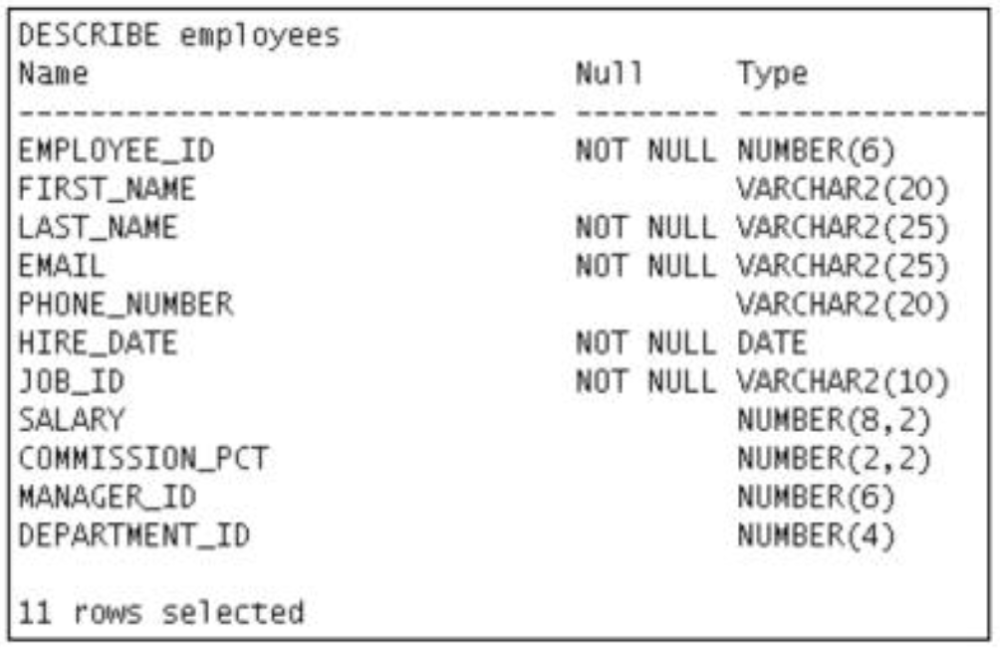<br><br>

## 2. 테이블로부터 데이터 검색
### 1) SELECT 구문
```sql
SELECT *
FROM   department;
```
* '*'은 모든 것을 보여달라고 할 때 사용한다.
* SQL 구문 또한 세미콜론(;)을 사용해서 문장이 끝났다는 것을 표시하기 때문에 명령어를 실행하려면 마지막에 세미콜론을 꼭 찍어줘야 한다.<br>

```sql
SELECT department_id, location_id
FORM   departments;
```
* SELECT 뒤에 컬럼명을 지정하면 해당 컬럼에 해당하는 내용들만 보여달라는 뜻이 된다.<br>

```sql
SELECT last_name, salary, 12*salary+100
FROM   employees;
```
* **12*salary+100** 처럼 내가 원하는 계산을 한 결과를 출력하게 할 수도 있다.<br><br>

#### 🔸 입력한 명령어 수정 (마지막으로 쓴 명령어와 비슷한 명령어를 또 써야 할 때 유용하다)
* SQL에서는 가장 마지막에 입력한 구문 하나만 버퍼에 저장되어서 이것을 수정할 수 있다.
```sql
ed
```
* 위 명령어를 입력하고 엔터를 치면 버퍼를 수정할 수 있는 모드에 들어갈 수 있다.
```sql
i
```
* 를 누르면 하단에 --INTSERT--가 표시되며 버퍼에 저장된 명령어를 수정할 수 있다.
* 이 때 구문의 마지막에 세미콜론을 입력하면 **안 된다!!!**
* 모든 수정이 끝나면 ESC를 눌러 수정을 종료한 뒤
```sql
:wq
```
* 위 명령어를 입력하면 버퍼 수정 모드를 빠져나온다.
```sql
/ + ENTER
```
* '/'를 입력하고 엔터를 누르면 버퍼에 저장된 명령어를 실행하는 동작이다. 모든 수정을 마치고 나와서 '/' + 엔터를 실행해주면 아까 수정했던 명령어가 실행되는 것을 볼 수 있다.<br><br>

### 2) null값이란?
* 사용할 수 없는 값, 알려지지 않은 값, 할당받지 못한 값, 모르는 값, 아직 정의되지 않은 값 등...
* null은 0(zero)이나 공백과는 다른 특수한 값으로 모든 데이터타입에 사용 가능하다.<br><br>

### 3) Column Alias
* 컬럼명에 별명을 붙이는 것
* 원래 정해져 있는 컬럼명을 사용자가 보기에 좀 더 알아보기 쉽게 표시하고 싶을 때 사용한다.
#### 1️⃣ 컬럼명 AS alias
#### 2️⃣ 컬럼명 alias
#### 3️⃣ 컬럼명 [AS] "Alias" => 대소문자 구분, 공백 포함, 특수문자 포함을 원하는 경우
```sql
SELECT last_name AS name, commission_pct comm
FORM   employees;
```
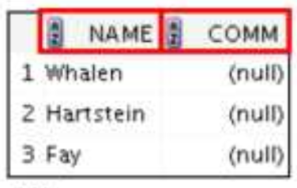<br><br>
```sql
SELECT last_name "Name", salary*12 "Annual Salary"
FROM   employees;
```
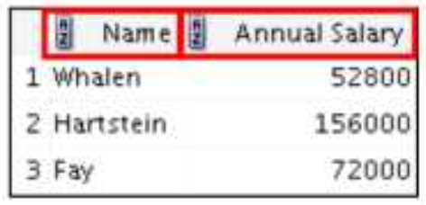<br><br>

### 4) 연결 연산자 (||)
```sql
SELECT last_name || job_id AS "Employees"
FROM   employees;
```
* || 로 연결된 컬럼들을 묶어서 한 컬럼에 표시해 준다. 이것 또한 Alias 지정이 가능하다.<br><br>

### 5) 리터럴 문자
* 리터럴 문자란 쿼리 구문에 포함된 일반 문자, 숫자, 날짜 값
* 문자나 날짜 리터럴은 작은 따옴표로 묶어서 작성해야 함
```sql
SELECT last_name || ' is a ' || job_id
       AS "Employee Details"
FROM   employees;
```
* Alias를 지정하지 않았다면 'last_name is a job_id' 라는 컬럼명으로 표시된다.<br><br>

### 6) DISTINCT 키워드
* 중복된 값을 자동으로 제거해 주는 키워드
```sql
SELECT DISTINCT department_id
FROM   employees;
```
********************************

# WHERE(조건문)절과 ORDER BY(정렬)절
## ☑️ 문법
```sql
SELECT * | {[DISTINCT] column | expression [alias], ...}
FROM   table
[WHERE condition(s)]
[ORDER BY {column, expr, alias} [ASC | DESC]];
```

## 1) 1. WHERE절
* WHERE절을 사용해서 특정 칼럼에서 어떤 값을 가진 필드값만 찾아달라고 할 수 있다.
```sql
SELECT employee_id, last_name, job_id, department_id
FROM   employees
WHERE  department_id = 90;
```
* employee_id, last_name, job_id, department_id 컬럼을 출력하는데 department_id가 90인 필드만 출력해라<br><br>
```sql
SELECT last_name, job_id, department_id
FROM   employees
WHERE  last_name = 'Whalen';
```
* last_name, job_id, department_id 컬럼을 출력하는데 last_name이 'Whalen'인 필드만 출력해라<br><br>
```sql
SELECT last_name
FROM   employees
WHERE  hire_date = '17-FEB-96';
```
* last_name 컬럼을 출력하는데 hire_date가 96년 2월 17일인 필드를 출력해라
* 날짜를 쓸 때엔 'DD-MM-YY'형식으로 쓴다.<br><br>

```sql
SELECT last_name, salary
FROM   employees
WHERE  salary <= 3000;
```
* last_name, salary 컬럼을 출력하는데 salary가 3000 이하인 필드를 출력해라<br><br>
```sql
SELECT last_name, salary
FROM   employees
WHERE  salary BETWEEN 2500 AND 3500;
```
* last_name, salary 컬럼을 출력하는데 salary가 2500 ~ 3500 사이인 필드를 출력해라<br><br>
```sql
SELECT employee_id, last_name, salary, manager_id
FROM   employees
WHERE  manager_id IN (100, 101, 201);
```
* employee_id, last_name, salary, manager_id 컬럼을 출력하는데 manager_id가 100이거나 101이거나 201인 필드를 출력해라(or과 같은 역할)<br><br>
```sql
SELECT last_name
FROM   employees
WHERE  last_name LIKE '_O%';
```
* last_name 컬럼을 출력하는데 last_name의 두번째 문자가 o인 필드를 출력해라
### 🔸 LIKE 비교연산자
* % : 0 char 또는 여러개 char
* _ : 반드시 1 char
    * a로 시작되는 문자열 : 'a%'
    * a가 포함된 문자열 : '%a%'
    * a로 끝나는 문자열 : '%a'
    * 두번째 문자가 a인 문자열 : '_a%'
    * 끝에서 세번째 문자가 a인 문자열 : '%a__'<br><br>
    
```sql
SELECT last_name, manager_id
FROM   employees
WHERE  manager_id IS NULL;
```
* last_name, manager_id 컬럼을 출력하는데 manager_id가 null인 필드를 출력해라<br><br>

```sql
SELECT employee_id, last_name, job_id, salary
FROM   employees
WHERE  salary >= 10000
AND    job_id LIKE '%MAN%';
```
* employee_id, last_name, job_id, salary 컬럼을 출력하는데 salary가 10000 이상이고 job_id에 MAN이 포함되는 필드를 출력해라<br><br>

```sql
SELECT employee_id, last_name, job_id, salary
FROM   employees
WHERE  salary >= 10000
OR     job_id LIKE '%MAN%';
```
* employee_id, last_name, job_id, salary 컬럼을 출력하는데 salary가 10000 이상이거나 job_id에 MAN이 포함되는 필드를 출력해라<br><br>

### 🔸 비교연산자에 NOT(논리연산자)이 조합으로 사용된 경우
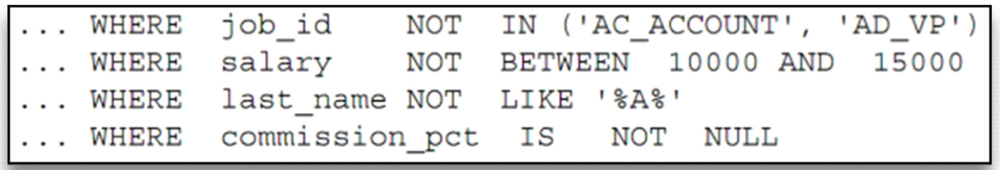<br><br>

## 2. ORDER BY절
* ASC : Ascending order, default 오름차순
* DESC : Descending order 내림차순
```sql
SELECT last_name, job_id, department_id, hire_date
FROM   employees
ORDER BY hire_date DESC;
```
* last_name, job_id, department_id, hire_date 컬럼을 출력하는데 hire_date의 내림차순으로 정렬해라<br><br>

```sql
SELECT employee_id, last_name, salary*12 annsal
FROM   employees
ORDER BY annsal;
```
* employee_id, last_name, salary*12 annsal 컬럼을 출력하는데 salary*12은 annsal이라는 Alias로 출력하고 annsal의 오름차순으로 정렬해라<br><br>

```sql
SELECT last_name, job_id, department_id, hire_date
FROM   employees
ORDER BY 3;
```
* last_name, job_id, department_id, hire_date 컬럼을 출력하는데 3번째 컬럼(department_id)의 오름차순으로 정렬해라
* 하지만 숫자로 표시하면 알아보기 힘들어서 추천하는 방법은 아니다.<br><br>

```sql
SELECT last_name, department_id, salary
FROM   employees
ORDER BY department_id, salary DESC;
```
* last_name, department_id, salary 컬럼을 출력하는데 department_id, salary 컬럼의 내림차순으로 정렬해라<br><br>
*************************************

# 단일 행 함수
## 1. 함수란?
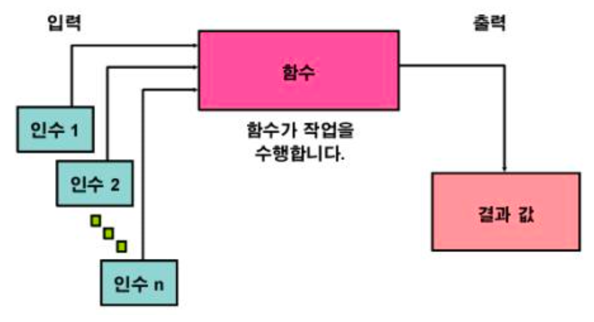<br><br>

## 2. SQL 함수의 두가지 유형
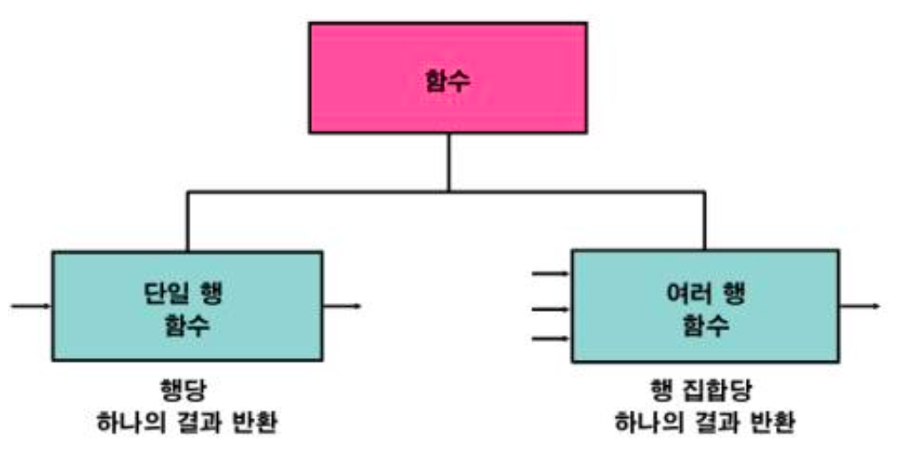<br><br>

## 3. 단일 행 함수
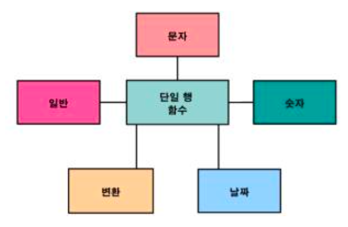<br><br>

### 1) 문자함수
* 문자 입력을 받아 들이며 문자 및 숫자값을 모두 반환할 수 있다.
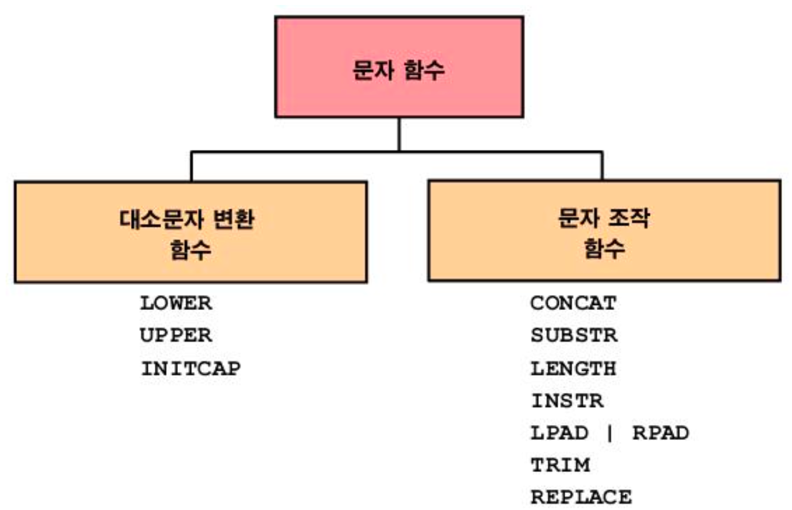<br><br>
#### 1️⃣ 대소문자 변환 함수<br>
|함수|결과|기능|
|---|---|---|
|LOWER('SQL Course')|sql course|모두 소문자로 변환|
|UPPER('SQL Course')|SQL COURSE|모두 대문자로 변환|
|INITCAP('SQL Course')|sql Course|단어의 첫 글자만 대문자로 변환|<br>

```sql
SELECT employee_id, last_name, department_id
FROM   employees
WHERE  LOWER(last_name) = 'higgins';
```
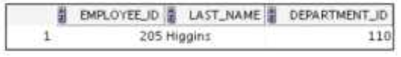<br><br>

#### 2️⃣ 문자 조작 함수<br>
|함수|결과|기능|
|---|---|---|
|CONCAT('Hello', 'World')|HelloWorld|파라미터 두개를 연결(사용 가능 파라미터는 두개로 제한)|
|SUBSTR('HelloWorld', 1, 5)|Hello|지정된 범위의 문자열 추출|
|LENGTH('HelloWorld')|10|문자열 길이 리턴|
|INSTR('HelloWorld', 'W')|6|문자열에서 지정된 문자의 숫자 위치를 찾음|
|LPAD(salary, 10, '@')|@@@@@24000|길이가 n이 되도록 왼쪽부터 문자식으로 채운 표현식 리턴|
|RPAD(salary, 10, '@')|24000@@@@@|길이가 n이 되도록 오른쪽부터 문자식으로 채운 표현식 리턴|
|REPLACE('JACK and JUE', 'J', 'BL')|BLACK and BLUE|1번 파라미터에서 2번 파리미터로 입력한 값을 3번 파라미터로 변경|
|TRIM('H' FROM 'HelloWorld')|elloWorld|문자열에서 선행문자나 후행문자를 자름|<br>

```sql
SELECT employee_id, CONCAT(first_name, last_name) NAME,
       job_id, LENGTH(last_name),
       INSTR(last_name, 'a') "Contains 'a'"
FROM   employees
WHERE  SUBSTR(job_id, 4) = 'REP';
```
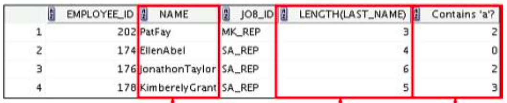<br><br><br>

### 2) 숫자함수
* 숫자 입력을 받아 들이고 숫자값을 반환한다.<br>

|함수|결과|기능|
|---|---|---|
|ROUND(45.926, 2)|45.93|지정된 소수점 자릿수로 반올림|
|TRUNC(45.926, 2)|45.92|지정된 소수점 자릿수로 버림|
|MOD(1600, 300)|100|나눈 나머지 반환|<br>

#### 🔸 DUAL 테이블
* SYS 소유
* 함수 및 계산 결과를 볼 때 사용하는 공용 테이블
* DUMMY라는 하나의 열과 값이 X인 하나의 행을 포함
    * 이걸 쓰는 이유는 컬럼을 출력할 필요가 없이 어떤 값을 계산한 결과만 보고 싶어도 FROM절에 테이블명을 꼭 써야 함
    * 이 때 employees 처럼 실제 데이터가 들은 테이블을 호출하면 비효율적이니까 아무것도 없는 빈 테이블을 DUAL 테이블이라 지정하고 계산 결과만 볼 때에 호출하는 것
```sql
SELECT ROUND(45.923, 2), ROUND(45.923, 0), ROUND(45.923, -1)
FROM   DUAL;
```
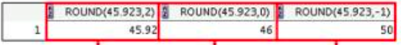<br><br>

### 3) 날짜함수
* DATE 데이터 유형의 값에 대해 실행된다.

#### 1️⃣ SYSDATE 함수
* 현재 데이터베이스 서버 날짜 및 시간을 반환하는 함수
```sql
SELECT sysdate
FROM   dual;
```
<br><br>

#### 2️⃣ 날짜를 사용한 산술 연산
|연산|결과|설명|
|---|---|---|
|날짜 + 숫자|날짜|날짜에 일 수를 더한다.|
|날짜 - 숫자|날짜|날짜에서 일 수를 뺀다.|
|날짜 - 날짜|일 수|한 날짜를 다른 날짜에서 뺀다.|
|날짜 + 숫자/24|날짜|날짜에 시간 수를 더한다.|<br>
```sql
SELECT last_name, (SYSDATE - hire_date) / 7 AS WEEKS
FROM   employees
WHERE  department_id = 90;
```
#### 3️⃣ 날짜 조작 함수
|함수|결과|
|---|---|
|MONTHS_BETWEEN|두 날짜 간의 월 수|
|ADD_MONTHS|날짜에 월 추가|
|NEXT_DAY|지정된 날짜의 다음 날|
|LAST_DAY|월의 마지막 날|
|ROUND|날짜 반올림|
|TRUNC|날짜 버림|<br>

|함수|결과|
|---|---|
|MONTHS_BETWEEN('01-SEP-95', '11-JAN-94')|19.6774194|
|ADD_MONTHS('31-JAN-96', 1)|'29-FEB-96'|
|NEXT_DAY('01-SEP-95', 'FRIDAY')|'08-SEP-95'|
|LAST_DAY('01-FEB-95')|'28-FEB-95'|<br>

#### 🔸 ROUND와 TRUNC의 활용
|함수|결과|
|---|---|
|ROUND(SYSDATE, 'MONTH')|01-AUG-03|
|ROUND(SYSDATE, 'YEAR')|01-JAN-04|
|TRUNC(SYSDATE, 'MONTH')|01-JUL-03|
|TRUNC(SYSDATE, 'YEAR')|01-JAN-03|<br>

### 4) 변환함수
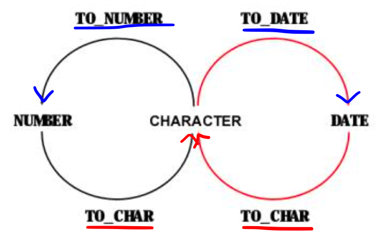<br><br>
* 값의 데이터유형을 변환한다.
#### 1️⃣ TO_CHAR 함수(DATE ➡️ CHAR)
##### 🔸 문법
```sql
TO_CHAR(date, 'format_model')
```

##### 🔸 날짜 형식 요소

|요소|결과|
|---|---|
|YYYY|숫자로 된 전체 연도|
|YEAR|영어 철자로 표기된 연도|
|MM|월의 2자리 값|
|MONTH|전체 월 이름|
|MON|월의 3자 약어|
|DY|3문자로 된 요일 약어|
|DAY|요일의 전체 이름|
|DD|숫자 형식의 월간 일|<br>

* 시간 요소는 날짜에서 시간 부분의 형식을 지정한다.<br>
HH24:MI:SS AM ➡️ 15:45:32 PM

* 문자열은 큰 따옴표로 묶어 추가한다.<br>
DD "of" MONTH ➡️ 12 of OCTOBER

* 숫자 접미어는 숫자를 영어 철자로 표기한다.<br>
ddspth ➡️ fourtheenth
* sp라 쓰면 약간 잘라서 약자로 표현함<br><br>


#### 2️⃣ TO_CHAR 함수(NUMBER ➡️ CHAR)
##### 🔸 문법
```sql
TO_CHAR(number, 'format_model')
```
<br><br>
##### 🔸 숫자 형식 요소
|요소|결과|
|---|---|
|9|숫자를 나타냄(0 ~ 9)|
|0|0이 표시되도록 강제 적용(0만 표시됨)|
|$|부동 달러 기호 배치|
|L|부동 로컬 통화 기호 사용|
|.|소수점 출력|
|,|천단위 표시자로 쉼표 출력|<br>

```sql
SELECT TO_CHAR(salary, '$99,999.00') SALARY
FROM   employees
WHERE  last_name = 'Ernst';
```
* TO_CHAR(salary, '$99,999.00') 에서 '$99,999.00'를 통해 출력할 수 있는 자리수는 최대 6자리이다.
* 만약 자리수를 초과하면 ####으로 출력되고 숫자 자체가 출력되지 않는다. => 그러니까 자리수를 넉넉히 쓰자<br><br>

#### 3️⃣ TO_NUMBER 함수(CHAR ➡️ NUMBER)
##### 🔸 문법
```sql
TO_NUMBER(char[, 'format_model'])
```
* 문자를 숫자로 바꿔주는 함수인데 쓸 일이 거의 없다.
* salary 같은 컬럼을 $3,000이라 저장하면 조회할 때 보기에는 편하지만 필드값을 계산에 사용하려고 하면 $가 없는 숫자로 바꿔줘야 해서 번거롭다. 
* 그래서 보통 3000 숫자 자체만 저장해놓기 때문에 TO_NUMBER 함수를 쓸 일이 없다.<br><br>

#### 4️⃣ TO_DATE 함수(CHAR ➡️ DATE)
##### 🔸 문법
```sql
TO_DATE(char[, 'format_model'])
```
* 내가 원하는대로 날짜값을 출력해주는 함수
```sql
SELECT employee_id, last_name, salary, hire_date
FROM   employees
WHERE  hire_date < to_date('2004/08/09', 'YYYY/MM/DD');
```
<br><br>

### 5) 일반함수
* 모든 데이터타입에 사용가능하다.<br>

|함수|
|---|
|NVL(expr1, expr2)|
|NVL2(expr1, expr2, expr3)|
|NULLIF(expr1, expr2)|
|COALESCE(expr1, expr2, ..., exprn)|<br>

#### 1️⃣ NVL 함수
* null 값을 실제 값으로 변환
* 사용할 수 있는 데이터 유형은 날짜, 문자 및 숫자
* 데이터 유형이 일치해야 함
    * NVL(commission_pct, 0)
    * NVL(hire_date, '01-JAN-97')
    * NVL(job_id, 'No Job Yet')
* 산술식에 null이 들어가면 결과값은 null이다.
```sql
SELECT last_name, salary, NVL(commission_pct, 0), (salary*12) + (salary*12*NVL(commission_pct, 0)) AN_SAL
FROM   employees;
```
<br><br>

#### 2️⃣ NVL2 함수
* 첫번째 표현식을 검사해서 null이 아니면 두번째 표현식을 반환하고 또 null이면 세번째 반환
```sql
SELECT last_name, salary, commission_pct, NVL2(commission_pct, 'SAL+COMM', 'SAL') income
FROM   employees
WHERE  department_id IN (50, 80);
```
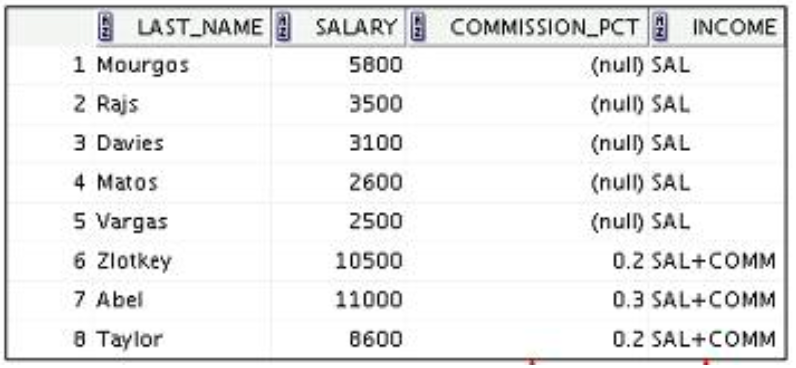<br><br>

#### 3️⃣ NULLIF 함수
* expr1과 expr2를 비교해서 두 표현식이 같으면 null을 반환하고 두 표현식이 다르면 expr1 반환
```sql
SELECT first_name, LENGTH(first_name) "expr1",
       last_name, LENGTH(last_name) "expr2",
       NULLIF(LENGTH(first_name), LENGTH(last_name)) result
FROM   employees;
```
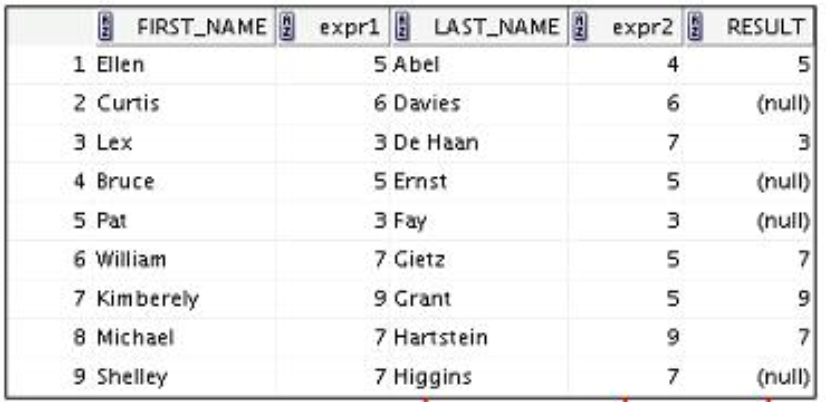<br><br>

#### 4️⃣ COALESCE 함수
* NVL 함수보다 여러 대체값을 가질 수 있음
* null이 아닌 첫번째 표현식 반환
* 파라미터들의 자료형이 모두 같아야 한다.
```sql
SELECT last_name, employee_id, COALESCE(TO_CHAR(commission_pct), TO_CHAR(manager_id), 'No commission and no manager')
FROM   employees;
```
***********************************

# 쿼리구문에 큰 따옴표 사용 문법
## 쿼리구문에 큰 따옴표(" ")가 사용되는 경우
* 컬럼명 [AS] "Alias" 
    * 대소문자 구분
    * 특수문자 포함
    * 공백 포함하는 경우
<br><br>
* TO_CHAR(sysdate, 'YYYY-MM-DD "Time" HH24:MI')
    * 사용자 형식 내 문자열 포함 시

## => 긴가민가하면 작은 따옴표를 쓰자
*********************************

# GROUP BY절과 HAVING절
* 그룹함수와 함께 사용하며 조건에 맞는 그룹으로 묶어서 보여준다.

## 문법
```sql
SELECT    column, group_function
FROM      table
[WHERE    contition]
[GROUP BY group_by_expression]
[HAVING   group_condition]
[ORDER BY column];
```
<br><br>

## 그룹함수
* `AVG` : 평균을 구해주는 함수
* `COUNT` : 개수를 세어주는 함수
* `MAX` : 최대값을 구해주는 함수
* `MIN` : 최소값을 구해주는 함수
    * 날짜와 문자의 최대값과 최소값도 구할 수 있는데 
    * 날짜에서의 최대값은 가장 최근 날짜, 최소값은 가장 과거 날짜
    * 문자에서는 알파벳/가나다 오름차순으로 보여준다.
* `STDDEV` : 표준편차를 구해주는 함수(쓸 일이 많지는 않다)
* `SUM` : 합계를 구해주는 함수
* `VARIANCE` : 분산을 구해주는 함수(쓸 일이 많지는 않다)

```sql
SELECT AVG(salary), MAX(salary),
       MIN(salary), SUM(salary)
FROM   employees
WHERE  job_id LIKE '%REP%';
```
```sql
SELECT COUNT(commission_pct)
FROM   employess
WHERE  department_id = 80;
```

## GROUP BY절
```sql
SELECT   department_id, AVG(salary)
FROM     employees
GROUP BY department_id;
```
```sql
SELECT   department_id, job_id, SUM(salary)
FROM     employees
WHERE    department_id > 40
GROUP BY department_id, job_id
ORDER BY department_id;
```
* `select`절에 있는 컬럼 리스트 중에서 그룹함수에 포함되어 있지 않은 컬럼은 반드시 `group by`절에 포함되어 있어야 문법 오류가 안 난다.<br><br>

## HAVING절
```sql
SELECT   job_id, SUM(salary) PAYROLL
FROM     employees
WHERE    job_id NOT LIKE '%REP%'
GROUP BY job_id
HAVING   SUM(salary) > 13000
ORDER BY SUM(salary);
```
* `GROUP BY`절과 `HAVING`절 사이에 순서는 없으나 `ORDER BY`절은 맨 마지막에 쓰는 것이 좋다.
* 왜냐면 최종 결과를 가지고 정렬하는 것이 가장 정확하니까.
***************************************

# JOIN
* 여러 테이블을 묶어서 데이터를 볼 때 사용한다. <br><br>

## ON절을 사용한 JOIN
```sql
SELECT e.employee_id, e.last_name, e.department_id,
       d.department_id, d.location_id
FROM   employees e JOIN departments d
ON     (e.department_id = d.department_id); -- 여기에 연결시킬 컬럼명을 입력한다.
```
```sql
SELECT e.employee_id, e.last_name, e.department_id,
       d.department_id, d.location_id
FROM   employees e JOIN departments d
ON     (e.department_id = d.department_id)
WHERE  e.manager_id = 149;
```
* 컬럼명을 입력할 때 해당 컬럼이 속해있는 테이블명을 입력하면 해당 범위에서만 검색을 시행하기 때문에 실행속도가 훨씬 빨라진다. (테이블명을 적지 않아도 실행되지만 그만큼 모든 테이블을 대상으로 검색해서 결과를 가져오기 때문에 실행속도가 훨씬 느리다.)
* 그래서 실행속도가 빠른 쿼리문을 작성하는 것이 중요하다.
* 그런데 테이블 풀네임을 일일이 적어주면 너무 길어서 가독성이 떨어지니까 약자로 적을 수 있는데 대신 약자로 적었다면 `FROM`절에서 어떤 테이블명의 약자인지 꼭 명시해줘야 `SQL`이 헷갈리지 않고 잘 찾아올 수 있다.
**************************************

# Subquery
## ☑️ 문법
* `GROUP BY`절을 제외하고 다 사용가능하며 `WHERE`, `HAVING`절에서 제일 많이 활용된다.

```sql
SELECT select_list
FROM   table
WHERE  expr operator (SELECT select_list
                      FROM   table);
```

* 테이블에서 어떤 정보를 조회할 때 특정 범위 안에 있는 정보만 조회하고 싶은데 그 특정 범위도 알 수가 없어서 쿼리문으로 물어봐야 할 때 사용한다.<br>

### 예제

```sql
SELECT last_name, salary
FROM   employees
WHERE  salary > (SELECT salary
                 FROM   employees
                 WHERE  last_name = 'Abel');
```

* `Able`이라는 사람보다 높은 연봉을 가진 사람들을 조회하고 싶을 때<br><br>

```sql
SELECT last_name, job_id, salary
FROM   employees
WHERE  salary = (SELECT MIN(salary)
                 FROM   employees);
```

* 연봉이 가장 적은 사람의 이름, 부서, 연봉정보를 출력하고 싶을 때<br><br>

```sql
SELECT   department_id, MIN(salary)
FROM     employees
GROUP BY department_id
HAVING   MIN(salary) > (SELECT MIN(salary)
                        FROM   employees
                        WHERE  department_id = 50);
```

* 부서번호 50번의 가장 적은 연봉보다는 큰 부서별 가장 적은 연봉을 보고 싶을 때<br><br>

### Inline View
* `From`절에 `Subquery`가 작성된 경우

```sql
SELECT a.last_name, a.salary, a.department_id, b.salavg
FROM   employees a JOIN (SELECT   department_id, AVG(salary) salavg
                         FROM     employees
                         GROUP BY department_id) b -- 이 쿼리구문 안에서만 유효한 inline view
ON     a.department_id = b.department_id
WHERE  a.salary > b.salavg;
```

* `employees` 테이블에서 자기가 소속된 부서의 평균 급여보다 본인의 급여가 더 큰 사원만 출력할 때
* `Inline view`는 실제로 존재하는 테이블은 아닌 이 쿼리문을 위한 가상 테이블로, 실제 존재하는 테이블은 아니기 때문에 마지막에 한 칸 띄우고 앨리어스를 꼭 작성해야 한다.
*****************************************

# 데이터조작어(DML)
* 테이블에 저장되어 있는 데이터를 다루는 명령어<br><br><br>

## 1. INSERT 구문
* 테이블에 새로운 행 추가

### ☑️ 문법

```sql
INSERT INTO table [(column [, column...])]
VALUES      (value [, value...]);
```

### 예제

```sql
INSERT INTO departments(department_name, namager_id, department_id, location_id)
VALUES      ('Java', 201, 290, 1700);
```
```sql
INSERT INTO departments(department_id, department_name)
VALUES      (300, 'Jsp');
```
* 테이블명 다음에 설정한 컬럼수만큼 `values`에 값을 채워준다. 나머지는 자동으로 `null`값이 들어간다.<br><br>

```sql
INSERT INTO departments
VALUES      (310, 'Web', null, null);
```
* 아니면 `null`을 넣고 싶은 필드를 직접 지정해 줄 수도 있다.<br><br><br>

## 2. UPDATE 구문
* 테이블이 기존 행 수정

### ☑️ 문법

```sql
UPDATE table
SET    column = value [, column = value, ...]
[WHERE condition];
```

### 예제

```sql
UPDATE employees
SET    department_id = 50
WHERE  employee_id = 113;
```
* 이렇게 쓰면 특정 `row`만 데이터 변경<br><br>

```sql
UPDATE employees
SET    department_id = 50;
```
* 이렇게 쓰면 해당 테이블 내의 모든 `row`의 데이터가 바뀐다. 이렇게 쓸 일은 거의 없으니까 `UPDATE` 사용시에는 `WHERE` 조건을 잘 확인하자.<br><br>

```sql
UPDATE copy_emp
SET    job_id = (SELECT job_id
                 FROM   copy_emp
                 WHERE  employee_id = 205),
       salary = (SELECT salary
                 FROM   copy_emp
                 WHERE  employee_id = 205)
WHERE  employee_id = 113;
```
* 수정할 데이터 구문에서 서브쿼리도 사용 가능<br><br><br>

### 3. DELETE 구문
* 테이블의 기존 행 삭제

### ☑️ 문법

```sql
DELETE [FROM] table
[WHERE        condition];
```

### 예제

```sql
DELETE FROM departments
WHERE       department_id = 60;
```
```sql
DELETE FROM copy_emp;
```
* 이렇게 쓰면 전체 삭제<br><br><br>

### 4. 트랜잭션(Transaction)
* 논리적인 작업 단위
* 여러 `DML`이 모여서 하나의 트랜잭션이 구성된다.
* `DML` 작업을 통해 변경한 내용들은 모두 `임시저장` 되어 있는 상태이다. 
* 그래서 `DML` 작업 후 `commit`(`DB`에 작업내용 최종 저장), `rollback`(`DB` 최종 저장 전에 작업내용 되돌리기)으로 트랜잭션을 종료해야 한다.<br><br>

#### 4-1) 트랜잭션 구성
* 여러 `DML` 구문이 하나의 트랜잭션 (`select`, `insert`, `update`, `delete`)
* 하나의 `DDL` 구문이 하나의 트랜잭션 (`create`, `alter`, `drop`, `truncate`)
* 하나의 `DCL` 구문이 하나의 트랜잭션 (`grant`, `revoke`)<br><br>

#### 4-2) 트랜잭션 시작 및 종료
##### 🔸 시작
* 첫 번째 `DML` 구문 실행 시

##### 🔸 종료
* `COMMIT` 또는 `ROLLBACK` 실행 시
    * `DML` 쓰다가 `DDL/DCL` 작성하면 `autocommit` 되면서 위에 썼던 `DML`도 같이 커밋된다.(트랜잭션 끝)
    
* `DDL` 또는 `DCL` 구문 실행 시(`autocommit`)
    * `DDL`과 `DCL`은 `autocommit`을 내포하고 있기 때문에 실행하는 순간 `commit`되고 트랜잭션이 끝난다. 
    * 그래서 `rollback`이 불가하기 때문에 신중하게 작업하는 것이 좋다. 

* `SQL *PLUS` 정상 종료 시(`autocommit`)
    * 그래픽창의 `X`를 눌러 끄는 것은 비정상 종료다. 
    * 터미널에서 `exit` 명령어 입력이나 그래픽 툴의 `exit` 버튼을 눌러서 끄는 것이 정상 종료이다.
    * 비정상 종료 시 `autorollback` 처리된다.
    
##### 🔸 SAVEPOINT와 ROLLBACK TO
* 최종 `commit` 전에 작업하던 중간 중간으로 되돌아 갈 수 있도록 `SAVEPOINT`를 만들 수 있다.
* 하지만 만든 세이브포인트를 확인할 수 있는 명령어는 없기 때문에 만든 사람이 기억하고 있어야 한다.

```sql
UPDATE...
SAVEPOINT update_done -- 세이브 포인트 생성

...

INSERT...
ROLLBACK TO update_done; -- 세이브 포인트로 되돌리기
```

* 세이브 포인트를 만들었다고 그 전까지 했던 작업들이 `COMMIT` 되는 것은 아니다. 
* 그렇기 때문에 모든 `DML` 작업이 끝났다면 최종 확인 후 꼭 `COMMIT`을 해 주어야 한다.

