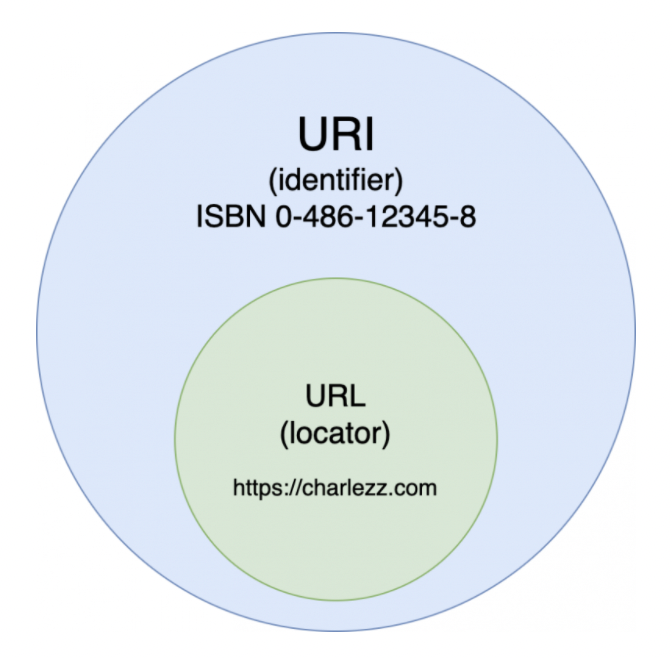
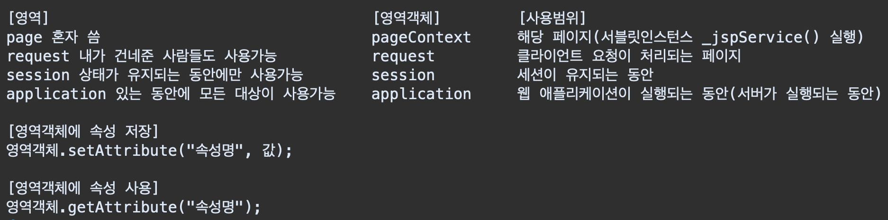

# JSP
# 목차
* [JSP(Java Server Page)란?](#JSPJava-Server-Page란)
* [JSP의 특징](#JSP의-특징)
* [JSP 사용](#JSP-사용)
* [JSP 지시어(Directive)](#JSP-지시어Directive)
* [JSP 스크립트 요소](#JSP-스크립트-요소)
* [내장 객체](#내장-객체)
* [액션 태그](#액션-태그)
* [영역 객체(Scope)와 속성(Attribute)](#영역-객체Scope와-속성Attribute)
* [세션(Session)](#세션Session)
* [쿠키(Cookie)](#쿠키Cookie)
* [JDBC(Java Database Connectivity)](#jdbcjava-database-connectivity)
* [회원관리 서비스 요구사항](#회원관리-서비스-요구사항)
* [자바빈(JavaBean)](#자바빈javabean)

# JSP(Java Server Page)란?
* `Java`를 이용하여 `동적인 웹 페이지`를 만들기 위해 Sun Microsystems사가 개발한 기술
*************************

# JSP의 특징
## 1. 강력한 이식성
* `자바기반`의 언어로 어떤 `JSP 컨테이너`에서도 사용이 가능하므로 한 번 작성한 코드를 별다른 수정 없이 다른 플랫폼으로 이식이 가능하다.
* `모듈화`와 `모듈의 재사용성`이 좋다.

## 2. 서버 자원의 효율적인 사용
* `스레드(Thread)` 기반의 아키텍처 사용으로 불필요한 자원 낭비를 감소시켰다.

## 3. 간편한 MVC 패턴(디자인 패턴)
* `MVC 패턴`을 `JSP(View)`와 `자바빈즈(Model)`, `서블릿(Controller)`을 이용해 쉽게 구현할 수 있다.

### 🔸 MVC 패턴
* 사용자에게 보여지는 화면인 `View` 부분과 실제 비즈니스 로직이 들어가는 `Model` 부분 그리고 `View`와 `Model`을 연결시켜주는 `Controller` 부분으로 구성
* 최근에 중대형 프로젝트에서 효과적이라 평가되어 많이 사용되고 있다.

### 🔸 디자인 패턴
* 프로젝트를 개발함에 있어서 특정한 문제가 주어졌을 때 그 문제를 해결하기 위한 방법을 설명해 놓은 일종의 지침
*********************************

# JSP 사용
* `HTML` 태그와 `Java` 코드를 함께 사용한다.

```html
<!DOCTYPE html>
<html>
<head>
<meta charset="UTF-8">
<title>Insert title here</title>
</head>
<body>
  <%
      // 스크립틀릿
  %>
</body>
</html>
```

* `HTML` `body` 태그 안에서 스크립틀릿을 쓴 다음에 스크립틀릿의 범위 내에 코드를 작성한다.

```html
<h2>자바코드로 테이블 생성</h2>
	<table border="1">
		<tr>
			<td>번호</td><td>이름</td>
		</tr>
		<%
			for (int i = 1; 6 > i; i++)
			{
				%>
				<tr>
					<td><%=i %></td><td>학생<%=i %></td>
				</tr>
				<%
			}
		%>
	</table>
```

* 위와 같이 자바 코드 사이에 `스크립틀릿`이 끝나는 표시(`%>`)를 하고 `HTML` 태그를 쓴 다음에 `<%= %>`를 이용해 자바 코드의 지역 변수를 출력하는 것이 가능하다.(신기...)

## 🔸 JSP 주석

```jsp
<%-- --%> (웹페이지 개발자 도구창에서 나타나지 않기 때문에 보안상 이것을 쓰는 것이 더 좋다)
// 자바 스타일도 사용 가능
```

********************************

# JSP 지시어(Directive)

```jsp
<%@ ... %>
```

* `JSP` 파일 내에서 `JSP`를 실행할 컨테이너에서 해당 페이지를 어떻게 처리할 것인가에 대한 설정 정보들을 지정해주는 데 사용
* `page` 지시어, `include` 지시어, `taglib` 지시어 3가지로 나누어진다.

## 1. page 지시어

```jsp
<%@ page 속성1="값1" 속성2="값2" 속성3="값3"... %>
```

* `JSP` 페이지에 대한 속성을 지정하는 지시어
* 속성에는 스크립트 언어, import할 패키지/클래스, 세션 사용 여부, 에러 페이지 등 12개의 설정 정보를 지정해 사용할 수 있다.

|속성|사용법|기본값|설명|
|---|---|---|---|
|language|language="java"|java|스크립트 요소에서 사용할 언어 설정|
|extends|extends="클래스명"|없음|상속받을 클래스를 설정|
|import|import="패키지.클래스명"|없음|import할 패키지.클래스 설정|
|session|session="true"|true|HttpSession 사용 여부를 설정|
|buffer|buffer="16kb"|8kb|JSP 페이지의 출력 버퍼 크기를 설정|
|autoFlush|autoFlush="true"|true|출력 버퍼가 다 찼을 경우 처리 방법을 설정|
|isThreadSafe|isThreadSafe="true"|true|다중 스레드의 동시 실행 여부를 설정|
|info|info="페이지 설명"|없음|페이지 설명|
|errorPage|errorPage="에러 페이지.jsp"|없음|에러 페이지로 사용할 페이지를 지정|
|contentType|contentType="text/html"|text/html;charset=ISO-8859-1|JSP 페이지가 생성할 문서의 타입을 지정|
|isErrorPage|isErrorPage="false"|false|현재 페이지를 에러 페이지로 지정|
|pageEncoding|pageEncoding="euc-kr"|ISO-8859-1|현재 페이지의 문자 인코딩 타입 설정| <br>

* 각각의 속성을 하나의 `page 지시어`에 한 번에 지정할 수도 있으며 여러 개의 `page 지시어`에 나누어 지정할 수도 있다.
* 하지만 `import` 속성을 제외한 나머지 속성은 하나의 페이지에서 오직 한 번씩만 지정할 수 있다.<br><br>

## 2. include 지시어

```jsp
<%@ include file="header.jsp" %>
```

* 특정한 `JSP` 파일 또는 `HTML` 파일을 해당 `JSP` 페이지에 삽입할 수 있도록 하는 기능을 제공한다.
* `include`되는 `JSP` 코드 자체가 해당 `JSP` 페이지에 복사되어 더해지므로 서블릿 컴파일 과정은 `include` 되는 페이지의 수가 아무리 많아도 단 한 번만 이루어지게 된다.
* 사용되는 공통 변수값들을 추가할 때 주로 사용한다.
* `include` 지시어는 중첩 사용이 가능하기 때문에 `include`되는 파일 안에서 또 다른 파일을 `include`하여도 문제없이 동작한다.<br><br>

## 3. taglib 지시어

```jsp
<%@ taglib url="http://taglib.com/sampleURI" prefix="samplePrefix" %>
```

* `JSTL(JSP Standard Tag Library)이나 커스텀 태그 등 태그 라이브러리를 `JSP`에서 사용할 때 접두사를 지정하기 위해 사용된다.
* `uri` 속성과 `prefix` 속성으로 이루어진다.

### 🔸 uri 속성
* 태그 라이브러리에서 정의한 태그와 속성 저보를 저장한 `TLD(Tag Library Descriptor)` 파일이 존재하는 위치 지정

### 🔸 prefix 속성
* 사용할 커스텀 태그의 네임 스페이스(Name Space)를 지정
**************************

# JSP 스크립트 요소
## 1. 선언문

```jsp
<%!
    // 멤버변수와 메서드 선언
%>
```

* 멤버변수와 메서드를 선언하기 위한 영역
* 클래스에서 멤버변수와 메서드를 선언한 것과 동일한 결과로 같은 `JSP` 페이지 어느 위치에서든 참조가 가능하다.

## 2. 스크립틀릿(Scriptlet)

```jsp
<% 문장1; %>
<%
    문장2; 문장3; 문장4; ...
%>
```

* `JSP` 코드를 작성하는 영역
* 서블릿 코드의 작성법이 다소 어려워서 이것을 보완하기 위해 만들어진 방식
* 스크립틀릿 영역에서 선언되는 변수들은 지역변수로 인식된다.
* `JSP` 파일이 실행되면 웹 컨테이너에 의해 `JSP` 파일이 파싱되어 서블릿 클래스로 변환된 자바 소스 파일과 클래스 자바 파일이 서버에 저장된다.

## 3. 표현식(Expression)

```jsp
<%=변수 %>
<%=리턴값이 있는 메소드 %>
<%=수식(변수 또는 리턴값이 있는 메소드를 포함할 수 있음) %>
```

* 선언문, 스크립틀릿에 생성한 변수, 메소드의 리턴값을 스크립틀릿 태그 외부에서 출력하기 위해 사용
* 하나의 표현식 태그 내의 구문 전체가 `print()` 메소드의 괄호 안에 통채로 들어가기 때문에 표현식 태그 내부에서는 `세미콜론(;)`을 사용해서는 안된다.
******************************

# 내장 객체
* `JSP` 페이지가 웹 컨테이너에 의해서 서블릿으로 변환할 때 웹 컨테이너가 자동으로 생성해 주는 객체(`클래스`, `import` 구분없이 사용 가능)<br><br>

javax.servlet 패키지 - 8개<br>

|내장 객체 변수명|설명|
|---|---|
|request|클라이언트의 `HTTP` 요청 정보를 저장한 객체(`HTTP`헤더 정보, 파라미터 등)|
|response|클라이언트 요청에 대한(`HTTP`) 응답 정보를 저장한 객체|
|session|클라이언트의 세션 정보를 저장한 객체|
|pageContext|페이지 실행에 필요한 컨텍스트 정보를 저장한 객체|
|out|응답 페이지 정보를 전송하기 위한 출력 스트림 객체|
|application|동일한 애플리케이션의 컨텍스트 정보를 저장한 객체|
|config|해당 페이지의 서블릿 설정 정보(초기화 정보)를 저장한 객체|
|page|해당 페이지 서블릿 객체(인스턴스)|<br><br>

java.lang 패키지 - 1개<br>
* exception : 예외 처리를 위한 객체

## 1. request 객체
* 사용자의 요청에 관한 정보를 얻기 위한 객체<br><br>

* 서버 도메인명 : ```request.getServerName();```
* 서버 포트번호 : ```request.getServerPort();```
* URL : ```request.getRequestURL();```
* URI : ```request.getRequestURI();```
* 클라이언트 호스트명 : ```request.getRemoteHost();```
* 클라이언트 IP주소 : ```request.getRemoteAddr();```
* 프로토콜 : ```request.getProtocol();```
* 페이지 요청(전송)방식 : ```request.getMethod();```
* 프로젝트 경로 : ```request.getContextPath();```
* 물리적 경로 : ```request.getRealPath("/");```
* http헤더 (user-agent): ```request.getHeader("user-agent");```
* http헤더 (accept-language) : ```request.getHeader("accept-language");```
* http헤더 (host) : ```request.getHeader("host");```
* http헤더 (connection) : ```request.getHeader("connection");```

* 전송을 통해 다른 페이지에서 전달받은 (이름 등의)정보를 얻을 때

```jsp
String name = request.getParameter("name");
```
<br>

* 정보들을 배열로 얻을 때

```jsp
String hobbies[] = request.getParameterValues("hobby");
```

### 🔸 URI
* URI는 특정 리소스를 식별하는 `통합 자원 식별자(Uniform Resource Identifier)`를 의미한다. 
* 웹 기술에서 사용하는 논리적 또는 물리적 리소스를 식별하는 고유한 문자열 시퀀스다.

### 🔸 URL
* URL은 흔히 웹 주소라고도 하며, 컴퓨터 네트워크 상에서 리소스가 어디 있는지 알려주기 위한 규약이다. URI의 서브셋이다.
* 한마디로 URI가 자원 자체에 대한 고유 식별자라면 URL은 자원이 실제로 존재하는 위치를 가리킨다. <br><br>
<br><br>

## 2. response 객체
* 클라이언트의 요청에 대한 `HTTP` 응답(HTTP Response)을 나타내는 객체<br><br>

* response.setHeader("헤더이름", 값);

```jsp
response.addHeader("Refresh", "3"); // 3초에 한번씩 새로고침
response.addHeader("Refresh", "3;url=http://www.naver.co.kr"); // 3초 후에 다음 페이지로 이동
```

* response.sendRedirect("주소"); // "주소"로 요청 재전송

```jsp
response.sendRedirect("http://www.naver.co.kr"); // 해당 페이지로 바로 이동
```

* ```response.setContentType("속성값"); 컨텐츠 타입 지정```
* ```response.addCookie("쿠키값"); 쿠키 추가```

## 3. session 객체
* 클라이언트의 정보가 유지되어야 할 필요가 있는 경우를 위해 가상 연결을 구현해주는 세션<br><br>

* 세션ID값 : ```session.getId();```
* 세션생성시간 정보(ms) : ```session.getCreationTime();```
* 최종 접속 시간(ms) : ```session.getLastAccessedTime();```
* 세션 유지시간(기본)(1800s,30m) : ```session.getMaxInactiveInterval();```<br>

## 4. application 객체
* 해당 웹 애플리케이션의 실행 환경을 제공하는 서버의 정보와 서버측 자원에 대한 정보를 얻어내거나 해당 애플리케이션의 이벤트 로그를 다루는 메소드들을 제공<br><br>

* 서버정보 : ```application.getServerInfo();```
* 서버의 물리적 경로 : ```application.getRealPath("/");```

## 5. out 객체
* 서블릿/JSP 컨테이너가 응답 페이지를 만들기 위해 사용하는 출력 스트림 객체
* 하지만 표현식을 사용해서 자바 코드의 변수 값들과 메소드의 리턴 값들을 출력할 수 있기 때문에 잘 사용되지 않는다.<br><br>

* 출력 : ```out.print("Hello");```
* 버퍼 사이즈 : ```<%=out.getBufferSize() %>byte<br>```
* 버퍼 사용후 : ```<%=out.getRemaining() %>byte<br>```
******************************

# 액션 태그

```jsp
<jsp:~ 형태로 시작하는 태그>
```

* `JSP` 페이지에서 `HTML` 태그 형태로 `JSP` 코드의 역할을 수행하는 것
* 스크립틀릿 등의 스크립트 요소(자바 코드)를 사용하지 않기 때문에 `JSP` 페이지의 내부적인 프로그램 로직을 사용자로부터 감출 수 있다.
* 즉, 사용자에게 보여지는 프레젠테이션 부분과 사용자의 요청을 처리하는 비즈니스 로직 부분(프로그램 부분)을 분리하는 것이 가능하다.
* 프로그램 재사용성을 높여주고 코드의 간결성을 향상시킨다.

## 🔸 <jsp:forward>

```jsp
<jsp:forward page="이동할 페이지(ex. forward.jsp)" />
<jsp:forward page="이동할 페이지"></jsp:forward>
```

* 액션 태그는 `XML` 문법을 이용하여 구현된 기능이므로 태그의 종료 끝에 반드시 종료 태그가 있어야 한다.
* `forward` 액션은 현재 페이지의 요청과 응답에 관한 처리권을 `page` 속성에 지정된 이동할 페이지로 영구적으로 넘기는 기능을 한다.

## 🔸 <jsp:include>

```jsp
<jsp:include page="이동할 페이지(ex. forward.jsp)" flush="false" />
<jsp:include page="이동할 페이지(ex. forward.jsp)" flush="false"></jsp:include>
```

* 특정 페이지를 `include` 한다.
* 각각의 페이지를 컴파일 후 해당 파일을 `include` 한다.
* top, bottom과 같은 동일 사용 페이지를 추가할 때 사용한다.

## 🔸 <jsp:param>

```jsp
<jsp:param name="파라미터 이름1" value="파라미터 값1" />
<jsp:param name="파라미터 이름2" value="파라미터 값2" />
```

* `forward`와 `include` 태그를 사용하여 이동할 페이지에 추가적으로 넘겨줄 파라미터가 있으면 `<jsp:param/>` 태그를 사용할 수 있다.
***********************

# 영역 객체(Scope)와 속성(Attribute)
* jsp 내장객체 중에서 특정 공간(Scope)에 정보를 저장하고, 저장된 정보(Attribute)를 공유할 수 있는 객체
* `JSP`에서는 `page`, `request`, `session`, `application` 4가지 영역으로 정의한다.<br><br>
<br><br>
************************

# 세션(Session)
## ☑️ 서버랑 클라이언트와의 관계(상태)를 유지하기 위해서 사용하는 값
* `HTTP 프로토콜`은 상태가 유지되지 않기 때문에 요청에 대한 응답이 한 번씩 이뤄지고 나면 그 관계가 소멸된다. 
* 하지만 이런 방식으로는 사용자가 회원 사이트에 로그인 했을 때 지속적으로 업무를 볼 수 없게 된다.
* 그래서 사용자가 지속적으로 업무를 볼 수 있도록 서버와 클라이언트간의 관계를 일정 시간동안 유지해주기 위해 쓰는 것이 `세션`이다.
* 세션객체(영역)는 브라우저당 1개씩 생성된다.

## 🔸 세션 메소드
* 세션값 생성 : `session.setAttribute("이름", 값);`
* 세션값 사용 : `session.getAttribute("이름");`
* 세션값 제거 : `session.removeAttribute("이름");`
* 세션값 초기화 : `session.invalidate();`
    * ❗️ 세션값 제거 메소드를 통한 부분제거보다는 세션값 초기화를 시켜야 한다.
    * 일부만 제거하면 사용자가 로그아웃 했는데 로그인 했을 때와 같은 행동이 일부 가능할 수 있다.
**********************************

# 쿠키(Cookie)
* `클라이언트` 측에서 관리되는 정보
* 사용 가능한 기간동안 하드디스크에 저장되기 때문에 웹 브라우저가 사라져도 사용이 가능하다.
* 하지만 그만큼 보안적으로 취약하다. (그래서 보안이 필요한 정보는 `세션` 사용)

## 🔸 쿠키 생성 절차
### 1. 쿠키 생성
### 2. 쿠키가 필요로 하는 설정값 저장(유효기간, 설명, 도메인, ...)
### 3. 웹 브라우저에 생성된 쿠키 정보 전달
### 4. 웹 브라우저 요청에서 쿠키를 얻어온다.
### 5. 쿠키 정보는 이름, 값의 데이터 쌍으로 형성된다.
### 6. 쿠키 이름을 사용해서 해당 값을 사용한다.

## 🔸 쿠키 사용 방법
### 1) `HTTP` 헤더 정보 사용 - 안씀 XX
### 2) 서블릿 API 사용 - 현재 쓰는 방식

* 쿠키 생성하는 예제 코드

```jsp
<%
    // 쿠키값 생성 - 서블릿 API 사용
    Cookie cookie = new Cookie("name", "CookieValue"); // HDD 저장X, 메모리에만 있는 상태
		
    // 쿠키값 설정 - 유효기간 설정
    cookie.setMaxAge(600); // 초 단위 - 10분
		
    // 쿠키값을 저장(응답정보(response)에 저장)
    response.addCookie(cookie);
    System.out.println("쿠키정보가 전달 완료시 사용자의 HDD에 저장");
%>
``` 

* 먼저 쿠키를 생성한 다음 클라이언트에게 전송한다.

* 쿠키값 가져오는 예제 코드

```jsp
<%
    // 쿠키값 가져오기(request - 요청정보로부터 꺼내오기)
    Cookie[] cookies = request.getCookies();
			
    if (null != cookies) // !!배열을 반복문 돌리기 전에 예외처리 꼭 하기!!
    {
        for (int i = 0; cookies.length > i; i++)
        {
            //System.out.println(cookies[i]);
            if (cookies[i].getName().equals("name"))
            {
                // Cookie cookie = new Cookie("name", "CookieValue"); // HDD 저장X, 메모리O
                // ⬆️ 얘를 가져올 것임
                // 이름이 같다면 내가 직접 생성한 쿠키임
                System.out.println(cookies[i].getValue());
						
                out.print("쿠키명: " + cookies[i].getName() + "\n");
                out.print("쿠키값 : " + cookies[i].getValue());
            }
        }
    }
%>
```

* 그 다음 클라이언트 측에서 쿠키를 가져온다.
* 쿠키값을 가져올 때엔 꼭 예외처리를 해서 `null`값이 아닐 때에만 가져오는 동작을 수행하도록 해야한다.
**************************************************

# JDBC(Java Database Connectivity)
* `Java`랑 `DBMS`를 연결시켜주는 `API`
* 즉 자바랑 DB를 연결시켜서 사용할 수 있게 해주는 기능들이 모여있는 라이브러리라 할 수 있다.
* 데이터베이스에 데이터를 삽입, 수정, 삭제할 때 `SQL` 프롬프트에서 `SQL`문을 사용하지 않아도 자바 프로그램에서 `SQL`문을 사용하여 데이터베이스에 데이터를 추가하고 삭제하는 작업을 할 수 있게 하는 `API`이다.
* `JDBC`는 `DBMS` 종류에 상관없이 독립적으로 사용 가능하다.
    * 여러 언어에서 작동하는 방법이 전반적으로 같다고 할 수 있다.
<br><br>

    
## JDBC 드라이버 설치
* `mysql` 홈페이지에서 `Connect J`를 다운받는다.(현재 최신버전인 8.0.28)
* 윈도우라면 `.zip` 파일을 받으면 되고 맥이라면 `.tar` 파일을 받는다.
* 압축을 풀면 `mysql-connector-java-8.0.28.jar`란 파일이 있다.
* 저걸 `JDBC`를 사용하고자 하는 (이클립스)프로젝트의 `WEB-INF/lib` 폴더에 넣는다.(경로 다르면 안 됨!! 무조건 저기에 넣어야 함)
* 그러면 설치 끝!
<br><br>


## JDBC 연동
### 1. 드라이버 로드(하드디스크에 있는 프로그램을 메모리로 불러오기)
* 아까 설치한 `JDBC` 드라이버를 불러올 것이다. 
```jsp
Class.forName("com.mysql.cj.jdbc.Driver"); // static method라서 객체 생성 없이 바로 호출할 수 있음
```

* 이렇게 입력하면 드라이버를 로드할 수 있다. 
* MySQL 홈페이지 가서 Documentation 페이지 - Connector/J 8.0 Developer Guide - 6. ConnectJ reference - 6.1 Driver/Datasource Class Name 가면 드라이버를 로드할 때 무슨 클래스명을 입력해야 하는지 찾을 수 있다. 
    * 그 외에도 레퍼런스가 필요하면 참고하자.
* 만약 설치를 안 했다면 실행시 참고할 드라이버가 없어서 `HTTP500` 에러가 뜬다.<br><br>

### 2. DB 연결
* `DriverManager.getConnection("디비주소", "디비아이디", "디비비밀번호");` 
* `DriverManager` 객체를 이용해 `DB`와 드라이버를 연결한다.

```jsp
Connection con = DriverManager.getConnection("jdbc:mysql://localhost:3306/jspdb", "root", "1234");
```

* 이런 식으로 `DB`의 주소와 아이디, 비밀번호를 입력한 뒤 연결 객체 정보를 `Connection`에 저장한다.
* 이러면 `mysql`과 연결된 것이다. 이제 `jsp` 파일에서 `SQL`문을 작성해 데이터베이스를 관리할 수 있다.

## JDBC 사용 예제 1) 사용자가 홈페이지에 회원가입 하는 상황 

### 1. `insertForm.jsp`라는 이름으로 간단한 회원가입 페이지를 만든다.
```html
<form action="insertPro.jsp" method="post">
    아이디 : <input type="text" name="id"><br>
    비밀번호 : <input type="password" name="pass"><br>
    이름 : <input type="text" name="name"><br>
    <input type="submit" value="전송하기">
  </form>
```

* 여기서 사용자가 정보를 입력하고 `submit`버튼을 클릭하면 `insertPro.jsp` 페이지로 전달된다.<br><br>

### 2. `insertPro.jsp`라는 이름으로 회원가입 정보를 받아서 `DB`에 사용자 정보를 추가하는 페이지를 만든다.
```jsp
  <% // 스크립틀릿 사용
    // 0단계 : 드라이버 설치 - 완료됐으니 로드 단계로 넘어간다.
    // 1단계 : 드라이버 로드
    Class.forName("com.mysql.cj.jdbc.Driver");
  
    System.out.println("드라이버 로드 성공!");
    
    // 2단계 : 디비 연결 (디비 바꾸려면 jdbc:mysql://localhost:3306/뒤에 디비 이름만 바꿔주면 됨)
    Connection con = DriverManager.getConnection("jdbc:mysql://localhost:3306/jspdb", "root", "1234");
    
    System.out.println("디비 연결 성공!");
    System.out.println("연결정보 : " + con);
    
    // 3단계 : SQL 구문 생성 & stmt(statement) 객체 생성
    // String sql = "insert into itwill_member (id, pass, name) values('id', 'pw', 'name')";
    
    // secure 코딩 예시) values에 담을 데이터의 개수만큼 ?를 넣는다.
    String sql = "insert into itwill_member (id, pass, name) values(?, ?, ?)";
    
    // stmt 객체 만들기 : sql 구문을 실행하는 객체 	   
    // Statement stmt = con.createStatement(); // 하지만 이렇게 쓰려면 valuse 괄호 안에 따옴표를 넘 많이 써야해서 안 쓸 예정
                            // 그리고 따옴표 안에 정보를 노출해서 써야해서 보안적으로 좋지 않다.
    // Statement랑 PreparedStatement 객체 둘 중 하나만 쓸 수 있음
    
    // pstmt 객체 : sql 구문을 실행하는 객체
    PreparedStatement pstmt = con.prepareStatement(sql); // 객체를 만들 때 쿼리 정보를 가져가서 사전준비함
    
    // ??? 값 sql 구문에 채워넣기
    // pstmt.setXXXXXX(물음표의 위치, 실제 들어갈 값);
    // => XXXXX : 컬럼의 데이터타입(int, double, string, ...)에 따라 변경
    // * ? 개수와 동일한 구문을 수행해야 함 - ?가 3개면 채우는 구문 3개 있어야 함
    // null 넣고 싶으면 쿼리문(String sql) 안에 직접 넣으면 됨
    pstmt.setString(1, id); // 뜻 : 1번 물음표에 id에 해당하는 값을 넣는다.
    pstmt.setString(2, pass);
    pstmt.setString(3, name);
    
    // 4단계 : SQL 구문 실행
    // stmt.executeUpdate(sql); // 얘는 미리 준비 안해서 파라미터로 넣어줌
    pstmt.executeUpdate(); // 그리고 바로 실행
    
    System.out.println("insert 동작 완료!");
  %>
```

* 위 과정을 완료하면 터미널이나 워크벤치에서 직접 `SQL`문을 작성하지 않았는데도 `DB`에 데이터가 삽입된다!<br><br>

### ❗️ 페이지를 실행할 땐 `~Form.jsp` 페이지에서 한다. 
* 사용자가 보는 페이지는 `Form` 페이지이지 처리를 하는 `Pro` 페이지를 사용자가 볼 수 없고 그럴 필요도 없기 때문이다.
* `Pro` 페이지는 개발과정에서 개발자만 보는 페이지이다.


## JDBC 사용 예제 2) 회원 정보를 수정하는 상황
### 1. `updateForm.jsp`라는 이름으로 수정할 정보를 입력받을 간단한 페이지를 하나 만든다.
```html
  <form action="updatePro.jsp" method="post">
    아이디 : <input type="text" name="id"><br>
    비밀번호 : <input type="password" name="pass"><br>
    수정할 이름 : <input type="text" name="update_name"><br>
    <input type="submit" value="전송하기">
  </form>
```

### 2. `updatePro.jsp`라는 이름으로 전송받은 정보를 `DB`에 삽입할 페이지를 만든다.
```jsp
  <%
    // 그냥 받으면 한글이 깨지기 때문에 꼭 한글처리 후 데이터 받기를 시작한다.
    request.setCharacterEncoding("UTF-8");
    
    // 전달된 파라미터 저장
    String id = request.getParameter("id");
    String pass = request.getParameter("pass");
    String uName = request.getParameter("update_name");
  %>
  
  아이디 : <%=id %><br>
  비밀번호 : <%=pass %><br>
  수정할 이름 : <%=uName %><br>
  <hr>
  
  <%
    final String DRIVER = "com.mysql.cj.jdbc.Driver";
    final String DBURL = "jdbc:mysql://localhost:3306/jspdb";
    final String DBID = "root";
    final String DBPASS = "1234";
  %>
  
  <h2> 1. 드라이버 로드 </h2>
  <%
    Class.forName(DRIVER); // Class는 java.lang 패키지에 들어서 임포트 없이 쓸 수 있음.
    
    System.out.println("드라이버 로드 성공!");
  %>
  
  <h2> 2. 디비 연결 </h2>
  <%
    Connection con = DriverManager.getConnection(DBURL, DBID, DBPASS);
    
    System.out.println("디비연결 성공!");
  %>
  
  <h2> 3. sql 작성 & pstmt 생성 </h2>
  <%
    String sql = "update itwill_member set name=? where id=? and pass=?"; // ?는 mysql 문법이 아니고 jsp 코드에서만 쓸 수 있는 문법
    
    PreparedStatement pstmt = con.prepareStatement(sql); // 인터페이스를 통해 객체를 생성하지 않고 만들어진 정보를 전달
    
    // ? 채우기
    pstmt.setString(1, uName);
    pstmt.setString(2, id);
    pstmt.setString(3, pass);
  %>
  
  <h2> 4. sql 실행 </h2>
  <%
    pstmt.executeUpdate();
    System.out.println("회원정보 수정 완료!");
  %>
```


## JDBC 사용 예제 3) 사용자 정보를 삭제하는 상황
### 1. `deleteForm.jsp`라는 이름으로 삭제할 사용자의 정보를 입력받는 페이지를 만든다.
```jsp
  <form action="deletePro.jsp" method="post">
    아이디 : <input type="text" name="id"><br>
    비밀번호 : <input type="password" name="pass"><br>
    <input type="submit" value="전송하기">
  </form>
```

### 2. `deletePro.jsp`라는 이름으로 `DB`에서 전달받은 정보를 삭제하는 작업을 하는 페이지를 만든다.
```jsp
  <%
    request.setCharacterEncoding("UTF-8");
  
    String id = request.getParameter("id");
    String pass = request.getParameter("pass");
  %>
  
  <%
    final String DRIVER = "com.mysql.cj.jdbc.Driver";
    final String DBURL = "jdbc:mysql://localhost:3306/jspdb";
    final String DBID = "root";
    final String DBPASS = "1234";
  %>
  
  <h2> 1. 드라이버 로드 </h2>
  <%
    Class.forName(DRIVER);
  %>
  
  <h2> 2. 디비 연결 </h2>
  <%
    Connection con = DriverManager.getConnection(DBURL, DBID, DBPASS);
  %>
  
  <h2> 3. sql 작성 & pstmt 생성 </h2>
  <%
    String sql = "delete from itwill_member where id=? and pass=?";
    
    PreparedStatement pstmt = con.prepareStatement(sql);
    pstmt.setString(1, id);
    pstmt.setString(2, pass);
  %>
  
  <h2> 4. sql 실행 </h2>
  <%
    pstmt.executeUpdate();
  
    System.out.println("회원정보 삭제 완료!");
  %>
```
**********************************************

# 회원관리 서비스 요구사항
* 모든 웹페이지의 기본 서비스라고 할 수 있는 회원관리 서비스! 아래와 같은 사항들이 가능해야 한다.<br><br>

1) 회원가입 페이지 - 아이디는 이메일을 사용하거나 전화번호를 입력받는 등 회원가입에 필요한 정보 입력<br>
2) 로그인<br>
3) 메인페이지<br>
4) 회원정보 조회<br>
5) 회원정보 수정<br>
6) 회원정보 삭제<br>
7) 관리자 - 회원 전체 목록 조회<br><br>

* 이렇게 작성하는 것을 `요구사항 확인` 혹은 `요구사항 명세`라고 한다. 
* 이 과정을 진행하기 전에 `DB` 테이블 생성을 먼저 진행한다.
*******************************************

# 자바빈(JavaBean)
* 관련있는 데이터를 하나의 클래스에 설계해서 한 번에 관리하는 것
* 디자인과 비즈니스 로직을 분리하기 위해 사용한다.
    * 자바 코드로만 입력하면 프로그래밍 언어를 모르는 디자이너가 알아보기 어렵고 그렇다고 프로그래머가 자바 코드를 안 쓸 수는 없는 일이니 중간 지점을 찾기 위해 사용한다고 보면 될 거 같다.<br><br>
    
## 자바빈 설계 규약
1) 기본패키지(default)를 제외한 특정 패키지 안에 있어야 함
2) 기본 생성자가 있어야 함
3) 멤버 변수는 접근지정자 `private` 선언
4) 멤버 변수에 접근하기 위해서 `get`, `set` 메서드 선언(`public`)<br><br>

## 자바빈을 사용한 DB 관리 예제 1) 회원가입 하는 상황
### 1. 사용자 정보를 저장할 클래스를 만든다.
```java
package com.itwillbs.member;

import java.sql.Timestamp;

// Object 클래스는 자바의 최상위 클래스 => 자바에서 사용하는 모든 클래스는 Object 클래스를 상속받는다.
// 명시된 상속관계가 없을 경우 자동으로 Object 클래스를 상속한다.(생략가능)

public class MemberBean {
	
	// member 테이블정보를 한 번에 저장하는 객체
	// MemberDTO / MemberVO 다 Bean이랑 같은거라고 보면 된다.
	
	private String id;
	private String pass;
	private String name;
	private int age;
	private String gender;
	private String email;
	private Timestamp regdate;
	
	// 하나하나 타이핑하지 말고 generate getter/setter를 사용해 get/set 메서드를 세팅한다.
	public String getId() {
		return id;
	}
	public void setId(String id) {
		this.id = id;
	}
	public String getPass() {
		return pass;
	}
	public void setPass(String pass) {
		this.pass = pass;
	}
	public String getName() {
		return name;
	}
	public void setName(String name) {
		this.name = name;
	}
	public int getAge() {
		return age;
	}
	public void setAge(int age) {
		this.age = age;
	}
	public String getGender() {
		return gender;
	}
	public void setGender(String gender) {
		this.gender = gender;
	}
	public String getEmail() {
		return email;
	}
	public void setEmail(String email) {
		this.email = email;
	}
	public Timestamp getRegdate() {
		return regdate;
	}
	public void setRegdate(Timestamp regdate) {
		this.regdate = regdate;
	}
	
	// alt + shift + s + s를 누르면 오버라이딩 할 수 있는 메서드 목록을 불러올 수 있다.
    // String 클래스에 있는 toString()이 오버라이딩 되는 이유는 자바의 모든 클래스는 Object 클래스를 상속받는데 
    // Object 클래스로 가보면 toString() 메서드의 원형이 작성되어 있다.(원형은 객체가 생성된 메모리의 주소를 리턴)
    // 자바의 모든 클래스는 Object 클래스를 상속받기 때문에 String 클래스에서도 toString()을 오버라이딩해서 우리가 자주 쓰는 동작을 보여주는 것이고
    // 사용자 정의로 만든 이 클래스 또한 Object를 상속받기 때문에 toString() 메서드의 오버라이딩이 가능한 것이다.  
	@Override // memberBean 정보를 모두 한 번에 확인하기 위해서 사용(하나하나 get 메서드로 부르려면 복잡하니깐..)
	public String toString() {
		return "MemberBean [id=" + id + ", pass=" + pass + ", name=" + name + ", age=" + age + ", gender=" + gender
				+ ", email=" + email + ", regdate=" + regdate + "]";
	}

}
```

### 2. `insertForm.jsp`라는 이름으로 가입정보를 입력받는 페이지를 만든다.
```jsp
  <!-- name은 컬럼명과 일치시켜 주는 것이 좋다 -->
  <fieldset>
    <form action="insertPro.jsp" method="post">
	  아이디 : <input type="text" name="id"><br>
	  비밀번호 : <input type="password" name="pass"><br>
	  이름 : <input type="text" name="name"><br>
	  나이 : <input type="number" name="age"><br><!-- number: 옆에 숫자 증감시키는 화살표 생김 -->
	  성별 : <input type="radio" name="gender" value="남자">남
	  		<input type="radio" name="gender" value="여자">여<br>
	  이메일 : <input type="email" name="email"><br><!-- email: 이메일 형식이 맞는지 확인해줌 -->
	  
	  <input type="submit" value="회원가입하기">
    </form>
  </fieldset>
```

### 3. `insertPro.jsp`라는 이름으로 전달받은 정보를 `DB`에 삽입하는 페이지를 만든다.
```jsp
  <%
    request.setCharacterEncoding("UTF-8");
  
    String id = request.getParameter("id");
    String pass = request.getParameter("pass");
    String name = request.getParameter("name");
	int age = Integer.parseInt(request.getParameter("age"));
    String gender = request.getParameter("gender");
    String email = request.getParameter("email");
  %>
  
  <hr>
    <h2>전달받은 회원정보</h2>
	  아이디 : <%=id %><br>
	  비밀번호 : <%=pass %><br>
	  이름 : <%=name %><br>
	  나이 : <%=age %><br>
	  성별 : <%=gender %><br>
	  이메일 : <%=email %><br>
	  
	  <%
//	    MemberBean mb = new MemberBean();
//	    System.out.println(mb);
//	    System.out.println(mb.toString()); // 둘은 같은 코드
                                           // MemberBean 클래스에서 toString()을 오버라이딩하지 않았으면 객체가 할당된 메모리 주소를 출력한다.
	  %>
  <hr>
  
  <h2>액션태그를 사용한 자바빈 객체 사용</h2>
  <jsp:useBean id="mb" class="com.itwillbs.member.MemberBean" />
  <jsp:setProperty property="*" name="mb"/>
  
  <%=mb %>
  
  <%
    // 회원가입하는 날짜정보를 저장
    // 내 컴퓨터에 있는 최근 시간정보를 가져다가 Timestamp 객체 초기화 & 호출
    mb.setRegdate(new Timestamp(System.currentTimeMillis()));
  %>
  
  <%=mb %>
  <!-- 여기까지 데이터를 전달하는 동작 -->
  
  <hr>
  <h2>전달된 정보(mb)를 DB에 저장</h2>
  <%
    // 1. 드라이버 로드
    Class.forName("com.mysql.cj.jdbc.Driver");
    System.out.println("드라이버 로드 성공!");
    
    // 2. 디비 연결
    Connection con = DriverManager.getConnection("jdbc:mysql://localhost:3306/jspdb", "root", "1234");
    System.out.println("디비 연결 성공 : " + con);
    
    // 3. sql 작성 & pstmt 객체 생성
    String sql = "insert into itwill_member(id, pass, name, age, gender, email, regdate) values(?, ?, ?, ?, ?, ?, ?)";
    PreparedStatement pstmt = con.prepareStatement(sql);
    
    // ??? 
    pstmt.setString(1, mb.getId());
    pstmt.setString(2, mb.getPass());
    pstmt.setString(3, mb.getName());
    pstmt.setInt(4, mb.getAge());
    pstmt.setString(5, mb.getGender());
    pstmt.setString(6, mb.getEmail());
    pstmt.setTimestamp(7, mb.getRegdate());
    
    // 4. sql 실행
    pstmt.executeUpdate();
    System.out.println("회원 가입 완료!");
  %>
  
  <script type="text/javascript">
    alert('정상적으로 회원가입 완료!');
    location.herf = 'loginForm.jsp';
  </script>
```

## 자바빈을 사용한 DB 관리 예제 2) 로그인하는 상황
### 1. 정보를 저장할 클래스는 아까 만들었으니까 생략

### 2. `loginForm.jsp`라는 이름으로 로그인용 페이지를 만든다.
```html
  <form action="loginPro.jsp" method="post">
    아이디 : <input type="text" name="id"><br>
    비밀번호 : <input type="password" name="pass"><br>
    <input type="submit" value="로그인">
    <input type="button" value="회원가입" onclick=" location.href='insertForm.jsp'; ">
  </form>
```

### 3. `loginPro.jsp`라는 이름으로 전달받은 정보를 `DB`와 매칭하는 페이지를 만든다.
```jsp
  <%
    // 한글처리
    request.setCharacterEncoding("UTF-8");
    
    // 전달받은 정보를 액션태그를 사용하여 저장
  %>
  
  <jsp:useBean id="mb" class="com.itwillbs.member.MemberBean"/>
  <jsp:setProperty property="*" name="mb"/>
  
  <%=mb %>
  
  <hr>
  
  <%
    // 1. 드라이버 로드
    Class.forName("com.mysql.cj.jdbc.Driver");
    System.out.println("드라이버 로드 성공!");
    
    // 2. 디비 연결
    Connection con = DriverManager.getConnection("jdbc:mysql://localhost:3306/jspdb", "root", "1234");
    System.out.println("디비 연결 성공 : " + con);
    
    // 3. sql 작성() & pstmt 생성
    // String sql = "select * from itwill_member where id=? and pass=?"; -> sql 인젝션이라 하는데 안 쓸 것임
    
    // 이 테이블에서 pass를 가져오는데 where의 조건에 해당하는 id만 가져온다.
    String sql = "select pass from itwill_member where id=?";
    PreparedStatement pstmt = con.prepareStatement(sql);
    
    // ?
    pstmt.setString(1, mb.getId());
    
    // 4. sql 실행
    ResultSet rs = pstmt.executeQuery();
    
    // 5. 데이터 처리
    if (rs.next())
    {
    	// 데이터 있음 -> DB저장 O -> 회원
    	// 비밀번호 체크
    	if (mb.getPass().equals(rs.getString("pass")))
    	{
    		// 회원이면서 비밀번호도 동일 -> 본인 로그인 성공
    		// 로그인 정보를 같이 가지고 이동
    		session.setAttribute("id", mb.getId());
    		
    		// 메인페이지 이동
    		response.sendRedirect("main.jsp");
    	}
    	else 
    	{
    		// 회원이긴 하나 비밀번호 틀림
    		%> <!-- 여기까지 아이디-비밀번호 확인 및 처리 과정 -->
    		  <!-- html 코드 -->
    		  <script type="text/javascript">
    		    alert("아이디 혹은 비밀번호 오류!"); /* 아이디나 비밀번호 하나만 오류라고 알려주는 것이 보안적으로 취약해서 둘 다 오류라고 알려줌 */
    		    history.back();
    		  </script>
    		<%
    	}
    }
    else 
    {
    	// 데이터 없음 -> DB저장 X -> 비회원
		%> <!-- 여기까지 아이디-비밀번호 확인 및 처리 과정 -->
		  <!-- html 코드 -->
		  <script type="text/javascript">
		    // alert("아이디 혹은 비밀번호 오류!"); /* 아이디나 비밀번호 하나만 오류라고 알려주는 것이 보안적으로 취약해서 둘 다 오류라고 알려줌 */
		    confirm("회원정보가 없습니다. 가입하시겠습니까?"); /* yes 누르면 가입페이지로 이동/ no 누르면 다시 뒤로 이동 */
		    history.back();
		  </script>
		<%
    }
  %>
```

## 로그인 후 메인 페이지로 이동하는 예제
* `main.jsp`라는 이름으로 페이지를 만든다.

```jsp
  <!-- 항상 로그인된 회원만 사용가능하게 만들기 -->
  <%
    // 로그인 정보가 없을 경우 다시 로그인 페이지로 이동
    // 로그인 정보 가져오기(세션값)
    String id = (String)session.getAttribute("id"); // 다운캐스팅 - session.setAttribute(String name, Object value) 함수 원형에서
                                    // Object 객체에 String 객체를 업캐스팅해서 씀 => 그래서 다운캐스팅 가능
    if (id == null)
    {
    	response.sendRedirect("loginForm.jsp"); // alert 창 띄우기는 불가능 - jsp 코드가 먼저 실행된 다음에 javascript 코드가 실행되기 때문에
                                    // 이 시점에 javascript는 로드되지도 않았음 - 그래서 javascript 코드는 못 쓴다.
    }
  %>
  
  <h2><%=id %>님 환영합니다.</h2>
  <hr>
  
  <input type="button" value="로그아웃" onclick="location.href='logout.jsp';">
  
  <hr><hr>
  
  <h3><a href="info.jsp"> 회원정보 보기 </a></h3>
```

## 로그인 후 회원정보를 볼 수 있는 페이지로 이동하는 예제
* `info.jsp`라는 이름으로 페이지를 만든다.

```jsp
  <h2>로그인한 회원 정보를 모두 출력하는 페이지</h2>
  <%
    // 로그인정보(세션값)
    String id = (String) session.getAttribute("id");
    if (id == null)
    {
    	response.sendRedirect("loginForm.jsp");
    }
    
    // DB에서 필요한 정보를 가져오기
    final String DRIVER = "com.mysql.cj.jdbc.Driver";
    final String URL = "jdbc:mysql://localhost:3306/jspdb";
    final String ID = "root";
    final String PASS = "1234"; // 실제 코드 작성시엔 이렇게 계정정보 노출하면 안됨. 이런 코드는 지우는 것이 좋다.
    
	MemberBean mb = null; // 전역변수로 쓸 수 있도록 처음엔 MemberBean 객체의 레퍼런스만 준비함
                    // 미리 객체를 만들지 않고 필요할 때 생성하도록 한다. (메모리 낭비를 줄이기 위해)
    
    // 1. 드라이버 로드
    Class.forName(DRIVER);
    
    // 2. 디비 연결
    Connection con = DriverManager.getConnection(URL, ID, PASS);
    
    // 3. sql 작성(select) & pstmt 객체 생성
    String sql = "select * from itwill_member where id=?";
    PreparedStatement pstmt = con.prepareStatement(sql);
    
    // ?
    pstmt.setString(1, id);
    
    // 4. sql 실행
    ResultSet rs = pstmt.executeQuery();
    
    // 5. 데이터 처리
    // DB에 있는 정보를 -> 화면(jsp)에 출력
    if (rs.next())
    {
    	// 무조건 저장이 아니라 정보가 있을 때만 저장
    	// 한 명의 회원정보를 저장하는 객체 생성
    	mb = new MemberBean();
    	
    	mb.setId(rs.getString("id"));
    	mb.setPass(rs.getString("pass"));
    	mb.setName(rs.getString("name"));
    	mb.setAge(rs.getInt("age"));
    	mb.setGender(rs.getString("gender"));
    	mb.setEmail(rs.getString("email"));
    	mb.setRegdate(rs.getTimestamp("regdate"));
    }
    
    System.out.println("회원정보 가져오기 성공!");
  %>
  
  <hr>
  
  <%-- 아이디 : <%=mb.getId() %><br> => if문 안에서 객체를 만들시(지역변수) 사용 불가 --%> 
  아이디 : <%=mb.getId() %><br> 
  비밀번호 : <%=mb.getPass() %><br>
  이름 : <%=mb.getName() %><br>
  나이 : <%=mb.getAge() %><br>
  성별 : <%=mb.getGender() %><br>
  이메일 : <%=mb.getEmail() %><br>
  회원가입일 : <%=mb.getRegdate() %><br>
  
  <h3><a href="main.jsp">메인페이지로...</a></h3> <!-- 메인 페이지랑 왔다갔다하기  -->
```

## 로그아웃하는 동작 예제
* `logout.jsp`라는 이름으로 페이지를 만든다.
```jsp, javascript
  <%
    // 로그아웃 - session 초기화
    session.invalidate();
  %>
  
  <script type="text/javascript">
    alert('로그아웃!');
    location.href = 'main.jsp'; 
    /* 메인페이지로 넘어갔을 때 로그인 세션 정보가 없으면 로그인 페이지로 이동되게 해 놨음 
       그래서 난 메인페이지로 이동시켰지만 세션 정보가 초기화 되었기 때문에 로그인 페이지로 이동하게 된다. */
  </script>
```
***************************************
