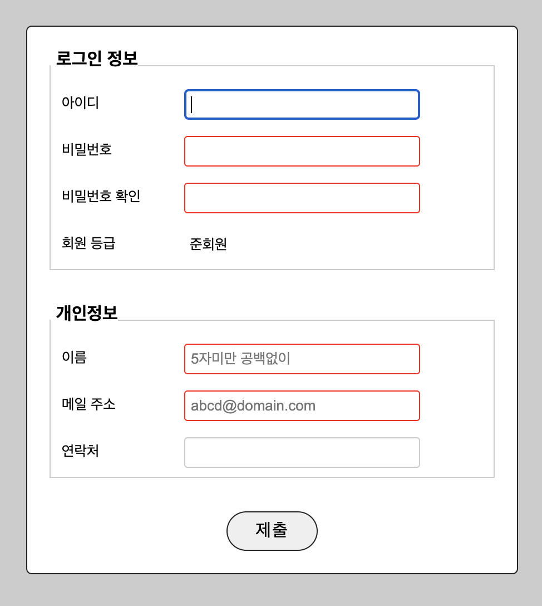

# CSS
## 목차
* [CSS란?](#CSS란)
* [기본 문법](#기본-문법)
* [CSS 꾸미기 속성들](#CSS-꾸미기-속성들)
* [0208 CSS 수업](#0208-css-수업)

# CSS란?
* `Cascading Style Sheets`의 약자로 `HTML`로 만든 웹 문서 뼈대에 디자인을 적용하기 위한 것

## 🔸 적용 방법
1. 태그에 바로 스타일 적용<br>
2. `head` 안에서 스타일 적용<br>
3. 외부파일로 스타일 적용<br>
****************************

# 기본 문법
```css
태그 대상
{
    속성: 값;
    속성: 값; ...
}

*
{
    HTML 내용 전체 선택
}

h2
{
    color: blue;
    background-color: skyblue;
    모든 h2 태그에 적용
} 

#p1
{
    id="p1" 인 id 모두 선택
}

.p2
{
    class="p2" 인 class 모두 선택
}

#footer p
{
    footer 안에 있는 p 태그에만 적용
}

/* 하이퍼링크 태그에만 부분적으로 적용하는 것도 가능하다 */
a:link, a:visited
{
	/* 하이퍼링크색, 방문한 하이퍼링크색 변경 */
	color: black;
}

a:hover
{
	/* 하이퍼링크에 마우스를 올리면 */
	color: white;
	background-color: black;
}
```

* `<p id="p1">`, `<span class="p2">` 와 같이 지정하며 `id`는 넓은 영역을 지정할 때 주로 사용하고 `class`는 좁은 영역을 지정할 때 주로 사용한다고 한다.
******************************

# CSS 꾸미기 속성들

```css
p
{
	/* 배치 */
	display: block; 전체영역(문단영역) : 블록레벨
	display: inline; 요소영역 : 인라인 레벨(가로로 붙음)
	display: inline-block; 메뉴 만들땐 인라인 블록이 편하다
	display: inline-block;
    
	/* 박스크기 계산 box-sizing */
    /* 웹 페이지의 내용물들을 배치할 때 박스크기 계산한 것을 바탕으로 배치하는 것이 좋다 */
	box-sizing: border-box; 내용 안여백 테두리선 포함해서 크기 계산
	box-sizing: content-box; 내용(기본값)물만 포함해서 크기 계산
    
	/* 너비 */
	width: 600px;
	
	/* 높이 */
	height: 50%;
 
    /* 안 여백 10px */
	padding: 10px;
	
	/* 밖 여백 */
	margin: 50px;
    
	/* 배경색 */
	background-color: silver;
	background-color: #0000ff;
	background-color: rgb(255, 0, 0);
    
    color: rgba(255, 0, 0, 0.5);
    color: #ff0000;
    
    font-family: "바탕";
    
    font-size: 20px;
    font-size: 3em;
    /* 절대크기(지정된 크기) : 상대크기(상대적인 글자크기) */
    /* 포인트 pt, 픽셀 px, em 대문자를 기준으로 비율값 적용, rem 1em 비율값 적용, ex 소문자를 기준으로 적용 */
    
    font-style: italic;
    
    font-weight: bold;
    
    /* 글자 가운데 정렬 */
    text-align: center;
    
    line-height: 100%;
    
    text-decoration: overline;
    
    /* 그림자 효과 */
    text-shadow: 5px 5px 3px black; 
    
    /* 글자 하나사이 간격*/
    letter-spacing: 0.5em; 
    
    /* 단어 사이 간격 */
    word-spacing: 50px; 
    
    /* 목록 들여쓰기 내어쓰기 inside/outside */
    list-style-position: outside;
    
    /* 목록 점(불릿) 대신 이미지 사용 */
    list-style-image: url("1.jpeg");
    
    /* 표 제목 위치 지정 caption-side: top/bottom; */
	caption-side: top;
    
	/* 표 테두리선 그려주기 border: 테두리선 두께 테두리선 모양 테두리선 색 */
	border: 1px solid black;
    border-style: dotted;
	border-color: blue;
    
	/* 셀(칸) 사이에 여백 */
	border-spacing: 10px;
	
	/* 표와 셀 테두리 합치기 */
	border-collapse: collapse;
    
    /* 모서리 둥글게 */
	border-radius: 50%;
    
    /* 박스 그림자 (12시부터 시계방향으로) 색상 */
	box-shadow: 5px 5px 15px 5px green;
 
	/* 어울림 배치하는 법 */
	float: left; /* 이미지를 왼쪽으로 기준으로 글자 어울림 배치 */
	float: right; /* 이미지 오른쪽으로 기준으로 글자 어울림 배치 */
 
	/* 어울림 배치 해제 */
	/* 아까 설정한 방향 중 해제하고 싶은 방향을 입력해줌 */
	clear: left;
	clear: right;
	clear: both;  
    
    /* 배경 이미지 삽입 */
	/* 이미지 태그에서 안보이면 스타일시트에서 이미지를 넣은 것이다. */
	background-image: url("dot.png");
	background-repeat: repeat; /* 이미지 바둑판 모양으로 반복 */
	background-repeat: repeat-x; /* x축만 반복 */
	background-repeat: repeat-y; /* y축만 반복 */
	background-repeat: no-repeat; /* 반복 안함 */ 
	background-position: center; /* 문단 가운데로 정렬 */
	background-position: bottom right; /* 두개 넣으면 오른쪽 아래와 같이 정렬됨 */
	background-position: top left;
	background-size: 50px 50px;
}
```

## ☑️ CSS 꾸미기 시작은
```css
*
{
	/* body 영역엔 기본적인 여백이 조금씩 있는데 이걸 다 0으로 만들고 시작한다. */
	margin: 0px;
	padding: 0px;
	
	/* 테두리포함 너비 계산하기 */
	box-sizing: border-box;
}
```

* 위와 같이 초기화하고 시작하는 것이 좋다.
************************************

# 0208 CSS 수업
<hr>

<p style="text-align: center;">

</p><br><br>

* `HTML` 페이지를 `CSS`로 이렇게 꾸미는 것을 했다. <br><br>

# 소스코드 - CSS
<hr>

```css
    <style type="text/css">
        * {
/*             기본적인 여백 없앰 - 0px */
            margin: 0px; padding: 0px;
        }
        
        body {
            background-color: #ccc;
            padding: 20px;
        }
        
        form {
/*            배경색 흰색, 테두리 1실선, #222, 테두리 둥글게 5px, 
            안여백 20px, 너비 400px 밖여백 위아래 30px 왼쪽오른쪽 가운데정렬 */
            background-color: white;
            border: 1px solid #222;
            border-radius: 5px;
            padding: 20px;
            width: 400px;
            margin: 30px auto;
        }
        
        fieldset {
/*            테두리 1px 실선 #ccc, 밖 아래여백 30px */
            border: 1px solid #ccc;
            margin-bottom: 30px;
        }
        
        legend {
/*            폰트크기 16px, 폰트굵게 bold, 안 왼쪽여백 5px, 안 아래여백 10px */
            font-size: 16px;
            font-weight: bold;
            padding-left: 5px;
            padding-bottom: 10px;
        }
        
        li {
/*            줄간격 30px, 리스트 스타일 none, 안여백 5px 10px, 밖아래여백 2px */
            line-height: 30px;
            list-style: none;
            padding: 5px 10px;
            margin-bottom: 2px;
        }
        
        label {
/*            왼쪽으로 배치, 폰트크기 13px, 너비 110px */
            float: left;
            font-size: 13px;
            width: 110px;
        }
        
        .btn {
/*            테두리 1px 실선 #222, 테두리 둥글게 20px, 글자크기 16px, 
            글자간격 1px, 밖여백 자동 가운데정렬, 안여백 7px 25px */
            display: block;
            border: 1px solid #222;
            border-radius: 20px;
            font-size: 16px;
            letter-spacing: 1px;
            margin: 0px auto;
            padding: 7px 25px;
        }
        
/*        input type="submit" 제외하는 법 */
        input:not([type=submit]) {
/*            테두리선 1px 실선 #ccc, 테두리선 둥글게 3px, 글자크기 13px, 안여백 5px,
             너비 200px */
            border: 1px solid #ccc;
            border-radius: 3px;
            font-size: 13px;
            padding: 5px;
            width: 200px;
        }
        
/*        여러 필드셋 중 마지막 필드셋만 스타일 지정 */
        fieldset:last-of-type {
            border: none;
            margin-bottom: 0px;
        }
        
/*        태그 중 조건을 걸어줄 땐 대괄호 [] */
        input[required] {
            border: 1px solid red;
        }
        
        input[readonly] {
            border: none;
        }
    </style>
```
<br><br>

# 소스코드 - HTML
<hr>

```html
<body>
<form action="a.jsp" method="get">
	<fieldset>
		<legend>로그인 정보</legend>
		<ul>
			<li><label>아이디</label>
			    <input type="text" name="id" autofocus required></li>
			<li><label>비밀번호</label>
			    <input type="password" name="pwd1"  required></li>
			<li><label>비밀번호 확인</label>
			    <input type="password" name="pwd2"  required></li>
			<li><label>회원 등급</label>
			    <input type="text" name="level" value="준회원" readonly></li>
		</ul>
	</fieldset>
	<fieldset>
		<legend>개인정보</legend>
		<ul>
			<li><label>이름</label>
			    <input type="text" name="name" placeholder="5자미만 공백없이" required></li>
			<li><label>메일 주소</label>
			    <input type="email" name="email" placeholder="abcd@domain.com" required></li>
			<li><label>연락처</label>
			    <input type="tel" name="tel"></li>
		</ul>
	</fieldset>
	<fieldset class="btnFieldset">
		<input type="submit" value="제출" class="btn">
	</fieldset>
</form>
</body>
```

