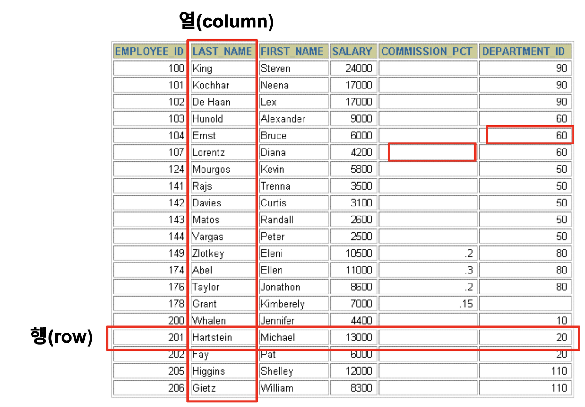

# 데이터베이스 
# 목차 
* [DB란?](#DB란) 

# DB란? 

## DB를 쓰는 이유
* 데이터를 오프라인으로 캐비넷에 저장하자니 물리적 저장 공간은 한정되어 있다. 
* 그렇다면 엑셀 파일을 만들어 암호를 걸어 쓰는 방법이 있는데 만약 암호가 유출된다면 그 엑셀 파일 안에 저장된 정보도 모두 유출된다. 따라서 이것도 안전한 방법은 아니다.
* 그래서 서버에 데이터베이스를 구축하고 거기에 고객 정보를 저정하고 관리하는 것이다. 
    * 데이터베이스엔 애초에 허가받은 사용자만 접근할 수 있고 허가받은 권한 만큼만 데이터에 접근할 수 있다.  

## DBMS
* 데이터베이스 관리 시스템
* DB에서 필요한 데이터를 검색하거나 삽입, 수정, 삭제하기 위한 프로그램
* ORACLE, MySQL등이 있으며 이것들이 DB 자체를 의미하는 것은 아니다.
    * DB를 다루기 위한 수단으로서 MySQL을 사용하면 MySQL을 사용한 DB 프로그램인 것이다.  
    
## RDBMS
* 관계형 DBMS
* 시중에 나와있는 대부분의 DBMS라고 보면 된다.  

## SQL
* 데이터 액세스를 위해 ORACLE server와 통신하는 언어로 DB와 소통하기 위한 언어
* 모든 DBMS에서 사용하는 공용언어  

## TABLE
* DB에서 사용하는 대표 객체(오브젝트)
* 테이블을 사용해서 데이터를 분류한다.  
  
* 세로는 **열(column)**, 가로는 **행(row)**!!
* column과 row가 만나는 곳은 Field(Record)값이라고 부른다. 
