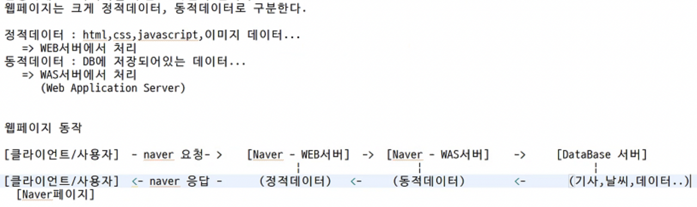
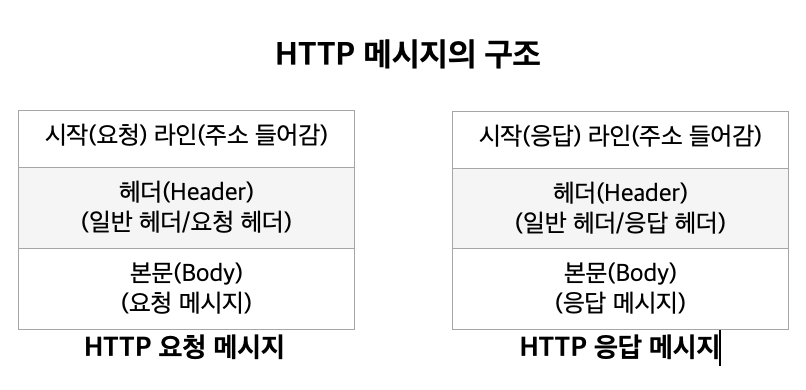
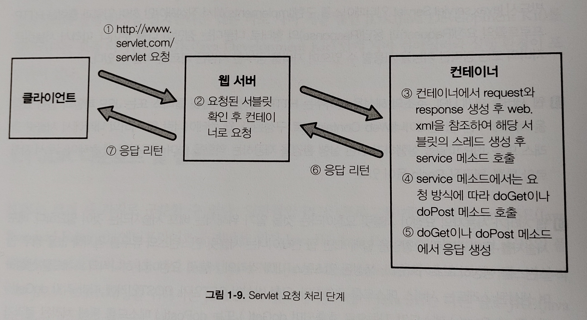

# 웹 페이지 이론 정리
# 목차
* [웹페이지 기초](#웹페이지-기초) 
* [웹 프로그래밍 언어 종류](#웹-프로그래밍-언어-종류) 
* [HTTP 프로토콜(HyperText Transfer Protocol)](#http-프로토콜hyperText-transfer-protocol) 
* [웹 컨테이너](#웹-컨테이너) 
* [서블릿의 동작 원리](#서블릿의-동작-원리)

# 웹페이지 기초
## 웹페이지에는 정적데이터와 동적데이터가 있다.

* 네이버 홈페이지에 접속하면 보이는 이미지 데이터들은 `정적데이터`
* HTML, CSS, JavaScript, ... => WEB 서버에서 처리  

* 신문 기사, 날씨, 코스피 지수 등 변하는 값들은 `동적데이터`
* DB에 저장되어 있는 데이터 => `WAS(Web Application Server - web에 application이 추가된 것)`서버에서 처리
    * 예) 톰캣이라는 `서버`에서 `자바 애플리케이션`이 실행되고 있는 것  
    
## 웹페이지 동작
* `[클라이언트/사용자]`가 naver에 요청 ➡️ `[naver - WEB서버]`가 판단해서 요청한 데이터가 `정적데이터`만 있다면 바로 실행하게 만듦 ➡️ `[클라이언트/사용자]`에게 naver가 응답(`정적데이터`)
* 👉 이 결과로 사용자는 naver 페이지를 볼 수 있게 된다.  

* 하지만 `동적데이터`도 있다면...
* naver가 `[naver서버 - WAS서버]`에 `동적데이터`를 요청한다.
* 그러면 `[Database서버]`에 데이터를 요청해서 사용자에게 보여준다.  
  

* +) .com, .co.kr 과 같은 도메인은 비싸다.
* .ar 같은 도메인들은 무료

## DNS
* `도메인 네임서버`
* IP주소를 도메인 주소로 바꾼 것
* 숫자로 된 IP주소는 외우기 힘드니까 좀 더 읽기 쉬운 문자형 주소로 바꾸는 것
*********************************

# 웹 프로그래밍 언어 종류
## 1. CGI(Common Gateway Interface)
* 응용 프로그램과 웹 서버 사이의 정보를 주고받는 방식이나 규약들을 정해 놓은 것
* 단순한 `HTML` 방식으로는 동적인 웹 페이지를 만들기가 어렵기 때문에 서버측에서 동적인 데이터를 처리해 클라이언트에 `HTML` 문서로 전송해 줄 수 있는 `응용 프로그램(웹 프로그램)`이 필요해져서 만들어졌다.
* 현재 웹 프로그래밍은 대부분 `ASP`, `PHP`, `JSP`를 이용한 것이 대부분인데, `DBMS와의 간편한 연동`, `객체 지향적인 특성`, `편한 개발 환경` 등 강력한 기능을 갖추었기 때문이다.  

### 🔸 DBMS(Database Management System)
* 데이터베이스 관리자라고도 불리며 다수의 컴퓨터 사용자들이 데이터베이스 안에 데이터를 기록하거나 접근할 수 있게 해주는 프로그램
* `DBMS`는 데이터베이스 내의 정보를 검색하거나, 데이터베이스에 정보를 저장하기 편리하고 효율적인 환경을 제공하며, 응용 소프트웨어별로 흩어져 있는 자료들을 통합하고 통합된 자료들을 각 응용 소프트웨어가 공유하여 정보의 체계적인 활용을 가능하게 한다.
* 일반적인 형태의 DBMS는 관계형 데이터베이스 관리 시스템(`RDBMS`)인데, `RDBMS`의 표준화된 사용자 및 프로그램 인터페이스를 `SQL(Strutured Query Language)`이라고 한다.
* `RDBMS`로는 `오라클(Oracle)`, `사이베이스(Sybase)`, `인포믹스(Infomix)`등이 쓰인다.  

### 🔸 인터페이스(Interface)
* 사물과 사물간의 소통이 가능하도록 만들어진 매개체 또는 규약
* 웹 프로그래밍에서는 서버와 응용 프로그램 간의 원활한 통신이 가능하도록 만들어진 규약을 말한다.  

### 🔸 스크립트 언어(Script Language)
* `C`와 같은 일반적인 프로그래밍 언어는 컴파일러에 의해 컴파일 되어 2진수로 되어있는 기계어로 변환되어야지만 컴퓨터 상에서 실행될 수 있다.
* 이와는 달리 컴파일이 필요 없이 해석기(`인터프리터`)에 의해 즉시 실행될 수 있는 프로그램 언어를 `스크립트 언어`라고 한다.
* 대표적으로 `브라우저`에 의해 해석되어 실행되는 `JavaScript`가 있으며, `Unix`의 쉘 스크립트, `윈도우`의 Batch 파일도 스크립트 언어라 할 수 있다.   

## 2. ASP(Active Server Page)
* `C#(.Net)`과 유사하다.
* 동적인 웹 페이지의 구현을 위해 `Visual Basic` 언어를 기반으로 만들어진 `VBScript`라는 스크립트 언어를 사용해서 구성된 웹 프로그래밍 기술
* 쉬운 문법을 가지고 있어 빠르고 쉽게 개발할 수 있고 Active-X 및 DDL 컴포넌트를 사용하여 어느 정도의 확장성도 갖추었지만 웹 서버로 오직 `Windows` 기반의 `IIS(Internet Information Server)`만을 사용할 수 있기 때문에 플랫폼에 비독립적이라는 큰 단점을 가디고 있다.
* 또한 `Java` 기반의 `JSP`에 비해 시스템 자원의 효율성과 확장성이 떨어진다.   

## 3. PHP(Personal Hypertext Preprocessor)
* `ASP`와 유사한 스크립트 기반의 언어이지만 `C`를 기반으로 만들어져서 빠른 속도를 가지고 있다.
* 다양한 플랫폼에서 사용 가능하며 100% 무료로 사용할 수 있다.
* 하지만 서버측의 지원 인프라가 매우 부족하여 확장성이 떨어지고, 기업형의 복잡한 시스템 구조에 적용하기가 힘들고 보안상의 약점을 가지고 있다.   

## 4. JSP
* `Java`를 기반으로 만들어진 `서블릿(Servlet)`이라는 동적 웹 구현 기술이 개발된다.
* `서블릿`은 객체지향적이며 플랫폼 독립적인 자바의 장점을 그대로 웹에서 구현할 수 있었으며 `스레드(Thread)` 기반의 요청 처리 방식을 채택했기에 사용자가 많을수록 효율적으로 동작하는 기술이었다.
* 하지만 익히기가 쉽지 않은 편이었기 때문에 유저인터페이스의 구현이 쉬운 `ASP`의 장점을 수용하여 `JSP`가 개발된다.
* `JSP` 또한 스크립트 기반으로 개발되어 훨씬 쉽게 작성할 수 있었고 **`서블릿`과 함께 구동함으로써 `서블릿`의 기능을 그대로 사용할 수 있고 `자바빈즈(JavaBeans)`, `EJB`같은 기술로 보다 강력한 객체지향적 지원이 가능**해졌다.
* 또한 `JSTL`을 지원하게 되면서 웹 프로그램의 가독성이 좋아지고 유지 및 보수가 훨씬 쉬워지는 장점을 가지게 되었다. 
* 이러한 장점들은 대규모 프로젝트에서 유용하기 때문에 최근에는 일정 규모 이상의 웹사이트를 개발할 때에는 주로 `JSP`를 사용한다.  

### 🔸 프로세스(Process)
* 실행 중인 프로그램을 나타내는 말로 `태스크(Task)`라고도 한다.
* `윈도우`와 같이 멀티태스킹을 지원하는 운영체제에서는 동시에 실행되고 있는 여러 개의 프로세스에 대하여 `CPU`와 `메모리 자원`을 안정되게 분배해 주어야 하며 이러한 역할은 그 운영체제의 성능을 결정하는 데 있어 아주 중요한 요소이다.
* 그런데 운영체제는 똑같은 프로그램이 두 개 이상 실행되면 같은 프로그램이라 하더라도 서로 다른 자원을 할당해 두 개 이상의 프로세스를 만든다. 
* 이는 실행되는 프로그램의 수가 늘어날수록 할당해야 하는 자원이 늘어나게 되어 굉장히 비효율적이고 성능의 하락을 가져올 것이다. 
* 이러한 단점을 극복하기 위해 개발된 것이 `스레드(Thread)`이다.  

### 🔸 스레드(Thread)
* 하나의 프로세스 내에서 해당 프로세스가 할당받은 자원을 공유하며 실행되는 독립적인 작업단위
* 프로세스의 자원을 참조할 뿐 새로 할당받을 필요가 없기 때문에 프로세스를 생성하는 것보다 훨씬 빠른 생성 속도를 가진다.
**********************************

# HTTP 프로토콜(HyperText Transfer Protocol)
* 실제 사용자와 연결된 최상위 계층의 프로토콜로 가장 대표적인 웹브라우저의 통신에 관한 프로토콜  

### 🔸 프로토콜(Protocol)
* 네트워크상에서 데이터를 주고 받는 규칙
* 컴퓨터 상호간의 대화에 필요한 통신 규약   

## 1. HTTP 프로토콜의 구조
* `요청(Request)`과 `응답(Response)` 형태로 이루어졌다.
* 사용자가 웹 페이지의 링크를 클릭하면 브라우저는 `HTTP` 프로토콜의 요청 형태로 `HTTP` 메시지를 작성하여 웹 서버에 전송한다.
* 웹 서버에서는 지금 받은 `HTTP` 메시지가 `요청(Request)` 메시지임을 판단하고 그 데이터를 분석해서 `HTTP` 프로토콜의 `응답(Response)` 형태로 메시지를 작성하여 브라우저로 보내게 되면 브라우저는 메시지를 받아서 사용자의 화면에 표시하게 된다.  
  
* 각 `HTTP` 메시지는 지금 작성 된 메시지가 요청인지, 응답인지와 요청 URL 등 기본적인 정보가 담겨있는 시작 라인과 수행 날짜, 서버 정보, 브라우저 버전 등 부가적인 정보를 담는 헤더 그리고 요청이나 응답에 필요한 내용을 담고 있는 본문(Body)으로 구성된다.   

## 2. HTTP 요청(Request) 메시지
* 기본적으로 `HTTP 메소드(Method)`와 접근할 주소(URL) 정보 그리고 서버에 전달할 데이터인 `폼 파라미터`로 구성된다.
* `HTTP 메소드(Method)`는 클라이언트가 웹 서버가 해야 할 행동을 정해주는 정보로 `GET 메소드`와 `POST 메소드`가 있다.
* `GET 메소드`를 사용하는 요청 메시지를 `GET 방식의 요청`, `POST 메소드`를 사용하는 요청 메시지를 `POST 방식의 요청`이라고 한다.  

### 🔸 GET 방식
* 전송할 파라미터 값들을 시작 라인의 URL 정보에 붙여서 같이 전송한다.
* 파라미터의 길이는 256바이트를 넘을 수 없다.
* 본문(Body)이 필요없기 때문에 전송 속도가 `POST` 방식에 비해 빠르다.
* 전송해야 할 데이터가 적을 때 유용하다.
* 파라미터가 URL뒤에 붙어서 전송되므로 사용자가 브라우저의 주소 창에서 전송되는 파라미터를 실제로 확인할 수 있다.  

### 🔸 POST 방식
* 전송할 파라미터 값들을 요청 메시지 본문(Body)에 담아서 전송한다.
* 따라서 전송할 수 있는 데이터의 양에 제한이 없으며 주소창에서 전송되는 파라미터 확인이 불가능하다.
* `GET` 방식에 비해 보안상 더 유용하다.  

   

## 3. HTTP 응답(Response) 메시지
* 요쳥에 대한 서버의 처리 성공 여부를 표시하는 상태 코드(HTTP 404, 500 등) 번호와 웹 서버가 응답해주는 콘텐츠의 타입 정보(텍스트/HTML, 이미지 등), 콘텐츠의 내용으로 구성된다.
* 실제적으로 `서블릿` 클래스가 요청을 처리해 생성하는 페이지는 웹 서버에서 응답 메시지의 형태로 작성되어 사용자의 브라우저에 전송된다.
*********************************

# 웹 컨테이너
* `JSP`와 `서블릿`을 사용한 웹 서버는 크게 URL 주소의 해석을 담당하는 `HTTP` 서버와 `서블릿` 클래스 또는 `JSP` 파일의 실행 요청을 처리해주는 `웹 컨테이너(Web Container)`로 구성된다.
* `HTTP` 서버는 단순히 어떤 주소(URL) 요청이 들어왔을 경우 그 주소에 미리 매핑되어 있는 콘텐츠(`HTML` 파일이나 이미지 등)를 사용자의 브라우저에 응답 형태로 전송하는 역할을 한다.
* 이 때 요청된 URL이 `서블릿` 클래스 또는 `JSP` 파일일 경우 `HTTP` 서버는 이를 `웹 컨테이너`에서 처리하도록 `클라이언트`의 요청을 넘겨준다.
* `웹 컨테이너`에서는 요청된 URL에 맞는(미리 설정된) `서블릿` 클래스 또는 `JSP` 파일을 실행하여 결과를 `HTTP` 서버에 넘겨주게 되고 이는 응답 메시지의 형태로 사용자의 브라우저에 전송된다.
#### 👉 즉 `웹 컨테이너`란 웹 서버 내부에서 `서블릿` 클래스 또는 `JSP` 파일을 실행하기 위한 실행 환경을 제공하는 역할을 한다.
* `서블릿` 클래스에 대한 `웹 컨테이너`를 `서블릿 컨테이너`
* `JSP` 파일에 대한 `웹 컨테이너`를 `JSP 컨테이너`  
* 대표적으로 아파치 톰캣, 웹로직, Resin 등이 있다.
********************************

# 서블릿의 동작 원리
## 1. 사용자의 URL 요청
* `웹 서버`가 `배포 서술자`를 통해 지금 받은 요청이 `서블릿` 요청이라는 것을 알게 되면 `서블릿`을 담당하는 `웹 컨테이너`로 그 요청을 전달한다.
#### 🔸 배포 서술자(Deployment Descriptor)
* 사전에 웹 서버측에 `URL`과 `서블릿` 클래스를 미리 매핑시켜놓은 것  

## 2. request, response 객체 생성
* `웹 컨테이너`는 받은 요청을 처리하기 위해 `HTTP` 요청을 처리하기 위한 `request` 객체와 `HTTP` 응답을 위한 `response` 객체를 생성한다.  

## 3. 서블릿 인스턴스와 스레드 생성
* `request`, `response` 객체가 생성된 뒤 사용자의 URL 요청이 어떤 `서블릿` 클래스를 필요로 하는지 `배포 서술자`를 통해 알아낸다.
* 그 클래스가 한 번도 실행된 적이 없거나 현재 메모리에 `인스턴스(프로세스)`가 없으면 새로 생성한 뒤 `스레드`를 하나 생성하고 이미 `인스턴스`가 존재한다면 기존의 `인스턴스`에 `스레드`만 하나 새로 생성한다.
* 각 `서블릿` 클래스는 `웹 컨테이너`당 하나만 존재한다.  

## 4. service() 메소드 호출과 서블릿 클래스 실행
* `스레드`가 생성되면 각 `스레드`에서 `service()` 메소드가 호출된다.
* `service()` 메소드가 호출되면 `HTTP` 요청 방식이 `GET` 방식이면 `doGet()` 메소드가, `POST` 방식이면 `doPost()` 메소드가 `request`, `response` 객체를 인자로 자동으로 호출된다.
* 개발자가 실제로 동적인 웹 페이지 생성을 할 수 있는 코드를 만들어야 하는 부분이 `doGet()`과 `doPost()` 메소드 부분이다.  

## 5. 응답과 스레드의 소멸
* 사용자의 요청에 따른 동적인 웹 페이지를 생성한 결과물이 담긴 `response` 객체를 `웹 컨테이너`가 `HTTP` 응답 형태로 바꾸어 `웹 서버`로 전송한다.
* 사용이 끝난 `request`와 `response` 객체를 소멸시키고 `스레드`를 종료한다.
* 웹 서버는 전송 받은 HTTP 응답 메시지를 사용자의 브라우저로 전송하게 되고 사용자는 브라우저를 통해 동적으로 생성된 페이지를 받아보게 된다.  

*****************************************
